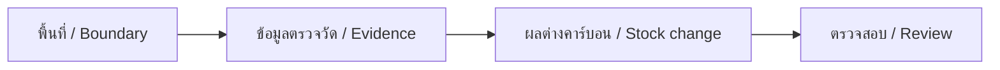

# Forest Carbon Thailand

**Live / เว็บไซต์:** [forest-carbon-thailand.pages.dev](https://forest-carbon-thailand.pages.dev)

**คู่มือภาษาไทย:** [การใช้งาน สูตรคำนวณ รูปแบบไฟล์ และการติดตั้ง](docs/GUIDE.th.md) · **English:** [Full user and developer guide](docs/GUIDE.en.md)

เครื่องมือภาษาไทย/อังกฤษสำหรับประเมินคาร์บอนป่าไม้: นำเข้าขอบเขต GeoJSON และแปลงสำรวจ CSV คำนวณคาร์บอนคงเหลือกับผลต่างตามช่วงเวลา และส่งออก JSON/CSV ที่ตรวจสอบย้อนกลับได้ ข้อมูลผู้ใช้ประมวลผลในเบราว์เซอร์ ไม่ส่งไปเก็บบนเซิร์ฟเวอร์

A Thai/English assessment workbench using the supplied Malaysia visual system. Import a boundary, review field evidence, calculate a monitoring-period estimate, and export its inputs and provenance. **An estimate is not an issued credit.** No trained AI model or registry is connected in this release.



## Start / เริ่มใช้งาน

```bash
npm ci
npm run build
npm test
npm run dev
```

Open `http://127.0.0.1:8788`. Select **ลองข้อมูลตัวอย่าง / Try illustrative example**, then **คำนวณ / Calculate**. The example yields **218.86 tCO₂e** over its selected interval and remains labelled illustrative. Start over before entering a real project.

## Features and limits / ความสามารถและข้อจำกัด

| Capability / ความสามารถ | Scope / ขอบเขต |
|---|---|
| Map / แผนที่ | Leaflet, street/imagery context, imported project polygons, mobile navigation |
| Geometry / ขอบเขต | WGS84, ≤2 MB, holes, overlap and self-intersection rejection; geodesic area |
| Accounting / คำนวณ | AGB or already-converted tCO₂e; explicit interval; prescribed fire deduction; negative losses retained |
| Field import / แปลงสำรวจ | Single-stratum mixed deciduous/dry dipterocarp tree CSV; named Ogawa equation |
| Evidence / หลักฐาน | User-file hashes, report reference, dated source catalogue, full JSON and numeric CSV exports |
| Context / ข้อมูลอ้างอิง | 11 historical province-year observations; full research catalogue kept separately |
| Not implemented / ยังไม่รองรับ | Trained AI inference, uncertainty estimates, land-rights verification, all forest methodologies, registry access, issuance |

## Publish / เผยแพร่

Cloudflare Pages project: `forest-carbon-thailand`, **Direct Upload** of `public/`.

```bash
npx wrangler login
npm run deploy
BASE_URL=https://forest-carbon-thailand.pages.dev npm run test:browser
```

Commit and push before deployment so the build's `/version.json` identifies its source. **GitHub pushes do not auto-deploy.** CI validates build/tests; deployment is an explicit authenticated command. No runtime secrets are needed. See [deployment details](docs/DEPLOYMENT.md).

## Development and verification / พัฒนาและตรวจสอบ

`npm test` covers numeric units, signed change, fire thresholds, date validation, plot expansion, malformed CSV and boundary topology. `npm run test:browser` exercises imports, TH/EN state, exports, mobile views and guide diagrams. Install Chromium with `npx playwright install chromium` first and keep `npm run dev` running for local browser tests.

Styling is adapted from [Nonarkara/Malaysia](https://github.com/Nonarkara/Malaysia) commit `6c4651bf525000555217cde55e5b7989b176e4cb`; provenance and library/font licences are recorded in [THIRD_PARTY.md](THIRD_PARTY.md). No licence is implied for third-party datasets beyond each provider's terms. Read [SECURITY.md](SECURITY.md) before adding network services.

## Research snapshot / งานวิจัยก่อนพัฒนา

Research and extracted data for a Thai/English forest-carbon assessment system requested for discussion with TGO.

- [Research findings, calculation method and sources](RESEARCH.md)
- [Concrete pilot implementation plan](IMPLEMENTATION_PLAN.md)
- [Full resource inventory](research/extracted/resources.csv)
- [Normalized province forest-area observations](research/extracted/province-forest-area.csv)
- [Download provenance and quality findings](research/extracted/download-manifest.json)
- [Validation evidence and raw-file hashes](research/extracted/evidence-checks.json)

Research date: 25 September 2026. The workspace began empty. The original research snapshot preceded application implementation; the guides above describe the implemented release. Trained AI models and official credit issuance remain outside this release.

Raw downloads are retained for provenance. A successful download does not establish fitness for carbon accounting or permission to republish. Follow the source-specific quality and licence notes in the research report.

## Research / งานวิจัย

Read the illustrated [Thai research notebook](https://forest-carbon-thailand.pages.dev/research-th) or [English research notebook](https://forest-carbon-thailand.pages.dev/research-en): purpose, worked calculation, satellite and AI workflow, Thai dataset audit, RFD observations, pilot design and Dr Non's profile. Source text lives in `docs/RESEARCH.th.md` and `docs/RESEARCH.en.md`; build renders accessible diagrams and navigation. The workbench Research link opens separately so current inputs remain available.
