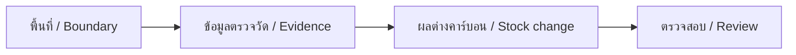

# คาบอนนะ · Forest Carbon Thailand

**The study / การศึกษา:** [Building a system to calculate a forest carbon footprint from public and open data](docs/RESEARCH.en.md) · [สร้างระบบคำนวณรอยเท้าคาร์บอนของป่าจากข้อมูลสาธารณะและข้อมูลเปิด](docs/RESEARCH.th.md). An independent short thesis, not a degree and not a TGO assessment. Open data can weigh a landscape. It cannot mint a credit.

**Live / เว็บไซต์:** [carbon.nonarkara.org](https://carbon.nonarkara.org)

**คู่มือภาษาไทย:** [การใช้งาน สูตรคำนวณ รูปแบบไฟล์ และการติดตั้ง](docs/GUIDE.th.md) · **English:** [Full user and developer guide](docs/GUIDE.en.md)

เปิดมาที่ **แผนที่คาร์บอน**: แตะจังหวัดหรือวาดกรอบ แล้วเห็นคาร์บอนสะสมในป่า การดูดซับ และการปล่อย (การสูญเสียป่า ไฟ และเชื้อเพลิงฟอสซิล) ทันที จากข้อมูลดาวเทียมที่เผยแพร่แล้ว พร้อมแหล่งที่มา ปี และช่วงความไม่แน่นอนทุกตัวเลข

เครื่องมือภาษาไทย/อังกฤษสำหรับประเมินคาร์บอนป่าไม้: นำเข้าขอบเขต GeoJSON และแปลงสำรวจ CSV คำนวณคาร์บอนคงเหลือกับผลต่างตามช่วงเวลา และส่งออก JSON/CSV ที่ตรวจสอบย้อนกลับได้ ข้อมูลผู้ใช้ประมวลผลในเบราว์เซอร์ ไม่ส่งไปเก็บบนเซิร์ฟเวอร์

Opens on the **carbon map**: tap a province or draw a box and see forest carbon stock, forest removals and emissions, landscape fire and fossil CO₂ at once, each with its dataset, year and uncertainty. Then a Thai/English assessment workbench with the owner-requested Bauhaus interface; Malaysia supplied the original map-led layout. Import a boundary, review field evidence, calculate a monitoring-period estimate, and export its inputs and provenance. **An estimate is not an issued credit.** No locally trained AI inference or authenticated registry transaction service is connected. A dated public TGO registry snapshot is displayed for context and screening.



## Start / เริ่มใช้งาน

```bash
npm ci
npm run build
npm test
npm run dev
```

Open `http://127.0.0.1:8788`. Select **ลองข้อมูลตัวอย่าง / Try illustrative example**, then **คำนวณ / Calculate**. The example yields **218.86 tCO₂e** over its selected interval and remains labelled illustrative. Start over before entering a real project.

## Features and limits / ความสามารถและข้อจำกัด

| Capability / ความสามารถ | Scope / ขอบเขต |
|---|---|
| Carbon map / แผนที่คาร์บอน | Province, drawn box or imported boundary → stock (ESA CCI v7.0 2020 × JAXA FNF 2020), forest flux (GFW v1.4.3, 2001–2025), fire (GFED5.1), fossil CO₂ (ODIAC2025); Climate TRACE and BTR1 cross-checks; never summed across datasets |
| About / เกี่ยวกับ | Illustrated, native TH/EN explanation of the open-data method; every figure filled live from the shipped ledger |
| Atmosphere / บรรยากาศ | NASA GIBS aerosol, fire detections, CO and column CO₂ as labelled pictures, never numbers |
| Map / แผนที่ | Leaflet, street/imagery context, imported project polygons, mobile navigation |
| Geometry / ขอบเขต | WGS84, ≤2 MB, holes, overlap and self-intersection rejection; geodesic area |
| Accounting / คำนวณ | AGB or already-converted tCO₂e; explicit interval; prescribed fire deduction; negative losses retained |
| Field import / แปลงสำรวจ | Single-stratum mixed deciduous/dry dipterocarp tree CSV; named Ogawa equation |
| Evidence / หลักฐาน | User-file hashes, report reference, dated source catalogue, full JSON and numeric CSV exports |
| Context / ข้อมูลอ้างอิง | 11 historical province-year observations; full research catalogue kept separately |
| Not implemented / ยังไม่รองรับ | GFW flux inside drawn boxes (needs a GFW API key), trained AI inference, project-level uncertainty estimates, land-rights verification, all forest methodologies, authenticated registry submissions/transactions, issuance |

## Publish / เผยแพร่

Cloudflare Pages project: `forest-carbon-thailand`, **Direct Upload** of `public/`.

```bash
npx wrangler login
npm run deploy
BASE_URL=https://carbon.nonarkara.org npm run test:browser
node scripts/release-smoke.mjs
```

Commit and push before deployment so the build's `/version.json` identifies its source. **GitHub pushes do not auto-deploy.** CI validates build/tests; deployment is an explicit authenticated command. No runtime secrets are needed. See [deployment details](docs/DEPLOYMENT.md).

## Development and verification / พัฒนาและตรวจสอบ

`npm test` covers numeric units, signed change, fire thresholds, date validation, plot expansion, malformed CSV and boundary topology. `npm run test:browser` exercises imports, TH/EN state, exports, mobile views and guide diagrams. Install Chromium with `npx playwright install chromium` first and keep `npm run dev` running for local browser tests.

Refresh carbon-map data with the offline pipeline in `scripts/ingest/` (see the guide, section 8). `npm test` enforces the conservation rule: provinces, grid cells and the national total agree for every quantity.

Styling is adapted from [Nonarkara/Malaysia](https://github.com/Nonarkara/Malaysia) commit `6c4651bf525000555217cde55e5b7989b176e4cb`; provenance and library/font licences are recorded in [THIRD_PARTY.md](THIRD_PARTY.md). No licence is implied for third-party datasets beyond each provider's terms. Read [SECURITY.md](SECURITY.md) before adding network services.

## Research snapshot / งานวิจัยก่อนพัฒนา

Research and extracted data for a Thai/English forest-carbon assessment system requested for discussion with TGO.

- [Research findings, calculation method and sources](RESEARCH.md)
- [Concrete pilot implementation plan](IMPLEMENTATION_PLAN.md)
- [Full resource inventory](research/extracted/resources.csv)
- [Normalized province forest-area observations](research/extracted/province-forest-area.csv)
- [Download provenance and quality findings](research/extracted/download-manifest.json)
- [Validation evidence and raw-file hashes](research/extracted/evidence-checks.json)

Research date: 25 September 2026. The workspace began empty. The original research snapshot preceded application implementation; the guides above describe the implemented release. Trained AI models and official credit issuance remain outside this release.

Raw downloads are retained for provenance. A successful download does not establish fitness for carbon accounting or permission to republish. Follow the source-specific quality and licence notes in the research report.

## Research / งานวิจัย

Read the illustrated [Thai research notebook](https://carbon.nonarkara.org/research-th) or [English research notebook](https://carbon.nonarkara.org/research-en): purpose, worked calculation, satellite and AI workflow, Thai dataset audit, RFD observations, pilot design and Dr Non's profile. Source text lives in `docs/RESEARCH.th.md` and `docs/RESEARCH.en.md`; build renders accessible diagrams and navigation. The workbench Research link opens separately so current inputs remain available.


## Start on the map

Open [carbon.nonarkara.org](https://carbon.nonarkara.org). **Explore 77 provinces** lists fossil emissions, forest stock or annual forest net flux. Choose a province to see substituted equations. **Select an area** accepts a drag or two opposite-corner clicks/taps; Escape cancels. Small areas below dataset resolution are suppressed. Missing flux is never zero.

**Vegetation** shows JAXA forest cover; **Aerosols** shows atmospheric particles, not CO2. Neither layer alone issues credits. **Research** holds explanations, diagrams and the author profile. **T-VER project tools** retains the measured-project workflow.

The global column (World tab on phones) separates concentrations, emissions, allowances and credits, with source dates and fetched/cache/fallback status. Quarterly auctions and annual inventories are not real-time quotes.


## เริ่มจากแผนที่

เปิด [carbon.nonarkara.org](https://carbon.nonarkara.org) แล้วเลือกจังหวัด หรือกดลูกศรเลือกพื้นที่ ลากกรอบหรือแตะมุมตรงข้ามสองจุด แล้วดูตัวเลขแทนค่าในสมการ กด Escape เพื่อยกเลิก ข้อมูลที่ยังไม่มีจะไม่แสดงเป็นศูนย์

พืชพรรณแสดงพื้นที่ป่าจาก JAXA ละอองลอยแสดงอนุภาคในบรรยากาศ ไม่ใช่ CO2 สองชั้นข้อมูลนี้ไม่ได้ออกเครดิตโดยอัตโนมัติ ปุ่มงานวิจัยรวมคำอธิบาย ภาพประกอบ และประวัติผู้พัฒนา เครื่องมือโครงการ T-VER ยังใช้ข้อมูลภาคสนามได้

คอลัมน์ข้อมูลโลกแสดงแหล่งข้อมูล วันที่ และสถานะข้อมูลสำรอง โทรศัพท์มีแท็บข้อมูลโลก ราคาประมูลรายไตรมาสและบัญชีรายปีไม่ใช่ข้อมูลเรียลไทม์

## Release credibility / ความน่าเชื่อถือของรุ่น

[Release audit](docs/RELEASE_AUDIT.md) records scope, evidence and remaining validation work. [Operating runbook](docs/OPERATIONS.md) covers pre-demo checks, failed feeds, recovery and rollback. [Scientific audit in Thai](https://carbon.nonarkara.org/bible.html?lang=th#scientific-audit) · [English](https://carbon.nonarkara.org/bible.html?lang=en#scientific-audit). The release is an independent assessment pilot, not a certified credit service.
