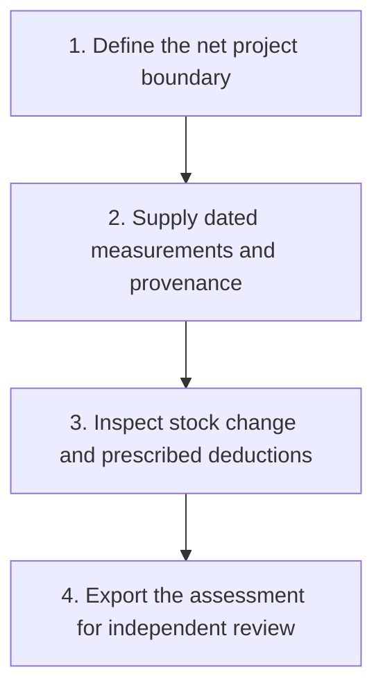
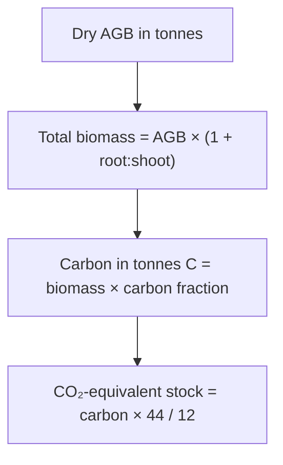
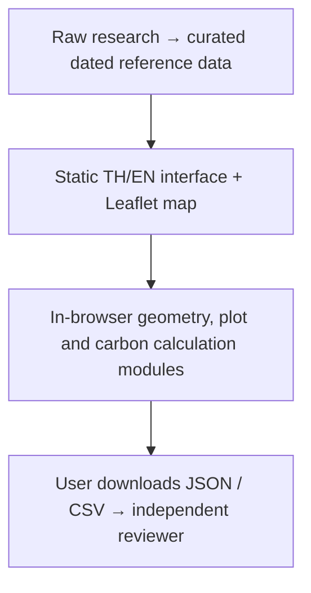

# Forest Carbon Thailand

## What this release does

An independent Thai/English workbench for assessing forest carbon from supplied measurements. Use it to explore a boundary, trace assumptions and prepare a reproducible calculation for review. It does **not** issue credits, establish land rights, train an AI model, or certify compliance with TGO.

**Live:** [Open the workbench](https://forest-carbon-thailand.pages.dev/?lang=en). **Source:** [Nonarkara/carbon](https://github.com/Nonarkara/carbon).

The default view is Thai. Select **EN** at the top to translate the interface without losing inputs. The app opens on the **Carbon map**. On a phone, use the bottom navigation to switch between Map, Carbon, Project, Calculate, Evidence and Sources. On desktop, the map and assessment rail remain side by side.



## Carbon map: absorption and emission by province or box

The carbon map opens first. It answers a landscape question from published satellite products; it never feeds the project calculation below.

1. **Choose an area.** Tap a province on the map, pick one in the list at the top, or select **Draw a box** and drag across the map (touch works; the map stops panning while you draw). **Use project boundary** sums a boundary imported in the Project tab. **All Thailand** returns to the national view.
2. **Read the four headline figures.** Selected area; forest carbon stock (tCO₂e, ESA CCI Biomass v7.0, 2020, forest defined by JAXA FNF 2020) with its 95% range; forest removals and forest emissions per year (Global Forest Watch flux v1.4.3, average of 2001–2025).
3. **Read the ledger in the rail.** Stock and absorption first, then emission: forest loss (GFW), all landscape fire (GFED5.1, 2013–2022 mean, with a monthly chart and land-type shares) and fossil-fuel CO₂ from all sectors (ODIAC2025, 2024). Provinces add cross-checks from Climate TRACE 2024; the national view adds Thailand's BTR1 inventory for 2022.
4. **Never add the rows together.** Each row has its own dataset, year and method. GFW's own net (emissions − removals) is the only net shown; a negative value means a net sink.
5. **Layers.** *Data layers* shows forest carbon density, the JAXA forest map, or province net flux. *Atmosphere* shows NASA GIBS images of aerosol, fire detections, carbon monoxide or column CO₂ for a chosen date. These are concentrations or detections, not emissions, and never produce numbers.
6. **Export.** *Export JSON* saves the rows with dataset versions, conversion factors and the conservation check; *Export CSV* saves the rows with both uncertainty ranges.

Limits you will see on screen: a box counts Thai land only; datasets coarser than a box are greyed out (fire 28 km, fossil 1 km); GFW flux inside a drawn box is marked *not ingested* because its 30 m grids need an API key. The **About** button at the top opens an illustrated explanation inside the app, without losing your inputs. The [research notebook, section 06](research-en.html#section-6) gives every method, source and check in full.

## 1. Try the complete flow

1. Open **Project → Try illustrative example**. A synthetic polygon appears near Saraburi. Its location and biomass values do not describe a registered forest project.
2. Open **Calculate**. The example supplies 1,000 tonnes of initial dry aboveground biomass and 1,100 tonnes at monitoring, with general-tree factors R=0.27 and CF=0.47. The fire assessment is explicitly “No”, with zero burned area.
3. Click **Calculate estimate**. The expected period change is **218.86 tCO₂e**, before any applicable project deductions. The unrounded value is 218.863333… . The annual average uses the exact date interval divided by 365.25 days; it is not a separate annual credit claim.
4. Select **Export assessment JSON**. It includes the formula version, original inputs, interval, boundary, source labels and unverified status. **Export table CSV** is a compact numeric summary; keep the JSON for the full evidence trail.
5. Select **Start over** before beginning a real assessment. Editing example values retains the illustrative warning until the session is reset.

## 2. Import a project boundary

Use a GeoJSON Polygon, MultiPolygon, Feature or FeatureCollection in **WGS84 longitude/latitude**. Coordinates are `[longitude, latitude]`, not `[latitude, longitude]`. A UTM shapefile must be reprojected before export to GeoJSON; renaming its extension does not convert it.

The current importer accepts up to 2 MB, 50 features and 20,000 vertices, within a Thailand screening rectangle (97–106°E, 5–21°N). This rectangle is a coordinate sanity check, **not** proof that a parcel is legally inside Thailand. It rejects empty geometry, unclosed rings, self-intersections, invalid holes and overlapping polygons. Shared edges are allowed. Exclude water, buildings and other ineligible areas in GIS before import, using holes where appropriate.

```json
{
  "type": "Feature",
  "properties": {"name": "Illustrative boundary"},
  "geometry": {
    "type": "Polygon",
    "coordinates": [[[100.95,14.60],[100.96,14.60],[100.96,14.61],[100.95,14.61],[100.95,14.60]]]
  }
}
```

The map calculates geodesic area for orientation: **1 hectare = 6.25 rai; 1 rai = 1,600 m²**. A mapped boundary does not verify ownership, rights to carbon, exclusions, forest classification, or overlap with another registered project. Replacing the boundary invalidates plot expansion because the assessment area changed.

Street and imagery basemaps are for orientation. Imagery acquisition dates are not supplied here; never use the background as monitoring-date evidence. Tile failure is disclosed and does not disable the calculator.

## 3. Choose the correct input quantity

| Input | What to enter | Conversion |
|---|---|---|
| Dry aboveground biomass | Total dry AGB in **tonnes for the full net project area**, at each date | Adds modeled roots and applies carbon fraction and 44/12 |
| Total tree carbon stock | Already calculated above- and below-ground tree stock in **tCO₂e** at each date | Uses the values directly; does not add roots or convert again |

Do not put kg, tonnes/hectare, tC, province totals or an NDVI value into these fields. Biomass density must first be expanded across the matching project area. Carbon in tonnes C must first be converted to tCO₂e or supplied through an appropriate biomass pathway.

Enter the baseline or **last credited** date and the new monitoring date. Reusing the original baseline after an interval has already been credited would double count growth. Describe the measurement/report source in the required source field. The UI clears calculated results whenever accounting inputs change; recalculate before exporting.



The general-tree factors are 0.27 and 0.47. Rhizophora uses 0.48 and 0.4715; palms use 0.41 and 0.413. These are named TGO recommendations, not universal ecological constants. A mixed-species project needs a justified stratified calculation; this simple form applies one parameter group to both dates.

The result follows the selected method reference:

`CSEQ = CTT(t) − CTT(i) − PE − GHG_LEAK`

Standard 13-01 v2 does not consider leakage. Do not generalize this to P-REDD+ or Premium T-VER. Fire PE is requested when burned area is above 5% and canopy fire killed trees; supply a reviewed CH₄/N₂O burning-emission result and its source. The tool does not derive emissions from fire area alone. Unknown fire status blocks calculation. Stock loss remains visible as a negative number. A result above the 16,000 tCO₂e/year size threshold produces a methodology-review flag; it does not automatically choose another method.

Full rules: [TGO Sustainable Forestation v2](https://tver.tgo.or.th/database/Uploads/Methodology/482ce748-b43f-4432-aef8-d7745dcc2692.pdf) and [Tree calculation tool v2](https://tver.tgo.or.th/database/Uploads/Tool/c575f516-1f3c-4dbc-83ec-2ab65e1d76dc.pdf). The application implements an estimate pathway, not every eligibility or issuance requirement.

## 4. Import measured trees

This release supports **one homogeneous mixed-deciduous or dry-dipterocarp stratum**, using the corresponding Ogawa (1965) equations reproduced in the TGO v2 appendix. It does not automatically identify species or forest type.

1. Import a net project boundary.
2. Open **Evidence** and confirm forest type and representative sampling.
3. Import UTF-8 CSV (≤2 MB, ≤10,000 rows). Use the downloadable example to check the schema; its values are illustrative.

```csv
plot_id,tree_id,plot_area_m2,dbh_cm,height_m
P01,T01,1600,20,15
P01,T02,1600,30,20
P02,T01,1600,25,18
```

DBH is in **centimetres**, height in **metres**, plot area in **square metres**. Repeat each plot's area on its tree rows. Area is counted once per plot. Tree IDs must be unique within each plot. Plot IDs refer to distinct sampled areas; this CSV has no coordinates, so the importer cannot prove sampling independence. Empty plots cannot be represented in this version: do not omit zero-tree plots from an assessment; calculate externally if any exist.

The equations use `x = DBH² × height`, `stem = 0.0396 × x^0.933`, `branch = 0.00349 × x^1.030`, `leaf = 1 / (28/(stem+branch) + 0.025)`, with dry biomass in kg. The importer converts to tonnes, divides summed AGB by surveyed area, and expands that density to the net project hectares. It assumes representative area-weighted sampling. This is a screening expansion, not a substitute for a statistically justified inventory design.

Click **Use plot estimate for monitoring value**. Supply the matching baseline separately. Trees below 4.5 cm DBH, saplings, bamboo, deadwood, litter and soil pools are outside this importer. Uncertainty is explicitly absent. If your forest or sampling design differs, calculate with the appropriate approved method outside this importer and enter the reviewed total.

## 5. Read the source evidence correctly

The Sources view contains dated official provincial statistics, TGO documents and links to satellite products. The app bundles **11 province-year observations** from Saraburi and Kanchanaburi, through 2024; these are historical forest-area context. They are not parcel biomass, project eligibility or credits.

The repository's research inventory contains 570 matching datasets and 2,111 resources from the data.go.th keyword query on 25 September 2026. Some downloads are metadata-only, link-only or quarantined for inconsistent units. See `RESEARCH.md` and the download manifest before reuse. Catalogue dates and licences are recorded as supplied. Licence conflicts and restricted transformations must be resolved before republishing derivative datasets.

JAXA radar and vegetation products can inform screening and predictors. GEDI provides modeled biomass samples with quality and uncertainty information. A future AI workflow needs actual matched field/satellite data, held-out validation and the relevant approval. No trained model runs in this release.

## 6. Privacy, evidence and limitations

Inputs remain in memory, with no upload endpoint, analytics, localStorage or automatic backup. Refreshing or closing the page loses the session. Export JSON and any boundary before leaving. Basemap providers receive ordinary tile requests for the viewed area, and Cloudflare receives ordinary website requests. Browser-only processing does not prevent that network metadata.

Imported file names and SHA-256 hashes accompany the full export. Manually entered data is labeled accordingly. Exports are editable files, not digitally signed certification documents. Review the source records, units, period, uncertainty and land/project eligibility before using any result externally. There is no credit price, payment, registry write or official issuance feature.

## 7. Run, test and deploy

Requirements: Node.js 22 or later, npm, Git. Wrangler access is needed only for deployment.

```bash
git clone https://github.com/Nonarkara/carbon.git
cd carbon
npm ci
npm run build
npm test
npm run dev
```

Open `http://127.0.0.1:8788`. The server serves **only public/**, never raw research or credentials.

```bash
npx playwright install chromium
npm run test:browser
npx wrangler login
npm run deploy
```

For browser tests against a deployment: `BASE_URL=https://forest-carbon-thailand.pages.dev npm run test:browser`. Use the existing Cloudflare Pages project `forest-carbon-thailand`; upload `public/`. `wrangler.toml` records that path. Deployment uses Direct Upload, so a GitHub push alone does **not** publish a new version. Run the deployment command after commit/push, then verify `/version.json`, the UI and exports on the public URL. The release ID is the Git commit present when building.

CI checks build and accounting/import tests. Dependency updates are proposed by Dependabot. Keep tokens in environment variables or platform secrets; never put them in the browser or repository. `public/_headers` contains the security policy. Adding an external service requires updating that policy and the privacy documentation deliberately.

## 8. Repository architecture



| Path | Responsibility |
|---|---|
| `public/js/carbon.js` | Numeric validation, biomass expansion, stock and period calculations |
| `public/js/ledger.js` | Carbon-map arithmetic: grid sums, box overlap, uncertainty ranges, ledger rows (pure, tested) |
| `public/js/landscape.js` | Carbon-map interface: province layer, box drawing, overlays, atmosphere layers, export |
| `scripts/ingest/` | Offline Python pipeline: `fetch.py` downloads sources with hashes; `build_ledger.py` writes `public/data/ledger/` |
| `src/geometry.js` | Turf-based boundary, topology and overlap checks |
| `public/js/imports.js` | Bounded CSV/file decoding and SHA-256 hashes |
| `public/js/app.js` | Session state, inputs, map and exports |
| `public/js/i18n.js` | Thai/English interface strings |
| `public/css/malaysia.css` | Preserved Malaysia visual reference |
| `public/css/app.css` | Carbon content, Thai typography and responsive adaptation |
| `docs/GUIDE.*.md` | Source for these guides; Mermaid diagrams render on GitHub |
| `scripts/build.mjs` | Geometry bundle, fonts, guide pages and version stamp |
| `tests/` | Accounting and ingestion regression checks |
| `research/` | Original research, provenance, quarantined data and extraction evidence |

To refresh the carbon map data: `python3 -m venv .venv && .venv/bin/pip install -r scripts/ingest/requirements.txt`, then `.venv/bin/python scripts/ingest/fetch.py` (about 5 GB into the git-ignored `research/raw/landscape/`) and `.venv/bin/python scripts/ingest/build_ledger.py` (about 3 minutes and 40 GB of memory). The build stops if provinces, grid cells and the national total disagree for any quantity, or if the land area drifts more than 1% from the official figure. Then run `npm test`.

Before extending the model, read `context.md`, `IMPLEMENTATION_PLAN.md`, and `RESEARCH.md`. Preserve the Malaysia reference and every source/date/quality label. A credible next milestone is reproducing one independently measured project and validating its uncertainty, not adding a nationwide “AI credits” number.


## Start on the map

Open [carbon.nonarkara.org](https://carbon.nonarkara.org). **Explore 77 provinces** lists fossil emissions, forest stock or annual forest net flux. Choose a province to see substituted equations. **Select an area** accepts a drag or two opposite-corner clicks/taps; Escape cancels. Small areas below dataset resolution are suppressed. Missing flux is never zero.

**Vegetation** shows JAXA forest cover; **Aerosols** shows atmospheric particles, not CO2. Neither layer alone issues credits. **Research** holds explanations, diagrams and the author profile. **T-VER project tools** retains the measured-project workflow.

The global column (World tab on phones) separates concentrations, emissions, allowances and credits, with source dates and fetched/cache/fallback status. Quarterly auctions and annual inventories are not real-time quotes.
