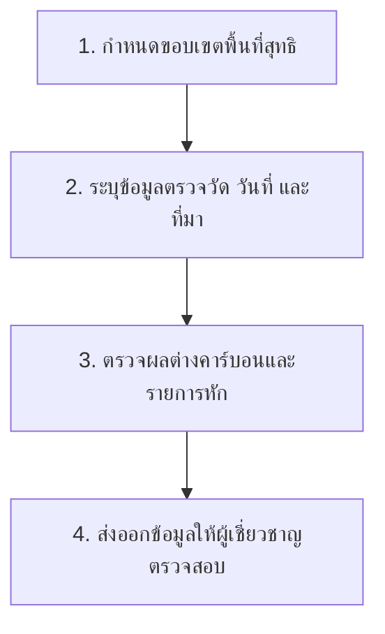
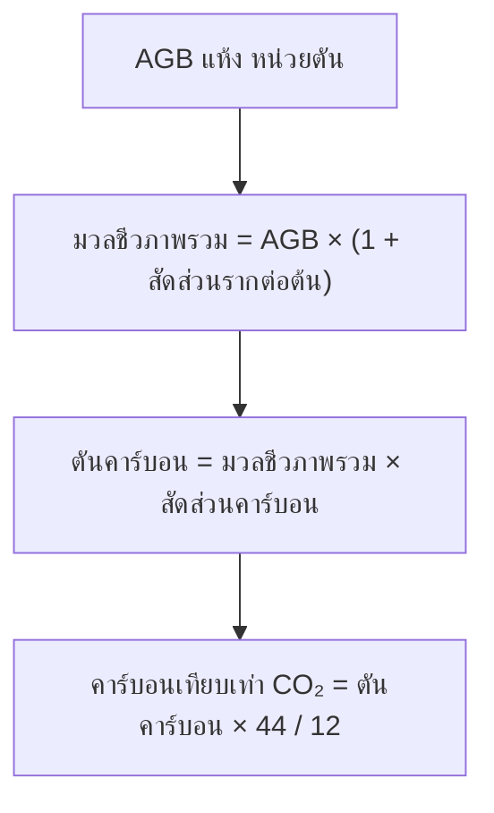
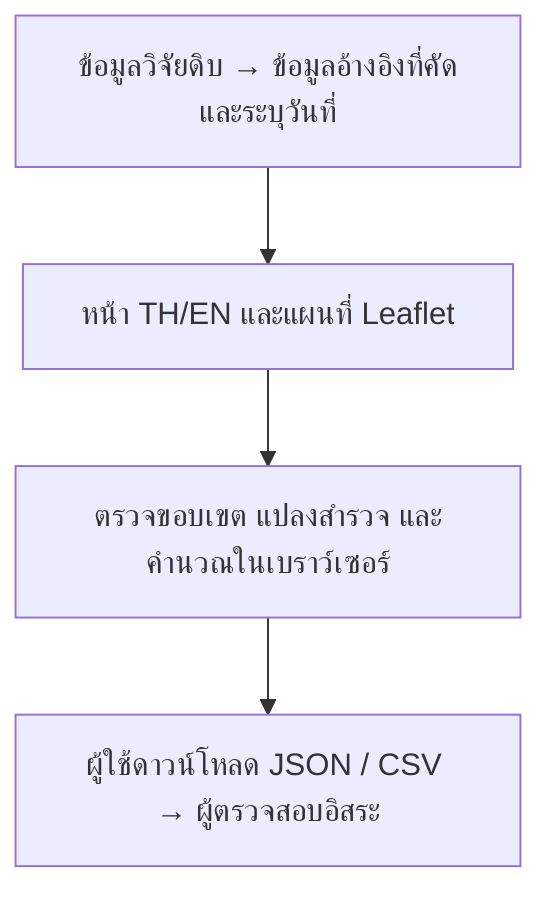

# คู่มือระบบคาร์บอนป่าไม้ประเทศไทย

## ระบบนี้ใช้ทำอะไร

เครื่องมือภาษาไทยและอังกฤษสำหรับประเมินคาร์บอนจากข้อมูลที่ผู้ใช้ระบุ ใช้ตรวจขอบเขตพื้นที่ คำนวณผลต่างของคาร์บอน และส่งออกหลักฐานให้ผู้เชี่ยวชาญตรวจสอบ ระบบนี้เป็นงานสาธิตอิสระ **ไม่ได้ออกคาร์บอนเครดิต ไม่รับรองสิทธิในที่ดิน และยังไม่มีแบบจำลอง AI ที่ผ่านการตรวจสอบเชื่อมต่อ**

**เว็บไซต์:** [เปิดเครื่องมือ](https://forest-carbon-thailand.pages.dev/?lang=th) · **ซอร์สโค้ด:** [Nonarkara/carbon](https://github.com/Nonarkara/carbon)

หน้าเริ่มต้นเป็นภาษาไทย เปลี่ยนเป็น **EN** ได้โดยข้อมูลที่กรอกยังอยู่ ระบบเปิดที่ **แผนที่คาร์บอน** ก่อน โทรศัพท์ใช้แถบนำทางด้านล่างเพื่อสลับแผนที่ คาร์บอน พื้นที่โครงการ คำนวณ หลักฐาน และแหล่งข้อมูล บนคอมพิวเตอร์จะแสดงแผนที่และแผงข้อมูลคู่กัน



## แผนที่คาร์บอน: การดูดซับและการปล่อยรายจังหวัดหรือตามกรอบ

แผนที่คาร์บอนเป็นหน้าแรกของระบบ ตอบคำถามระดับภูมิทัศน์จากผลิตภัณฑ์ข้อมูลดาวเทียมที่เผยแพร่แล้ว และไม่ถูกนำไปใช้ในการคำนวณโครงการด้านล่าง

1. **เลือกพื้นที่** แตะจังหวัดบนแผนที่ เลือกจากรายการด้านบน หรือกด **วาดกรอบบนแผนที่** แล้วลากบนแผนที่ (ใช้นิ้วได้ ระหว่างวาดแผนที่จะไม่เลื่อน) ปุ่ม **ใช้ขอบเขตโครงการ** รวมค่าในขอบเขตที่นำเข้าในแท็บพื้นที่โครงการ ปุ่ม **ทั้งประเทศ** กลับสู่ภาพรวมประเทศ
2. **อ่านตัวเลขหลักสี่ตัว** พื้นที่ที่เลือก คาร์บอนสะสมในป่า (tCO₂e จาก ESA CCI Biomass v7.0 ปี 2020 นิยามป่าตาม JAXA FNF 2020) พร้อมช่วง 95% การดูดซับและการปล่อยของป่าต่อปี (Global Forest Watch flux v1.4.3 เฉลี่ย 2001–2025)
3. **อ่านบัญชีในแผงด้านข้าง** ด้านสะสมและดูดซับก่อน ตามด้วยด้านปล่อย ได้แก่ การสูญเสียป่า (GFW) ไฟทุกประเภทในภูมิทัศน์ (GFED5.1 เฉลี่ย 2013–2022 พร้อมกราฟรายเดือนและสัดส่วนตามประเภทพื้นที่) และ CO₂ จากเชื้อเพลิงฟอสซิลทุกภาคส่วน (ODIAC2025 ปี 2024) ระดับจังหวัดมีข้อมูลตรวจเทียบจาก Climate TRACE ปี 2024 ระดับประเทศมีบัญชี BTR1 ของไทยปี 2022
4. **อย่านำแถวมารวมกัน** แต่ละแถวมีชุดข้อมูล ปี และวิธีการของตัวเอง ค่าสุทธิที่แสดงมีเพียงค่าของ GFW (ปล่อย − ดูดซับ) ค่าติดลบหมายถึงป่าเป็นแหล่งดูดซับสุทธิ
5. **ชั้นข้อมูล** ส่วน *ชั้นข้อมูล* แสดงความหนาแน่นคาร์บอนในป่า แผนที่ป่าของ JAXA หรือค่าสุทธิรายจังหวัด ส่วน *บรรยากาศ* แสดงภาพจาก NASA GIBS ได้แก่ ละอองลอย จุดความร้อน คาร์บอนมอนอกไซด์ หรือ CO₂ ในคอลัมน์อากาศตามวันที่เลือก ข้อมูลกลุ่มนี้เป็นความเข้มข้นหรือการตรวจพบ ไม่ใช่ปริมาณการปล่อย และไม่ถูกแปลงเป็นตัวเลข
6. **ส่งออก** *ส่งออก JSON* เก็บแถวข้อมูลพร้อมรุ่นชุดข้อมูล ค่าแปลงหน่วย และผลตรวจการอนุรักษ์ผลรวม *ส่งออก CSV* เก็บแถวข้อมูลพร้อมช่วงความไม่แน่นอนทั้งสองแบบ

ข้อจำกัดที่เห็นบนหน้าจอ: กรอบนับเฉพาะพื้นที่บกในไทย ชุดข้อมูลที่หยาบกว่ากรอบจะถูกทำให้จาง (ไฟ 28 กม. ฟอสซิล 1 กม.) และฟลักซ์ของ GFW ภายในกรอบที่วาดจะแสดงว่า *ยังไม่ได้นำเข้า* เพราะกริด 30 เมตรต้องใช้คีย์ API ปุ่ม **เกี่ยวกับ** ด้านบนเปิดคำอธิบายพร้อมภาพประกอบภายในแอปโดยข้อมูลที่กรอกไว้ไม่หาย ส่วน[สมุดงานวิจัย หัวข้อ 06](research-th.html#section-6) อธิบายวิธีการ แหล่งข้อมูล และการตรวจสอบทั้งหมดแบบละเอียด

## 1. ทดลองใช้งานครบขั้นตอน

1. เลือก **พื้นที่โครงการ → ลองข้อมูลตัวอย่าง** ระบบจะแสดงขอบเขตสมมติใกล้สระบุรี ขอบเขตและค่ามวลชีวภาพนี้ไม่ได้แทนโครงการที่ขึ้นทะเบียนจริง
2. เลือก **คำนวณ** ตัวอย่างใช้มวลชีวภาพเหนือดินแห้งตั้งต้น 1,000 ตัน และเมื่อติดตามผล 1,100 ตัน ใช้ค่าสัดส่วนรากต่อต้น 0.27 และสัดส่วนคาร์บอน 0.47 พร้อมสถานะไม่มีไฟเรือนยอดและพื้นที่ไหม้เป็นศูนย์
3. กด **คำนวณผลประเมิน** ผลต่างที่คาดหวังคือ **218.86 tCO₂e** ก่อนรายการหักที่เกี่ยวข้อง ค่าที่ยังไม่ปัดเศษคือ 218.863333… ส่วนค่าเฉลี่ยต่อปีใช้จำนวนวันจริงหารด้วย 365.25 ไม่ใช่เครดิตอีกชุดหนึ่งที่นำไปนับซ้ำได้
4. กด **ส่งออกผล JSON** เพื่อเก็บข้อมูลนำเข้า วันที่ สูตร ขอบเขต และสถานะยังไม่ทวนสอบ กด **ส่งออกตาราง CSV** เมื่อต้องการตารางตัวเลขย่อ ควรเก็บ JSON ไว้เป็นหลักฐานฉบับเต็มด้วย
5. กด **เริ่มใหม่** ก่อนประเมินโครงการจริง หากแก้ค่าจากตัวอย่าง ระบบยังคงป้ายข้อมูลสมมติไว้จนกว่าจะเริ่มใหม่

## 2. เตรียมและนำเข้าขอบเขต

รองรับ GeoJSON แบบ Polygon, MultiPolygon, Feature และ FeatureCollection ที่ใช้พิกัด **WGS84 ลองจิจูด/ละติจูด** ลำดับต้องเป็น `[ลองจิจูด, ละติจูด]` หากมีไฟล์ shapefile ที่ใช้ UTM ให้แปลงระบบพิกัดใน GIS แล้วส่งออก GeoJSON ก่อน การเปลี่ยนนามสกุลไฟล์ไม่ใช่การแปลงพิกัด

ข้อจำกัดปัจจุบันคือไฟล์ไม่เกิน 2 MB ไม่เกิน 50 features และไม่เกิน 20,000 จุดพิกัด พิกัดต้องอยู่ในกรอบตรวจสอบ 97–106°E และ 5–21°N กรอบนี้ใช้ตรวจค่าพิกัดเบื้องต้น **ไม่ได้พิสูจน์ว่าพื้นที่อยู่ในประเทศไทยตามกฎหมาย** ระบบปฏิเสธขอบเขตว่าง วงแหวนไม่ปิด เส้นตัดกันเอง ช่องว่างภายในรูปที่ไม่ถูกต้อง และรูปหลายเหลี่ยมที่ซ้อนกัน แต่ยอมให้รูปที่มีเพียงขอบติดกันได้

หักแหล่งน้ำ สิ่งปลูกสร้าง และพื้นที่ที่ไม่นำมาประเมินออกใน GIS ก่อนนำเข้า ใช้ช่องว่างภายในรูปหรือ holes เพื่อระบุพื้นที่กันออกได้

```json
{
  "type": "Feature",
  "properties": {"name": "ขอบเขตสมมติ"},
  "geometry": {
    "type": "Polygon",
    "coordinates": [[[100.95,14.60],[100.96,14.60],[100.96,14.61],[100.95,14.61],[100.95,14.60]]]
  }
}
```

ระบบคำนวณพื้นที่จากรูปทรงบนผิวโลกเพื่อใช้อ้างอิง โดย **1 เฮกตาร์ = 6.25 ไร่ และ 1 ไร่ = 1,600 ตารางเมตร** ขอบเขตที่แสดงไม่ยืนยันกรรมสิทธิ์ สิทธิในคาร์บอน ประเภทป่า หรือการซ้อนทับกับโครงการที่ขึ้นทะเบียนอื่น หากเปลี่ยนขอบเขต ระบบจะยกเลิกผลขยายค่าจากแปลงเดิม เพราะพื้นที่ประเมินเปลี่ยนไป

แผนที่ถนนและภาพพื้นหลังใช้ระบุตำแหน่งเท่านั้น ระบบไม่ได้ระบุวันถ่ายภาพ จึงห้ามใช้ภาพพื้นหลังแทนหลักฐานวันที่ติดตามผล หากแผนที่บางส่วนโหลดไม่ได้ ระบบจะแจ้ง และยังใช้ขอบเขตกับเครื่องคำนวณได้

## 3. เลือกหน่วยนำเข้าให้ถูกต้อง

| ตัวเลือก | ค่าที่ต้องกรอก | วิธีแปลง |
|---|---|---|
| มวลชีวภาพเหนือดินแห้ง | AGB แห้งรวม **หน่วยตันของพื้นที่โครงการสุทธิทั้งหมด** ณ แต่ละวันที่ตรวจวัด | เพิ่มมวลรากตามสัดส่วน คูณสัดส่วนคาร์บอน และคูณ 44/12 |
| คาร์บอนต้นไม้รวมเหนือ/ใต้ดิน | ค่าที่คำนวณเป็น **tCO₂e** แล้ว ณ แต่ละวันที่ตรวจวัด | ใช้ค่าโดยตรง ไม่เพิ่มรากหรือแปลง 44/12 ซ้ำ |

ห้ามนำหน่วยกิโลกรัม ตันต่อเฮกตาร์ ตันคาร์บอน หรือค่า NDVI มาใส่ในช่องนี้โดยตรง หากเป็นความหนาแน่นมวลชีวภาพต้องขยายค่าตามพื้นที่ที่ตรงกันก่อน หากเป็นตันคาร์บอนหรือ tC ต้องแปลงเป็น tCO₂e หรือใช้วิธีนำเข้ามวลชีวภาพที่เหมาะสม

ระบุวันที่ฐานหรือ **วันที่ได้รับการรับรองครั้งล่าสุด** และวันที่ติดตามผลใหม่ การย้อนใช้ฐานเดิมหลังจากช่วงหนึ่งได้รับเครดิตแล้วอาจทำให้นับการเติบโตซ้ำ ระบุชื่อรายงานหรือแหล่งข้อมูลในช่องที่มา เมื่อแก้ค่าทางบัญชี ระบบจะล้างผลคำนวณ ต้องคำนวณใหม่ก่อนส่งออก



ค่าที่ระบบเตรียมให้ตามกลุ่มคือ พรรณไม้ทั่วไป 0.27/0.47 โกงกาง 0.48/0.4715 และปาล์ม 0.41/0.413 เป็นค่าที่ อบก. แนะนำสำหรับกลุ่มนั้น ไม่ใช่ค่าคงที่เดียวสำหรับทุกสภาพป่า แบบฟอร์มนี้ใช้กลุ่มพารามิเตอร์เดียวกันทั้งสองวันที่ประเมิน โครงการหลายกลุ่มพรรณไม้ควรคำนวณแยกชั้นภูมิอย่างมีเหตุผลก่อนรวมผล

สูตรผลต่างที่อ้างอิงคือ:

`CSEQ = CTT(t) − CTT(i) − PE − GHG_LEAK`

โดย CTT(t) เป็นค่าติดตามผล CTT(i) เป็นฐานหรือครั้งล่าสุดที่รับรอง ส่วน PE เป็นการปล่อยจากการเผาชีวมวลตามที่วิธีกำหนด วิธี Standard 13-01 v2 ไม่พิจารณา leakage ห้ามนำข้อกำหนดนี้ไปใช้แทน P-REDD+ หรือ Premium T-VER

ระบบให้กรอก PE เมื่อพื้นที่ไหม้เกิน 5% และไฟเรือนยอดทำให้ไม้ตาย ต้องนำผลประเมิน CH₄/N₂O ที่ตรวจสอบแล้วพร้อมแหล่งอ้างอิงมาใช้ ไม่สามารถคำนวณจากพื้นที่ไฟไหม้เพียงค่าเดียว หากยังไม่ประเมินสถานะไฟป่า ระบบจะไม่คำนวณ หากคาร์บอนลดลงจะแสดงค่าติดลบ ส่วนผลที่เกิน 16,000 tCO₂e/ปีจะแจ้งให้ทบทวนเกณฑ์ขนาดและวิธีที่ใช้ ไม่เลือกวิธีใหม่ให้อัตโนมัติ

อ่านเงื่อนไขฉบับเต็มที่ [วิธีการปลูกป่าอย่างยั่งยืน v2](https://tver.tgo.or.th/database/Uploads/Methodology/482ce748-b43f-4432-aef8-d7745dcc2692.pdf) และ [เครื่องมือคำนวณต้นไม้ v2](https://tver.tgo.or.th/database/Uploads/Tool/c575f516-1f3c-4dbc-83ec-2ab65e1d76dc.pdf) ระบบนี้คำนวณเส้นทางประเมินเบื้องต้น ไม่ได้ครอบคลุมทุกเงื่อนไขการขึ้นทะเบียนและขอรับรอง

## 4. นำเข้าข้อมูลต้นไม้จากแปลงสำรวจ

รุ่นนี้รองรับ **ป่าเบญจพรรณหรือป่าเต็งรังชั้นภูมิเดียว** ด้วยสมการ Ogawa (1965) ตามภาคผนวก TGO v2 ระบบไม่ได้จำแนกชนิดต้นไม้หรือประเภทป่าให้อัตโนมัติ

1. นำเข้าขอบเขตสุทธิโครงการก่อน
2. เปิด **หลักฐาน** และยืนยันประเภทป่าที่รองรับกับความเป็นตัวแทนของแปลง
3. นำเข้าไฟล์ CSV แบบ UTF-8 ไม่เกิน 2 MB และ 10,000 แถว ใช้ไฟล์ตัวอย่างที่ดาวน์โหลดได้เพื่อตรวจรูปแบบ โดยตัวเลขในไฟล์นั้นเป็นข้อมูลสมมติ

```csv
plot_id,tree_id,plot_area_m2,dbh_cm,height_m
P01,T01,1600,20,15
P01,T02,1600,30,20
P02,T01,1600,25,18
```

DBH ใช้หน่วย **เซนติเมตร** ความสูงใช้ **เมตร** พื้นที่แปลงใช้ **ตารางเมตร** ให้ใส่พื้นที่แปลงซ้ำในทุกแถวของต้นไม้แปลงเดียวกัน ระบบจะนับพื้นที่แต่ละแปลงครั้งเดียว รหัสต้นไม้ต้องไม่ซ้ำภายในแปลงเดียวกัน รหัสแปลงต้องแทนพื้นที่สำรวจคนละแปลงจริง CSV นี้ไม่มีพิกัด จึงตรวจความเป็นอิสระทางพื้นที่ของการสุ่มไม่ได้

รุ่นนี้ยังแทนแปลงที่ไม่มีต้นไม้ไม่ได้ **ห้ามตัดแปลงว่างออกเพื่อให้ไฟล์ผ่าน** หากมีแปลงว่าง ให้คำนวณภายนอกด้วยวิธีที่รวมแปลงว่างอย่างถูกต้อง

สมการใช้ `x = DBH² × ความสูง`, `ลำต้น = 0.0396 × x^0.933`, `กิ่ง = 0.00349 × x^1.030`, `ใบ = 1 / (28/(ลำต้น+กิ่ง) + 0.025)` โดยได้มวลแห้งเป็นกิโลกรัม ระบบแปลงเป็นตัน รวมมวล AGB หารด้วยพื้นที่สำรวจ แล้วคูณพื้นที่โครงการหน่วยเฮกตาร์ เป็นการขยายค่าแบบถ่วงด้วยพื้นที่ภายใต้สมมติฐานแปลงเป็นตัวแทน ไม่ใช่สิ่งทดแทนการออกแบบสำรวจทางสถิติ

กด **ใช้ผลแปลงเป็นค่าติดตามผล** แล้วระบุฐานที่สอดคล้องกันแยกต่างหาก ตัวนำเข้านี้ไม่รวมต้นไม้ DBH ต่ำกว่า 4.5 ซม. ไม้หนุ่ม ไผ่ ไม้ตาย เศษซากพืช และคาร์บอนในดิน อีกทั้งยังไม่มีค่าความไม่แน่นอน หากประเภทป่าหรือวิธีสำรวจต่างออกไป ให้คำนวณด้วยวิธีที่เหมาะสมภายนอกแล้วนำค่ารวมที่ตรวจสอบแล้วมาใช้

## 5. อ่านข้อมูลอ้างอิงอย่างไร

หน้าแหล่งข้อมูลแสดงสถิติจังหวัด เอกสาร TGO และลิงก์ผลิตภัณฑ์ดาวเทียม ระบบบรรจุ **11 ระเบียนจังหวัด-ปี** ของสระบุรีและกาญจนบุรีถึงปี 2567 ข้อมูลนี้เป็นบริบทพื้นที่ป่าในอดีต ไม่ใช่มวลชีวภาพรายแปลง คุณสมบัติโครงการ หรือเครดิต

งานวิจัยใน repository มีข้อมูลรายการ 570 ชุดข้อมูล และ 2,111 ทรัพยากรจากการค้นคำว่า “ป่าไม้” ใน data.go.th เมื่อ 25 กันยายน 2569 บางไฟล์เป็นเพียง metadata หรือลิงก์ และบางตารางถูกกันออกเพราะหน่วยไม่สอดคล้อง อ่าน `RESEARCH.md` และ download manifest ก่อนนำกลับมาใช้ วันที่ปรับปรุงรายการและสัญญาอนุญาตบันทึกตามต้นทาง หากสัญญาอนุญาตขัดกันหรือจำกัดการดัดแปลง ต้องตรวจให้ชัดก่อนเผยแพร่ข้อมูลต่อ

JAXA ช่วยด้านการคัดกรองป่าและตัวแปรเรดาร์ GEDI ให้ตัวอย่างประมาณมวลชีวภาพพร้อมข้อมูลคุณภาพและความคลาดเคลื่อน ขั้น AI ในอนาคตต้องมีข้อมูลภาคสนามกับภาพดาวเทียมที่ตรงกัน การทดสอบกับแปลงอิสระ และการรับรองวิธีที่เกี่ยวข้อง รุ่นนี้ยังไม่มีการรันโมเดลที่ฝึกแล้ว

## 6. ความเป็นส่วนตัวและหลักฐาน

ข้อมูลนำเข้าอยู่ในหน่วยความจำของเบราว์เซอร์ ไม่มีจุดรับอัปโหลด ไม่มี analytics ไม่มี localStorage และไม่มีการสำรองให้อัตโนมัติ เมื่อรีเฟรชหรือปิดหน้าข้อมูลจะหาย ให้ส่งออก JSON และขอบเขตก่อนออกจากระบบ ผู้ให้บริการแผนที่ได้รับคำขอแผ่นภาพตามพื้นที่ที่เปิดดู และ Cloudflare ได้รับคำขอเว็บไซต์ตามปกติ การคำนวณในเบราว์เซอร์ไม่ได้ปิดการรับส่ง metadata เหล่านี้

ไฟล์ส่งออกฉบับเต็มเก็บชื่อไฟล์นำเข้าและ SHA-256 ส่วนข้อมูลกรอกเองมีป้ายระบุที่มา ไฟล์ส่งออกสามารถแก้ไขได้ ไม่ใช่เอกสารรับรองที่ลงลายมือชื่อดิจิทัล ก่อนนำผลไปใช้ภายนอกต้องตรวจที่มา หน่วย ช่วงเวลา ความไม่แน่นอน สิทธิที่ดิน และคุณสมบัติโครงการ ระบบไม่มีราคาซื้อขาย การชำระเงิน การเขียนข้อมูลเข้าทะเบียน หรือการออกเครดิตอย่างเป็นทางการ

## 7. ติดตั้ง ทดสอบ และเผยแพร่

ต้องมี Node.js 22 ขึ้นไป npm และ Git ส่วนสิทธิ Cloudflare/Wrangler ใช้เฉพาะตอนเผยแพร่

```bash
git clone https://github.com/Nonarkara/carbon.git
cd carbon
npm ci
npm run build
npm test
npm run dev
```

เปิด `http://127.0.0.1:8788` เซิร์ฟเวอร์เปิดให้เข้าถึงเฉพาะ **public/** ไม่เปิดแฟ้มวิจัยดิบหรือข้อมูลรับรองสิทธิ

```bash
npx playwright install chromium
npm run test:browser
npx wrangler login
npm run deploy
```

ทดสอบเว็บจริงด้วย `BASE_URL=https://forest-carbon-thailand.pages.dev npm run test:browser` ใช้ Cloudflare Pages project ชื่อ `forest-carbon-thailand` และอัปโหลดโฟลเดอร์ `public/` ตาม `wrangler.toml`

การเผยแพร่ใช้ Direct Upload ดังนั้น **git push เพียงอย่างเดียวไม่ทำให้เว็บเปลี่ยน** หลัง commit/push ให้รันคำสั่ง deploy แล้วตรวจ `/version.json` พร้อมทดลองนำเข้า คำนวณ และส่งออกบนเว็บจริง รหัสรุ่นเป็น Git commit ที่ใช้ตอน build

CI ตรวจ build และการทดสอบบัญชี/นำเข้า Dependabot เสนออัปเดต dependencies เก็บ token ในตัวแปรสภาพแวดล้อมหรือ platform secrets เท่านั้น ห้ามใส่ในหน้าเว็บหรือ repository นโยบายความปลอดภัยอยู่ใน `public/_headers` หากเพิ่มบริการภายนอกต้องปรับนโยบายและคำอธิบายความเป็นส่วนตัวให้ตรงกับสิ่งที่ทำจริง

## 8. โครงสร้างระบบสำหรับผู้พัฒนา



| ตำแหน่ง | หน้าที่ |
|---|---|
| `public/js/carbon.js` | ตรวจตัวเลข ขยายค่าจากแปลง คำนวณคาร์บอนและผลต่าง |
| `public/js/ledger.js` | คณิตศาสตร์ของแผนที่คาร์บอน: ผลรวมกริด สัดส่วนกรอบ ช่วงความไม่แน่นอน แถวบัญชี (ฟังก์ชันล้วน มีการทดสอบ) |
| `public/js/landscape.js` | หน้าจอแผนที่คาร์บอน: ชั้นจังหวัด การวาดกรอบ ชั้นข้อมูล ชั้นบรรยากาศ และการส่งออก |
| `scripts/ingest/` | ขั้นตอน Python แบบออฟไลน์: `fetch.py` ดาวน์โหลดพร้อมค่าแฮช `build_ledger.py` สร้าง `public/data/ledger/` |
| `src/geometry.js` | ตรวจรูปทรง ขอบเขต และการซ้อนทับด้วย Turf |
| `public/js/imports.js` | อ่าน CSV/ไฟล์แบบจำกัดขนาด และคำนวณ SHA-256 |
| `public/js/app.js` | สถานะระหว่างใช้งาน แบบฟอร์ม แผนที่ และส่งออก |
| `public/js/i18n.js` | ข้อความภาษาไทยและอังกฤษ |
| `public/css/malaysia.css` | รูปแบบอ้างอิง Malaysia ที่เก็บไว้ |
| `public/css/app.css` | ส่วนคาร์บอน ฟอนต์ไทย และหน้าจอหลายขนาด |
| `docs/GUIDE.*.md` | ต้นฉบับคู่มือ แผนภาพ Mermaid แสดงบน GitHub |
| `scripts/build.mjs` | รวม geometry module เตรียมฟอนต์ คู่มือ และรหัสรุ่น |
| `tests/` | ทดสอบสูตรและการปฏิเสธข้อมูลผิด |
| `research/` | งานวิจัย ที่มา ข้อมูลที่กันออก และหลักฐานการดึงข้อมูล |

ปรับปรุงข้อมูลแผนที่คาร์บอน: `python3 -m venv .venv && .venv/bin/pip install -r scripts/ingest/requirements.txt` แล้วรัน `.venv/bin/python scripts/ingest/fetch.py` (ประมาณ 5 GB ลงใน `research/raw/landscape/` ซึ่งไม่เก็บใน git) และ `.venv/bin/python scripts/ingest/build_ledger.py` (ประมาณ 3 นาที ใช้หน่วยความจำราว 40 GB) ขั้นตอนนี้จะหยุดทันทีหากผลรวมรายจังหวัด รายช่องกริด และระดับประเทศไม่ตรงกันในปริมาณใด หรือพื้นที่บกต่างจากตัวเลขทางการเกิน 1% จากนั้นรัน `npm test`

ก่อนพัฒนาต่อให้อ่าน `context.md`, `IMPLEMENTATION_PLAN.md` และ `RESEARCH.md` รักษารูปแบบ Malaysia และป้ายที่มา/วันที่/คุณภาพทุกจุด เป้าหมายถัดไปคือคำนวณโครงการที่มีการตรวจวัดอิสระให้ได้ผลตรงกันพร้อมประเมินความไม่แน่นอน ก่อนขยายเป็นระบบ AI ระดับประเทศ


## เริ่มจากแผนที่

เปิด [carbon.nonarkara.org](https://carbon.nonarkara.org) แล้วเลือกจังหวัด หรือกดลูกศรเลือกพื้นที่ ลากกรอบหรือแตะมุมตรงข้ามสองจุด แล้วดูตัวเลขแทนค่าในสมการ กด Escape เพื่อยกเลิก ข้อมูลที่ยังไม่มีจะไม่แสดงเป็นศูนย์

พืชพรรณแสดงพื้นที่ป่าจาก JAXA ละอองลอยแสดงอนุภาคในบรรยากาศ ไม่ใช่ CO2 สองชั้นข้อมูลนี้ไม่ได้ออกเครดิตโดยอัตโนมัติ ปุ่มงานวิจัยรวมคำอธิบาย ภาพประกอบ และประวัติผู้พัฒนา เครื่องมือโครงการ T-VER ยังใช้ข้อมูลภาคสนามได้

คอลัมน์ข้อมูลโลกแสดงแหล่งข้อมูล วันที่ และสถานะข้อมูลสำรอง โทรศัพท์มีแท็บข้อมูลโลก ราคาประมูลรายไตรมาสและบัญชีรายปีไม่ใช่ข้อมูลเรียลไทม์

ความละเอียดพื้นที่เลือก: ข้อมูลฟอสซิล ODIAC ต้นทางประมาณ 1 กม. แต่ระบบนี้รวมข้อมูลเป็นเซลล์ประมาณ 2.8 กม. ค่าที่คำนวณจากเซลล์จะไม่แสดงสำหรับพื้นที่ต่ำกว่าความละเอียดที่ให้บริการ ส่วนไฟยังใช้ข้อจำกัด 28 กม. ข้อมูลส่งออกรวม GeoJSON ของขอบเขต และค่าที่งดแสดงจะเป็น null
