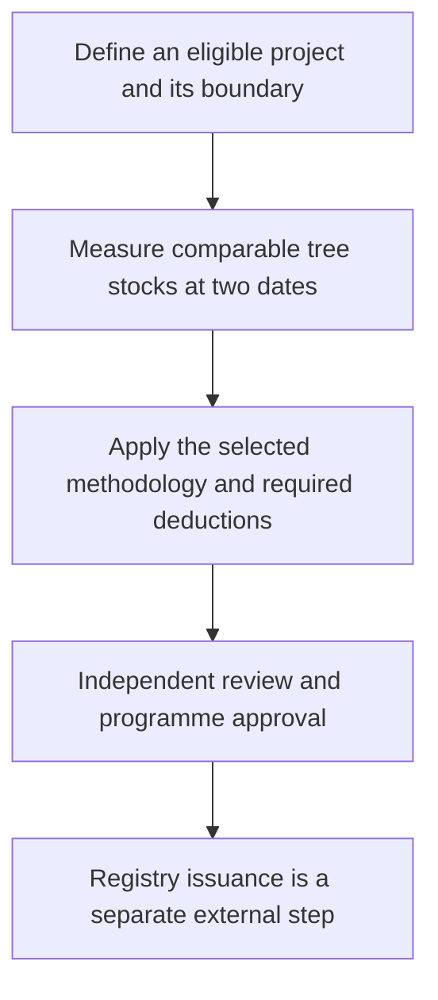
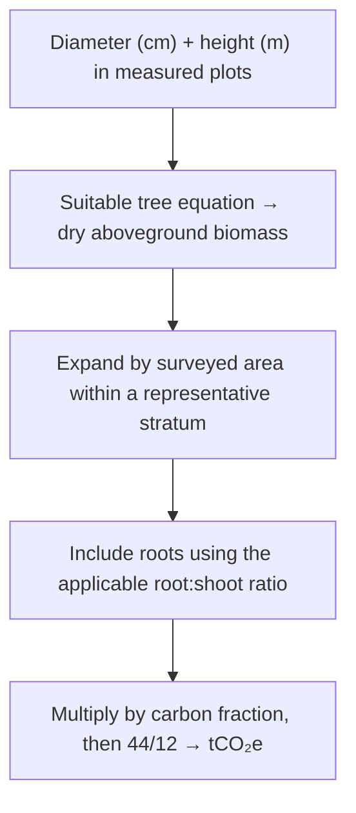
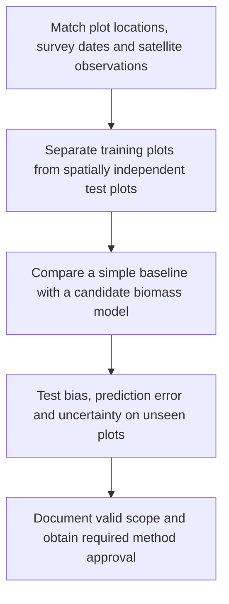
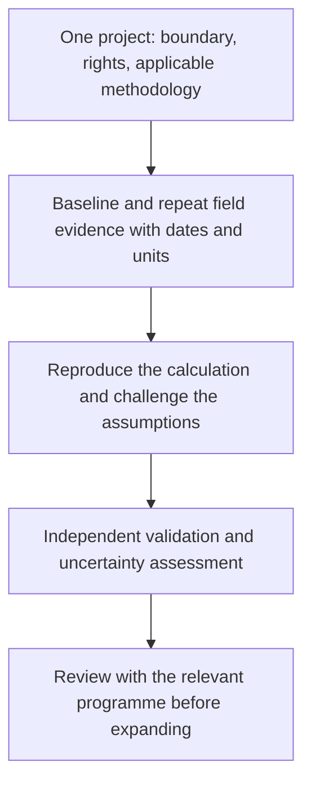

Research notebook · Thailand · 25 September 2026

# A forest worth caring for. Evidence worth trusting.

A practical case for using AI, satellites and field measurements to make forest carbon understandable—and every estimate open to scrutiny.

A person can spend years protecting a forest and still struggle to prove what that work has achieved. The trees are there. The effort is real. The evidence is scattered across survey sheets, maps, government tables and satellite archives. Turning those pieces into a defensible carbon estimate takes work that a beautiful dashboard cannot wish away.

That is the reason for this project. Make the evidence easier to assemble. Make the calculation easier to question. Give the person in the field and the person reviewing the result a shared view of what is known, what was assumed, and what still needs measuring. Technology earns its place when it makes that conversation more honest.

This independent pilot grew from an enquiry about AI-assisted forest-carbon assessment from Thailand's greenhouse-gas management community. It is a working research instrument, with public code and traceable calculations. No TGO endorsement, approved AI model or credit issuance is claimed.

## 01 · Start with the question that matters

“How much carbon is in this forest?” and “How many credits can this project receive?” require different evidence. A forest can contain a great deal of carbon without that entire stock being available for a new credit claim.

| Quantity | Plain meaning | What this workbench does |
|---|---|---|
| Carbon stock | Carbon held in the included tree pools at a date, expressed here as tCO₂e | Converts supplied biomass or accepts a compatible total tree-stock estimate |
| Monitoring-period change | The difference between comparable dates, after applicable deductions | Calculates a signed estimate from the supplied inputs |
| Issued credits | Units approved and recorded through the relevant programme | No registry connection; never inferred from the estimate |

The order matters. Drawing a polygon establishes a calculation area; it does not establish land rights. Finding trees establishes vegetation; it does not establish additionality, meaning the benefit required beyond the applicable baseline. A registration count is administrative evidence, not proof that the same carbon has never been claimed elsewhere.

## 02 · Follow one tonne through the calculation

Trees are measured before they become numbers on a carbon ledger. Diameter and height feed an **allometric equation**: a relationship developed from measured trees to estimate dry biomass. “Dry” matters because water adds weight without adding the carbon being estimated. The equation must fit the forest and tree group.

The current importer supports the TGO appendix equation for mixed deciduous and dry dipterocarp trees, with DBH at least 4.5 cm. It estimates aboveground biomass from measured trees, then expands the plot total by surveyed area under a single representative-stratum assumption. It does not prove that the sampling design is representative. Empty plots cannot be represented by the current CSV format; do not quietly drop them. See the [user guide](guide-en.html) for coefficients, units and exclusions.

For the general-tree factors in [TGO tree tool v2](https://tver.tgo.or.th/database/Uploads/Tool/c575f516-1f3c-4dbc-83ec-2ab65e1d76dc.pdf), roots are estimated at 0.27 times aboveground biomass and the carbon fraction is 0.47. The factor 44/12 converts carbon mass to the corresponding CO₂ mass. Other tree groups use other factors. If an input already includes roots or is already in tCO₂e, applying those conversions again inflates the answer.

### A worked example you can reproduce

Assume the same project's dry aboveground biomass rises from **1,000 to 1,100 tonnes**. Keep factors and included pools unchanged. This is synthetic teaching data, not a measured Thai forest.

| Step | Calculation | Result |
|---|---|---:|
| Aboveground increase | 1,100 − 1,000 | 100 t dry biomass |
| Include estimated roots | 100 × 1.27 | 127 t total biomass |
| Convert to carbon | 127 × 0.47 | 59.69 tC |
| Convert to CO₂ | 59.69 × 44/12 | 218.8633 tCO₂ |

This is the stock increase before applicable deductions. For an exactly five-year duration, its average is 43.7727 tCO₂ per year. The app instead divides by elapsed days / 365.25; its sample dates therefore produce a slightly different annual average. Neither average creates five additional claims on top of the period total.

The selected accounting reference is [Standard T-VER-S-METH-13-01 v2](https://tver.tgo.or.th/database/Uploads/Methodology/482ce748-b43f-4432-aef8-d7745dcc2692.pdf): current tree stock minus baseline or last credited stock, minus prescribed project emissions and leakage. This method does not consider leakage, so that term is zero here. Its fire conditions, eligibility and small-project limit must be checked in the full document. Other activities and programme tiers can require different accounting. A loss stays negative; the software must not hide it behind a zero.

## 03 · What the satellite sees—and what it needs from the field

The [JAXA vegetation page](https://earth.jaxa.jp/en/data/products/vegetation/index.html) is a useful starting point. It provides routes to vegetation indices, leaf-area information and forest/non-forest products. These observations describe vegetation. They do not measure issued credits.

NDVI compares red and near-infrared reflectance. It can help describe greenness, but a greener pixel is not a universal quantity of stored carbon. Forest type, season, canopy structure and observation conditions affect interpretation. A model connecting imagery to biomass needs suitable measurements and validation.

| Source | Contribution to a pilot | Limit that travels with the data |
|---|---|---|
| [JAXA PALSAR / PALSAR-2](https://www.eorc.jaxa.jp/ALOS/en/dataset/fnf_e.htm) | Radar predictors and forest screening; approximately 25 m mosaics | Preserve observation dates, masks and processing versions; check download registration and terms |
| [Sentinel-2](https://dataspace.copernicus.eu/data-collections/copernicus-sentinel-missions/sentinel-2) | Optical predictors and cloud-screened change evidence | Compare usable observations with compatible seasons and processing |
| [NASA GEDI L4A v3](https://doi.org/10.3334/ORNLDAAC/2508) | Footprint estimates of aboveground biomass density, prediction errors and quality information | Samples are not a continuous parcel census or error-free field truth |
| Measured field plots | Local evidence for fitting and independently testing a model | Record sampling design, coordinates, dates, species/group and measurement quality |

The imagery products above are research candidates. This release does not download their rasters or run a satellite biomass model. A basemap visible in the workbench is a navigation aid, not evidence that those products have been analysed.

## 04 · Give AI a job it can be tested on

The useful first AI task is specific: predict biomass for a defined forest type from dated observations, then compare those predictions with independent measurements. A language model can help explain a method or flag a missing field. It should not fill a missing biomass value with a plausible sentence.

A tempting shortcut is to split neighboring pixels randomly between training and testing. The test can then reward familiarity with the same landscape. For this pilot, reserve spatially separated plots and inspect error by forest type and biomass range. Compare a simple regression with a candidate such as Random Forest before accepting more complexity. This is a proposed validation design, not a completed experiment.

Uncertainty must follow the calculation. A difference between two uncertain stock maps is itself uncertain. Shared model errors, plot sampling and spatial correlation affect how much confidence to place in the change. Reporting more decimal places does not resolve those errors. The current workbench explicitly exports uncertainty as unavailable; a validated interval remains a prerequisite for a defensible project assessment.

## 05 · Open data: open the file before believing the label

The research search for “ป่าไม้” in data.go.th on **25 September 2026** returned **570 unique dataset records and 2,111 resource records**. These are catalogue counts. They include documents, duplicate-looking resources, file components and links; they are not 570 ready-to-use biomass datasets. Nine selected resource files were downloaded and inspected. The app currently ships 11 normalized province-year observations.

| Source inspected | What was actually found | Decision |
|---|---|---|
| [Saraburi forest area](https://data.go.th/dataset/saraburi-forest-area) | Seven annual observations, 2018–2024; 2024: 532,177.56 rai | Historical province context |
| [Kanchanaburi forest area](https://data.go.th/dataset/forest-area-2567) | Four years, 2021–2024; 2024: 7,478,170.33 rai | Historical province context; checked unit agreement |
| [RFD forest cover 2019](https://data.go.th/dataset/forestarea_2562_wgs84) | ZIP contained metadata only; separate geometry headers were probed | Full geometry not ingested; CRS is UTM 47N, requiring reprojection |
| [DNP conservation-area carbon](https://data.go.th/dataset/gdpublish-67-dnp07-31-02) | Table labelled tCO₂eq without an explicit annual denominator | Do not label it yearly credits |
| [Reserved-forest table](https://data.go.th/dataset/gdpublish-https-www-forest-go-th-land) | Inconsistent area units in an inspected row | Quarantined; no guessed correction |

The full [research record](https://github.com/Nonarkara/carbon/blob/main/RESEARCH.md), [download manifest](https://github.com/Nonarkara/carbon/blob/main/research/extracted/download-manifest.json) and [normalized province data](data/province-forest-area.csv) make these decisions inspectable. A catalogue's “modified” date is not automatically a measurement date. Conflicting or restrictive licences require clarification before reuse.

### The RFD dashboard: a useful lead with a visible discrepancy

The [Royal Forest Department dashboard](https://fp.forest.go.th/rfd_app/rfd_dashboard_m/app/main.php), inspected on 25 September 2026, displayed **83,290 plantation registrants, 83,681 plots, 1,447,111 rai and 139,013,341 trees**. Its regional registration breakdown summed to **83,217 registrants**, a difference of 73. No explicit update date explaining this difference was found during inspection. These are separate observed views; neither has been silently corrected.

The northern drill-down returned 9,480 registrants in Nan and 9,538 in Uttaradit. These counts can inform a discussion about where to seek pilot partners. They cannot establish current living biomass. Public endpoints returned HTML and chart configuration without login; no documented API contract was established. These observations are a dated research snapshot, not a live integration or calculator input.

## 06 · The first pilot should earn the next one

Start with one project whose boundary, rights, methodology and field records can be checked. Agree on the decision first: screening a candidate, estimating stock, or preparing monitoring evidence. Each requires a different level of proof.

A useful pilot pack includes a versioned boundary, the project's registration details where applicable, sampling design, plot measurements at comparable dates, disturbance records, and permission to use the data. If an approved remote-sensing provider is involved, obtain its output definitions, approved scope and uncertainty documentation. An approval held by another platform does not transfer to this application.

The pilot succeeds when another qualified person can reproduce the result, explain its limits and identify the measurements that would change the conclusion. That is a harder target than making the map look convincing. It is also a target worth building for.

## 07 · The person behind the work

<h3>Dr Non Arkaraprasertkul</h3>
Architect, anthropologist and civic-systems builder. His public profile describes architectural training at MIT, anthropology at Harvard, and work in smart-city promotion at Thailand's Digital Economy Promotion Agency (depa).

The connection to forest carbon is a design question: how can complicated evidence become usable by people making decisions? This project applies that question to boundaries, measurements and the public record behind each estimate.

<a href="https://www.nonarkara.org/">Personal website</a> · <a href="https://github.com/Nonarkara">Public projects</a> · <a href="https://www.linkedin.com/in/drnon/">LinkedIn</a>

Portrait source: [RMIT Vietnam's profile](https://www.rmit.edu.vn/research/hubs/rmit-vietnam-smart-and-sustainable-cities-hub/people/dr-non-arkaraprasertkul). Biography checked against that page and the [personal website](https://www.nonarkara.org/) on 25 September 2026. Institutional affiliations provide background; this independent pilot does not claim institutional endorsement. No personal quotation or fieldwork story has been invented for this page.

## 08 · Keep the evidence within reach

The [Thai guide](guide-th.html) and [English guide](guide-en.html) cover actual use, formulas, file formats and deployment. The [source catalogue](data/source-catalog.json) records the supplied references. [Code and tests](https://github.com/Nonarkara/carbon) are public, together with the original research audit. Official documents linked above govern their own methods; this page is an explanation, not a replacement.

Open the workbench, try the clearly labelled synthetic example, and follow a number back to its inputs. Then ask what evidence would be needed to replace that example with a real forest. That is where this work becomes useful.
