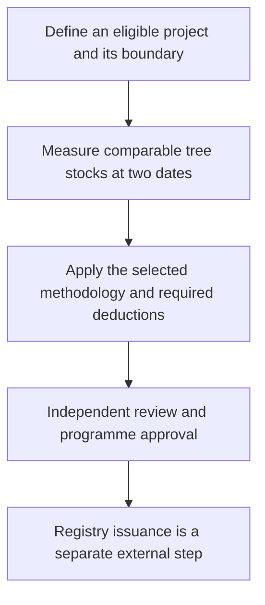
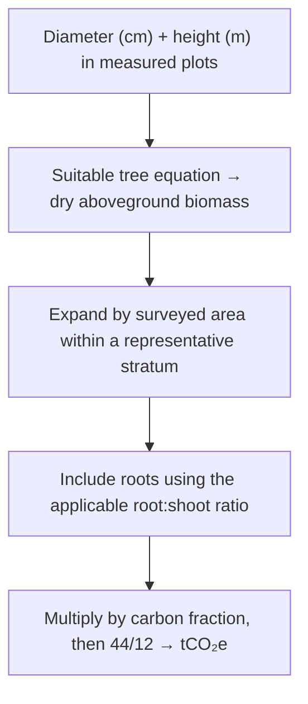
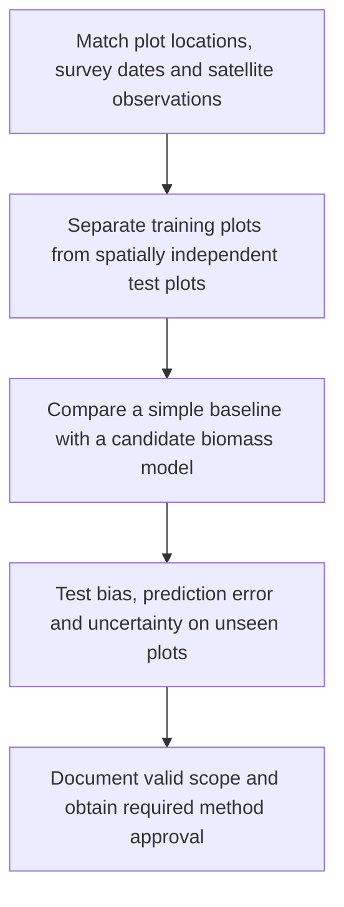
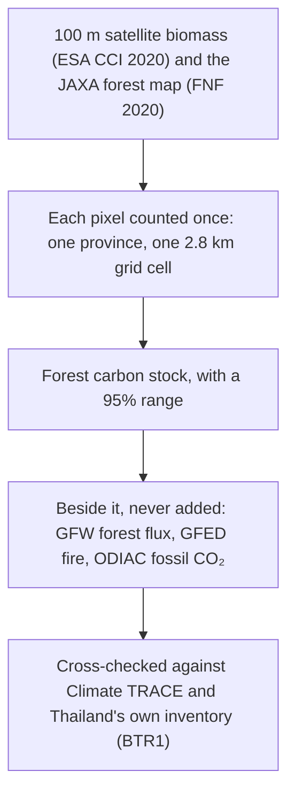
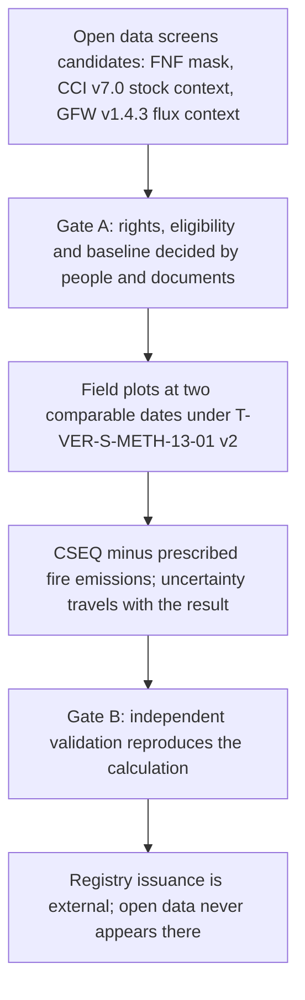
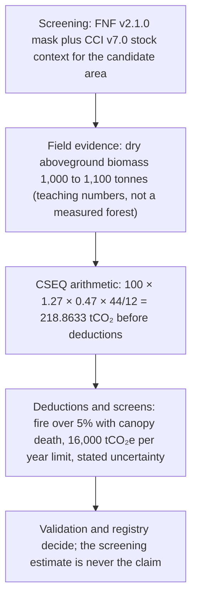
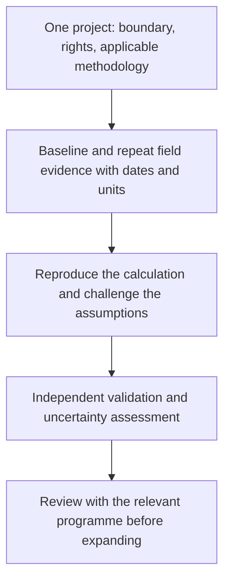

Independent study, written as a short thesis · คาบอนนะ · Thailand · September 2026

# Building a system to calculate a forest carbon footprint from public and open data

Open and public data can weigh a landscape. They cannot mint a credit. This study builds the system that keeps those two sentences apart, and shows every number that results.

This is an independent study in the form of a short thesis. It is not a university submission, not a degree, and not an official TGO assessment. The working system is called คาบอนนะ. The chapters below are the thesis: question, method, evidence, limits, and the design of the public face.

<dl class="thesis">
<dt>Question</dt>
<dd>Can a public system calculate a forest carbon footprint for Thailand from open and public data, at the scale of a province, a drawn box, or a project boundary, without pretending the result is an issued credit?</dd>
<dt>Answer</dt>
<dd>Yes for a landscape account, and only for that. Satellite biomass, a forest mask, forest loss and gain, fire, and fossil CO₂ can be summed inside one boundary and kept in their own units. No, for a single footprint number, and no, for a credit. Stock is not a period flux. A flux is not a fire emission. A fire emission is not fossil CO₂. None of them is a credit TGO has certified.</dd>
<dt>What was built</dt>
<dd>An offline ingest that turns public rasters and tables into a ledger where every 100 m pixel belongs to at most one province and exactly one grid cell, so province totals, the national total, and the grid total match. A browser then answers a province, a box, or an imported boundary at once. A separate workbench applies T-VER-S-METH-13-01 v2 only to numbers the user supplies from the field. TGO’s public T-VER list sits beside the map as context, never as an input.</dd>
<dt>What this does not claim</dt>
<dd>No trained model, no TGO approval, no validation opinion, no issuance. Atmospheric pictures (aerosol, fire detections, carbon monoxide, column CO₂) are concentrations and detections, not an inventory. Verification fees are not in the registry extract, so they are not priced here.</dd>
</dl>

| Thesis part | Where it is argued |
|---|---|
| The question, and why one number is the wrong answer | 01 |
| The calculation, from a measured tree to tCO₂e | 02 |
| What a satellite can see, and what still has to be measured | 03, 06 |
| Where a model is allowed to work | 04 |
| Opening each open dataset before trusting its label | 05 |
| Why open data does not become a credit | 07 |
| What a first pilot has to earn | 08 |
| Who did the work | 09 |
| Where the evidence is kept | 10 |
| TGO’s registry as context, not an input | 11, 12 |
| Why the public name is คาบอนนะ | 13 |

A person can spend years protecting a forest and still struggle to prove what that work has achieved. The trees are there. The effort is real. The evidence is scattered across survey sheets, maps, government tables and satellite archives. Turning those pieces into a defensible carbon estimate takes work that a beautiful dashboard cannot wish away.

That is the reason for this project. Make the evidence easier to assemble. Make the calculation easier to question. Give the person in the field and the person reviewing the result a shared view of what is known, what was assumed, and what still needs measuring. Technology earns its place when it makes that conversation more honest.

The study grew from an enquiry about AI-assisted forest-carbon assessment from Thailand’s greenhouse-gas management community. The code is public and the calculations are traceable. No TGO endorsement, approved AI model, or credit issuance is claimed.

## 01 · Start with the question that matters

“How much carbon is in this forest?” and “How many credits can this project receive?” require different evidence. A forest can contain a great deal of carbon without that entire stock being available for a new credit claim.

| Quantity | Plain meaning | What this workbench does |
|---|---|---|
| Carbon stock | Carbon held in the included tree pools at a date, expressed here as tCO₂e | Converts supplied biomass or accepts a compatible total tree-stock estimate |
| Monitoring-period change | The difference between comparable dates, after applicable deductions | Calculates a signed estimate from the supplied inputs |
| Issued credits | Units approved and recorded through the relevant programme | No registry connection; never inferred from the estimate |

The order matters. Drawing a polygon establishes a calculation area; it does not establish land rights. Finding trees establishes vegetation; it does not establish additionality, meaning the benefit required beyond the applicable baseline. A registration count is administrative evidence, not proof that the same carbon has never been claimed elsewhere.

## 02 · Follow one tonne through the calculation

Trees are measured before they become numbers on a carbon ledger. Diameter and height feed an **allometric equation**: a relationship developed from measured trees to estimate dry biomass. “Dry” matters because water adds weight without adding the carbon being estimated. The equation must fit the forest and tree group.

The current importer supports the TGO appendix equation for mixed deciduous and dry dipterocarp trees, with DBH at least 4.5 cm. It estimates aboveground biomass from measured trees, then expands the plot total by surveyed area under a single representative-stratum assumption. It does not prove that the sampling design is representative. Empty plots cannot be represented by the current CSV format; do not quietly drop them. See the [user guide](guide-en.html) for coefficients, units and exclusions.

For the general-tree factors in [TGO tree tool v2](https://tver.tgo.or.th/database/Uploads/Tool/c575f516-1f3c-4dbc-83ec-2ab65e1d76dc.pdf), roots are estimated at 0.27 times aboveground biomass and the carbon fraction is 0.47. The factor 44/12 converts carbon mass to the corresponding CO₂ mass. Other tree groups use other factors. If an input already includes roots or is already in tCO₂e, applying those conversions again inflates the answer.

### A worked example you can reproduce

Assume the same project's dry aboveground biomass rises from **1,000 to 1,100 tonnes**. Keep factors and included pools unchanged. This is synthetic teaching data, not a measured Thai forest.

| Step | Calculation | Result |
|---|---|---:|
| Aboveground increase | 1,100 − 1,000 | 100 t dry biomass |
| Include estimated roots | 100 × 1.27 | 127 t total biomass |
| Convert to carbon | 127 × 0.47 | 59.69 tC |
| Convert to CO₂ | 59.69 × 44/12 | 218.8633 tCO₂ |

This is the stock increase before applicable deductions. For an exactly five-year duration, its average is 43.7727 tCO₂ per year. The app instead divides by elapsed days / 365.25; its sample dates therefore produce a slightly different annual average. Neither average creates five additional claims on top of the period total.

The selected accounting reference is [Standard T-VER-S-METH-13-01 v2](https://tver.tgo.or.th/database/Uploads/Methodology/482ce748-b43f-4432-aef8-d7745dcc2692.pdf): current tree stock minus baseline or last credited stock, minus prescribed project emissions and leakage. This method does not consider leakage, so that term is zero here. Its fire conditions, eligibility and small-project limit must be checked in the full document. Other activities and programme tiers can require different accounting. A loss stays negative; the software must not hide it behind a zero.

## 03 · What the satellite sees—and what it needs from the field

The [JAXA vegetation page](https://earth.jaxa.jp/en/data/products/vegetation/index.html) is a useful starting point. It provides routes to vegetation indices, leaf-area information and forest/non-forest products. These observations describe vegetation. They do not measure issued credits.

NDVI compares red and near-infrared reflectance. It can help describe greenness, but a greener pixel is not a universal quantity of stored carbon. Forest type, season, canopy structure and observation conditions affect interpretation. A model connecting imagery to biomass needs suitable measurements and validation.

| Source | Contribution to a pilot | Limit that travels with the data |
|---|---|---|
| [JAXA PALSAR / PALSAR-2](https://www.eorc.jaxa.jp/ALOS/en/dataset/fnf_e.htm) | Radar predictors and forest screening; approximately 25 m mosaics | Preserve observation dates, masks and processing versions; check download registration and terms |
| [Sentinel-2](https://dataspace.copernicus.eu/data-collections/copernicus-sentinel-missions/sentinel-2) | Optical predictors and cloud-screened change evidence | Compare usable observations with compatible seasons and processing |
| [NASA GEDI L4A v3](https://doi.org/10.3334/ORNLDAAC/2508) | Footprint estimates of aboveground biomass density, prediction errors and quality information | Samples are not a continuous parcel census or error-free field truth |
| Measured field plots | Local evidence for fitting and independently testing a model | Record sampling design, coordinates, dates, species/group and measurement quality |

The project workbench does not use these products: its numbers come only from the user's own measurements. The carbon map (section 06) does use published satellite products — ESA CCI Biomass and JAXA's forest map among them. It runs no model of its own: it re-grids, masks and converts those products, and its landscape figures never feed a project calculation. The street and imagery basemaps are navigation aids, not evidence.

## 04 · Give AI a job it can be tested on

The useful first AI task is specific: predict biomass for a defined forest type from dated observations, then compare those predictions with independent measurements. A language model can help explain a method or flag a missing field. It should not fill a missing biomass value with a plausible sentence.

A tempting shortcut is to split neighboring pixels randomly between training and testing. The test can then reward familiarity with the same landscape. For this pilot, reserve spatially separated plots and inspect error by forest type and biomass range. Compare a simple regression with a candidate such as Random Forest before accepting more complexity. This is a proposed validation design, not a completed experiment.

Uncertainty must follow the calculation. A difference between two uncertain stock maps is itself uncertain. Shared model errors, plot sampling and spatial correlation affect how much confidence to place in the change. Reporting more decimal places does not resolve those errors. The current workbench explicitly exports uncertainty as unavailable; a validated interval remains a prerequisite for a defensible project assessment.

## 05 · Open data: open the file before believing the label

The research search for “ป่าไม้” in data.go.th on **25 September 2026** returned **570 unique dataset records and 2,111 resource records**. These are catalogue counts. They include documents, duplicate-looking resources, file components and links; they are not 570 ready-to-use biomass datasets. Nine selected resource files were downloaded and inspected. The app currently ships 11 normalized province-year observations.

| Source inspected | What was actually found | Decision |
|---|---|---|
| [Saraburi forest area](https://data.go.th/dataset/saraburi-forest-area) | Seven annual observations, 2018–2024; 2024: 532,177.56 rai | Historical province context |
| [Kanchanaburi forest area](https://data.go.th/dataset/forest-area-2567) | Four years, 2021–2024; 2024: 7,478,170.33 rai | Historical province context; checked unit agreement |
| [RFD forest cover 2019](https://data.go.th/dataset/forestarea_2562_wgs84) | ZIP contained metadata only; separate geometry headers were probed | Full geometry not ingested; CRS is UTM 47N, requiring reprojection |
| [DNP conservation-area carbon](https://data.go.th/dataset/gdpublish-67-dnp07-31-02) | Table labelled tCO₂eq without an explicit annual denominator | Do not label it yearly credits |
| [Reserved-forest table](https://data.go.th/dataset/gdpublish-https-www-forest-go-th-land) | Inconsistent area units in an inspected row | Quarantined; no guessed correction |

The full [research record](https://github.com/Nonarkara/carbon/blob/main/RESEARCH.md), [download manifest](https://github.com/Nonarkara/carbon/blob/main/research/extracted/download-manifest.json) and [normalized province data](data/province-forest-area.csv) make these decisions inspectable. A catalogue's “modified” date is not automatically a measurement date. Conflicting or restrictive licences require clarification before reuse.

### The RFD dashboard: a useful lead with a visible discrepancy

The [Royal Forest Department dashboard](https://fp.forest.go.th/rfd_app/rfd_dashboard_m/app/main.php), inspected on 25 September 2026, displayed **83,290 plantation registrants, 83,681 plots, 1,447,111 rai and 139,013,341 trees**. Its regional registration breakdown summed to **83,217 registrants**, a difference of 73. No explicit update date explaining this difference was found during inspection. These are separate observed views; neither has been silently corrected.

The northern drill-down returned 9,480 registrants in Nan and 9,538 in Uttaradit. These counts can inform a discussion about where to seek pilot partners. They cannot establish current living biomass. Public endpoints returned HTML and chart configuration without login; no documented API contract was established. These observations are a dated research snapshot, not a live integration or calculator input.

## 06 · Absorption and emission from space

The workbench answers a project question: how much has this parcel's measured carbon changed? The carbon map answers a landscape question. How much carbon do a province's forests hold? How much do they take up and release each year? What else is emitted in the same place? It uses published satellite-derived products and runs no model of its own: it re-grids, masks and converts those products, as described below. Every figure in it is a screening estimate, never a credit, and never an input to the project workbench.

### Four quantities, four datasets

| Quantity | What the map shows | Dataset | Period | Resolution |
|---|---|---|---|---|
| Carbon **stock** | Carbon held in forest trees, tCO₂e | [ESA CCI Biomass v7.0](https://catalogue.ceda.ac.uk/uuid/6429d1aafe1e43b9b414e4a5a7f8b903) aboveground biomass, masked with [JAXA PALSAR-2 FNF v2.1.0](https://www.eorc.jaxa.jp/ALOS/en/dataset/fnf_e.htm) | 2020 | 100 m |
| Forest **flux** | Gross removals, gross emissions and their net, tCO₂e per year | [GFW forest carbon flux v1.4.3](https://essd.copernicus.org/articles/17/1217/2025/) (Harris et al. 2021; Gibbs et al. 2025) | Average of 2001–2025 | 30 m model, summarised by province |
| **Fire** | CO₂ from all landscape fire, with the share by land type and month | [GFED5.1](https://zenodo.org/records/16794692) | Mean of 2013–2022 | 0.25° (about 28 km) |
| **Fossil** CO₂ | Energy, industry and transport emissions | [ODIAC2025](https://db.cger.nies.go.jp/dataset/ODIAC/) | 2024 | 1 km |

Cross-checks: [Climate TRACE API v7](https://api.climatetrace.org/v7/docs) forest subsectors by province for 2024, and [Thailand's First Biennial Transparency Report](https://www.dcce.go.th/wp-content/uploads/2024/12/Submitted-1st-BTR_compressed-1.pdf) (BTR1) for the nation in 2022. Province boundaries are the Royal Thai Survey Department's, published by [OCHA/HDX (COD-AB v01)](https://data.humdata.org/dataset/cod-ab-tha).

### Where JAXA fits

JAXA's vegetation page offers NDVI, leaf area and a forest/non-forest map. None of these is a carbon stock. The carbon map uses JAXA's 2020 forest/non-forest map in three ways. It is the visible "JAXA forest map (FNF 2020)" layer. It decides which part of each biomass pixel counts as forest. Its land classes also weight how coarse fire and fossil data are spread over land. Both FNF forest classes count: canopy of 90% or more, and canopy between 10% and 90%.

FNF forest is not the Royal Forest Department's forest. FNF maps **44.7%** of Thailand as forest in 2020. The [Royal Forest Department](https://data.forest.go.th/dataset/https-www-forest-go-th-land) reports **31.64%** (102,353,484.76 rai) for the same year. A radar forest mask sees tree canopy. It does not know whether the trees are natural forest, plantation or a tree crop. Read "forest" on this map as "tree canopy seen by radar", not as a legal or administrative forest.

### How a number is computed

**One pixel, counted once.** Every 100 m biomass pixel is assigned by its centre to at most one province and exactly one 2.8 km grid cell. Provinces, grid cells and the national total are therefore sums of the same pixels. Automated tests check this for every quantity. Thailand's land area computed pixel by pixel is 515,415 km². That matches the boundary file's own attribute (515,416 km²) and is within 0.45% of the official 513,120 km².

**From biomass to CO₂e.** Stock (tCO₂e) = aboveground biomass (t) × (1 + 0.27) × 0.47 × 44/12. That is 2.1886 tCO₂e per tonne of aboveground biomass. These are the general-tree values of TGO's tree tool, the same ones the workbench uses. IPCC 2019 root-to-shoot ratios for Asian tropical natural forests range from about 0.21 to 0.44 by forest type and biomass class ([2019 Refinement, Vol. 4, Ch. 4, Table 4.4](https://www.ipcc-nggip.iges.or.jp/public/2019rf/pdf/4_Volume4/19R_V4_Ch04_Forest%20Land.pdf)). Using that range instead would move total biomass by about −5% to +13%.

**Forest share of a pixel.** ESA CCI biomass is a mean over the whole pixel, forest or not. Each pixel's biomass is multiplied by the fraction of the pixel that FNF classes as forest. This assumes biomass is spread evenly within the pixel. It also keeps forest plus non-forest equal to the total, so nothing is created or lost.

**Coarse data.** Fire (0.25°) and fossil CO₂ (1 km) are spread over the 100 m land pixels in each coarse cell in proportion to land area. A coarse cell with no land in the JAXA map, such as a coastal sliver, falls back to plain area, so no emission is lost in the allocation step. Emissions allocated outside Thai province boundaries, such as offshore or across a border, are excluded by design. The Thai fossil total from this allocation differs by 0.3% from a crude alternative that assigns whole 1 km cells by their centre.

**Drawn boxes.** A box is summed from 2.8 km cells, each weighted by the share of its area on the sphere that falls inside the box. Values are assumed to be spread evenly within a cell. The sum counts Thai land only; parts of a box outside Thailand add nothing. A project boundary imported in the workbench is summed with 16 sample points per cell. In practice box figures therefore have about 2.8 km resolution, not 100 m. A figure is greyed out when the box's shorter side is narrower than the dataset's cell: 2.8 km for stock, 28 km for fire, 1 km for fossil CO₂.

### Uncertainty, stated as a range rather than a decimal

ESA CCI publishes a standard deviation for every 100 m pixel. How those errors add up over a province depends on how much neighbouring pixels err together, which a single map cannot tell. The carbon map shows three 95% ranges for the random part of the map error:

| Range | Assumption | Thailand | Chiang Mai | Samut Songkhram |
|---|---|---:|---:|---:|
| Floor | every pixel errs independently | ±0.03% | ±0.10% | ±1.5% |
| **Central** | errors fully correlated within 5.6 km blocks, independent between blocks | **±1.4%** | **±4.7%** | **±43%** |
| Ceiling | every pixel errs in the same direction | ±110% | ±116% | ±121% |

The central range is not a guess. ESA's product guide states that its aggregated maps (1, 10, 25 and 50 km) carry a standard error with a variance term and a covariance term, the spatial correlation of errors having been estimated from airborne LiDAR ([CCI Biomass Product User Guide v6, §5](https://climate.esa.int/media/documents/D4.3_CCI_PUG_V6.0_20250606.pdf)). The pipeline recomputes, for every fully mapped 10 km and 25 km cell in the processing window, the error that the block model gives from the 100 m pixel errors and compares it with the error ESA published for that cell in 2020. With 5.6 km blocks, the model's error is 1.47 times ESA's at 10 km (median of 2,068 cells) and 1.23 times at 25 km (197 cells). The central range is therefore somewhat wider than ESA's own LiDAR-based estimate — deliberately on the cautious side, because 5.6 km is the smallest block that lines up with the grid the browser uses for drawn boxes. The ratios are recomputed on every build and stored in the ledger manifest.

All three ranges describe random error only. They exclude systematic map bias, which is usually the larger problem: global biomass maps tend to overestimate low biomass and underestimate high biomass ([Araza et al. 2022](https://doi.org/10.1016/j.rse.2022.112917)), and a study of New York State parcels found that spatially correlated residual error dominated ([Johnson et al.](https://arxiv.org/abs/2412.16403)). The CCI Biomass fact sheet (written for v5; the map uses v7.0) advises checking regional totals against a national forest inventory or field plots, and says estimates for individual full-resolution pixels should not be used on their own ([CCI Biomass v5 fact sheet](https://climate.esa.int/documents/2791/CCI_Biomass_product_fact_sheet_V5.0_20240319.pdf)). That check follows, in "Checked against Thailand's forest inventory": the map reads high. GFW's province summaries carry only partial variance components, not a complete flux uncertainty, and the map does not use them. Its global estimate of removals for 2001–2023 is −14.5 ± 7.7 GtCO₂ per year (Gibbs et al. 2025). GFED and ODIAC publish no pixel uncertainty. The ODIAC spatial pattern is itself a model: national totals spread by night lights and point sources.

### Checked against Thailand's forest inventory

A satellite map should be checked against field measurements before its totals are trusted. Thailand's forest reference level submitted to the UNFCCC ([FREL/FRL, modified July 2021](https://redd.unfccc.int/media/modified_thailand_rl_july2021.pdf)) publishes what the national forest inventory found: mean aboveground biomass per forest type from cycle 3 plots measured 2012–2018 (median year 2017; Table 13), and the area of each forest type in 2016 (Table 6). The pipeline compares the two at national scale, same year, stratum means rather than plots against pixels ([Réjou-Méchain et al. 2019](https://doi.org/10.1007/s10712-019-09532-0)). Script: `scripts/ingest/nfi_check.py`; result: [`nfi-check.json`](data/ledger/nfi-check.json).

| | National forest inventory (FREL) | ESA CCI 2017 over JAXA FNF 2017 forest |
|---|---:|---:|
| Forest area | 17.2 Mha ± 0.7 | 23.8 Mha |
| Mean aboveground biomass | 90.5 ± 7.5 t/ha | 165.0 t/ha |
| Total aboveground biomass | 1.56 ± 0.11 Gt | 3.94 Gt |
| Forest carbon stock | 3.48 ± 0.25 Gt CO₂e (FREL root:shoot by type) | — |

The two forest definitions differ, and that explains part of the gap. The inventory's forest excludes plantations other than teak; radar counts any tree canopy of at least 10% over at least 0.5 ha, including rubber and orchards. Inventory forest is essentially a subset of radar forest, which allows a bound. If the map were unbiased on inventory forest, the 6.6 Mha of extra tree cover would have to hold the rest of the map's biomass — an average of **359 t/ha**, more than two and a half times the inventory's evergreen forest (136 t/ha). That is not plausible for rubber and orchards. For any average between 0 and 200 t/ha on the extra tree cover, the map reads **1.7 to 2.5 times** the inventory on inventory forest.

So the ESA map reads high on Thai forest at national scale, in the direction [Araza et al. (2022)](https://doi.org/10.1016/j.rse.2022.112917) report for global maps in lower-biomass forest, and far outside the map's random-error range. The carbon map keeps ESA's figures, labels them as ESA's, and shows the inventory's 3.48 Gt beside the national stock and a note beside every stock figure. It does not rescale provinces or boxes by a national ratio: the ratio mixes a definitional difference with map bias, and the inventory publishes no provincial means to calibrate against. A forest-type comparison was also tried and rejected: the Copernicus LC100 2017 forest-type layer labels 97% of Thai forest evergreen, against about 35% in the inventory, so its strata cannot be matched to the inventory's.

The inventory has its own limits: plot sampling, Thai allometric equations (the FREL compares them with pantropical equations in its Table 10), and different plot and map years. It is still the only nationally designed, field-measured reference available, and the one Thailand reports to the UNFCCC.

### Why these figures are never added together

- **GFW forest emissions already include forest loss caused by fire.** GFED fire in forest classes, especially its "deforestation" class, may describe some of the same events. They are marked and never added.
- **GFED counts all landscape fire.** Its land types come from its own land-cover map. In Thailand 79% of fire carbon falls in its savanna, shrub and grass classes, and only 9% in cropland; in Chiang Mai, where JAXA maps 80% of the land as forest, the savanna group is 90%. Much of this is deciduous forest by Thai definitions, and Thailand's inventory reports wildfire carbon losses on forest land. IPCC practice treats CO₂ from cropland and grassland burning as balanced by regrowth; that assumption does not cover all of this fire. Fire CO₂ is shown as gross emission from burning, not as a net loss of stock.
- **ODIAC excludes land use and biomass burning.** Its scope complements the others, but its year and method differ. It sits beside the forest figures and is not netted against them.
- **The only net shown is GFW's own**: emissions minus removals within one model. A negative value means the forest is a net sink.
- **Two stock years are never subtracted.** ESA warns that differences between CCI years "may be affected by substantial biases" (fact sheet above). The Global Forest Observations Initiative rates change estimated from two biomass maps as research-level ([GFOI 2025](https://www.reddcompass.org/mgd/resources/GFOI_BiomassMaps_Guidance-20251022.pdf)).

### Aerosol is not carbon

The atmosphere layers answer a different question from the ledger:

- **Aerosol optical depth** measures particles: dust and smoke. It shows the burning season clearly and contains no CO₂.
- **Carbon monoxide** indicates combustion, but it is not CO₂.
- **Column CO₂ (XCO₂)** from OCO-2 is a concentration along a narrow orbit track, not an emission.

Directly, plume by plume, satellites can turn XCO₂ into an emission only for large, isolated sources. A study of power plants seen by OCO-2 and OCO-3 kept 106 usable cases out of about 23,000 candidate tracks ([Atmospheric Chemistry and Physics, 2023](https://acp.copernicus.org/articles/23/6599/2023/)). Atmospheric inversions using OCO-2 estimate coarse national and regional net fluxes ([Byrne et al. 2023](https://essd.copernicus.org/articles/15/963/2023/)), not provincial totals. For this reason the atmosphere layers ([NASA GIBS](https://nasa-gibs.github.io/gibs-api-docs/)) are pictures with labels and never numbers.

### Two national accounts, side by side

| Account | Removals | Emissions | Net | Scope |
|---|---:|---:|---:|---|
| GFW, average 2001–2025 | 92.9 Mt/yr | 71.7 Mt CO₂e/yr | −21.2 Mt CO₂e/yr | Satellite-mapped forest with >30% tree cover in 2000, or later gain; stand-replacing loss |
| BTR1 2022, forest land remaining forest | 49.0 Mt | 19.7 Mt | −29.3 Mt | Managed land by national definitions |
| BTR1 2022, land converted to cropland | — | 12.5 Mt | +12.5 Mt | Conversion to cropland |
| BTR1 2022, whole LULUCF sector | 156.8 Mt | 48.6 Mt | −107.9 Mt | Includes cropland remaining cropland, −91.5 Mt |

Sources: GFW row, sum of the 77 province summaries divided by 25 (equal to GFW's own country table); GFW emissions include methane and nitrous oxide. BTR1 rows, Table 2-184, page 2-241, million tonnes; removals and emissions are CO₂, and the sector net also includes 0.27 Mt of methane and nitrous oxide from biomass burning. Most of Thailand's reported land sink sits in cropland remaining cropland, not forest. A satellite forest model and a national inventory also define "forest" and "anthropogenic" differently. Global bookkeeping models and national inventories differ by about 6.7 GtCO₂ per year for similar definitional reasons ([Grassi et al. 2023](https://essd.copernicus.org/articles/15/1093/2023/)). The carbon map shows both and chooses neither.

### Checks performed

Run on 26 September 2026:

- **Conservation.** Provinces, grid cells and a box covering Thailand all reproduce the national total for every quantity. Split boxes add up to the whole box.
- **Boundary crosswalk.** All 77 COD-AB province names match Climate TRACE's GADM names one to one. GFW rows are joined by the same GADM numbers, and GFW's province areas agree with COD-AB within 6.7%, which confirms the numbering.
- **Fossil CO₂.** ODIAC's 2024 total for Thailand is 290.0 Mt. BTR1 reports 271.1 Mt of CO₂ excluding land use for 2022 (Table 2-3), of which energy is 241.3 Mt and industrial processes 28.6 Mt. The scopes differ (ODIAC covers fossil combustion, cement and flaring), the years differ, and ODIAC projects recent years from energy statistics.
- **Fire season.** 83% of fire carbon falls in February–April, and March alone is 44%. This matches the northern burning season.
- **Chiang Mai.** GFED fire CO₂ is 12.1 Mt per year (2013–2022, all land types). Climate TRACE forest-land fires are 6.3 MtCO₂e (2024, forest only). The scopes differ; the order of magnitude agrees.
- **Provenance.** Every source file's URL, size, SHA-256 and retrieval date is in the [ledger manifest](data/ledger/manifest.json). The processing code is `scripts/ingest/build_ledger.py`.

### What this map cannot tell you

- **Credits, eligibility or additionality.** A satellite removal figure has no baseline, no leakage deduction, no permanence buffer and no independent verification. See the [ICVCM Core Carbon Principles](https://icvcm.org/wp-content/uploads/2024/05/CCP-Book-V3-FINAL-LowRes-10May24.pdf).
- **An approved method.** T-VER remote-sensing models need TGO approval. These products have none for project use.
- **Current conditions.** Stock is for 2020, forest flux is a 2001–2025 average, fire is 2013–2022 and fossil CO₂ is 2024.
- **Flux inside a drawn box.** GFW's 30 m grids require an API key and are not yet ingested. The map says so instead of showing zero.

## 07 · Can open data become a carbon credit?

Short answer: no. Open and public data can screen a candidate, supply dated context, and flag what still needs measuring — but no satellite, catalogue or model output in this system is a credit, and none becomes one by arithmetic. A credit is minted outside this system, by people and a registry, after three gates that open data cannot pass on its own.

The three quantities from section 01 still govern everything below: carbon stock, monitoring-period change, and issued credits stay separate. Open data speaks fluently about the first, approximately about the second at landscape scale, and not at all about the third.

### Three gates no satellite passes

A credit needs three things that are not pixels. First, **rights and eligibility**: who holds the land, whether the activity is additional to the baseline, and whether the same carbon has been claimed elsewhere. A polygon proves none of this. Second, **an approved method with a baseline**: T-VER-S-METH-13-01 v2 (or the method that fits the activity) names the pools, the equation `CSEQ = CTT(t) − CTT(i) − PE − GHG_LEAK`, the fire conditions (burned area above 5% with canopy fire causing tree death), and the small-project screen of 16,000 tCO₂e per year. An unapproved model — however accurate — is not a method. Third, **independent validation and a registry**: a second qualified party reproduces the result, the programme approves, and units are recorded. This pilot connects to no registry and runs no approved model; it says so on every screen.

<figure class="sysmap" aria-label="How the system would work">
<figcaption>How the system would work — three lanes, three gates</figcaption>

Lane 1 · Open data — screening and context

<ul>
<li><b>ESA CCI Biomass v7.0 (2020, 100 m)</b> → stock context for a candidate area</li>
<li><b>JAXA FNF v2.1.0 (2020, 25 m)</b> → forest mask and visible change screening</li>
<li><b>GFW flux v1.4.3 (2001–2025 average, province)</b> → removals and emissions context, net only</li>
<li><b>GFED5.1 (2013–2022, 0.25°)</b> → dated fire evidence by month and land type</li>
<li><b>ODIAC2025 (2024, 1 km)</b> → fossil context, shown beside — never netted</li>
<li><b>COD-AB v01 (valid 2022-01-22)</b> → province boundaries for orientation</li>
<li><b>Climate TRACE API v7 (2024)</b> and <b>BTR1 (2022)</b> → independent cross-checks</li>
</ul>

This lane never mints a credit. Its job is to say where to look and what to verify.

A Gate A · Rights, eligibility and baseline — decided by people and documents

Lane 2 · Field and approved method — the only path to a credit number

<ul>
<li><b>Versioned boundary plus land rights</b> → the calculation area becomes a project</li>
<li><b>Measured plots at two comparable dates</b> → dry biomass both sides of the period</li>
<li><b>T-VER-S-METH-13-01 v2 arithmetic</b> → CSEQ minus prescribed fire emissions</li>
<li><b>Stated uncertainty and exclusions</b> → the result travels with its limits</li>
</ul>

The workbench lives here: user-supplied measurements in, reproducible arithmetic out.

B Gate B · Independent validation — a second qualified party reproduces the result

Lane 3 · Registry — external to this system

<ul>
<li><b>Programme approval</b> → eligibility, baseline and monitoring plan accepted</li>
<li><b>Issuance</b> → units recorded; open data never appears in this lane</li>
</ul>

Dashed because it happens elsewhere. No integration is claimed.

</figure>

### The pipeline, with open data in its place

### What each open dataset can and cannot prove

| Credit ingredient | Open-data support (version, period) | What open data can never supply |
|---|---|---|
| Project boundary and rights | [COD-AB v01](https://data.humdata.org/dataset/cod-ab-tha) boundaries (valid 2022-01-22) for orientation; data.go.th community-forest rows as partner leads | Tenure, consent, additionality, proof against double claiming |
| Stock context | [ESA CCI Biomass v7.0](https://catalogue.ceda.ac.uk/uuid/6429d1aafe1e43b9b414e4a5a7f8b903) (2020, 100 m) masked by [JAXA FNF v2.1.0](https://www.eorc.jaxa.jp/ALOS/en/dataset/fnf_e.htm) (2020, 25 m) | Parcel stock at credit dates; approved-method status |
| Flux context | [GFW flux v1.4.3](https://essd.copernicus.org/articles/17/1217/2025/) (2001–2025 average, province) | Baseline, leakage, permanence buffer, verification |
| Fire deduction evidence | [GFED5.1](https://zenodo.org/records/16794692) (2013–2022, 0.25°) by month and group | Whether canopy fire killed trees on the parcel — that needs the field |
| Fossil context, never netted | [ODIAC2025](https://db.cger.nies.go.jp/dataset/ODIAC/) (2024, 1 km) | Anything about the forest credit |
| Independent cross-checks | [Climate TRACE API v7](https://api.climatetrace.org/v7/docs) (2024, province); BTR1 Table 2-184 (2022, nation) | A second opinion is not validation |

### A walk-through with teaching numbers

Reuse the section 02 teaching case — dry aboveground biomass rising from 1,000 to 1,100 tonnes — and watch each number change hands:

The screening numbers and the credit number meet only at Gate B, where a validator reproduces the field arithmetic — never by copying a satellite total into the claim. GFW's own net (−21.2 MtCO₂e per year for Thailand, 2001–2025) stays a landscape context beside the claim; GFED fire stays gross burning, not net loss; ODIAC fossil CO₂ stays beside the forest figures, never netted. The workbench enforces the same separation: its numbers come only from user-supplied measurements, and landscape figures never feed it.

### What would have to change — and what this pilot already does

For an open-data pipeline to end in a real credit, three external things must exist: a remote-sensing model with TGO approval for the activity (the four approved platforms announced 13 June 2025 hold their own approvals, which do not transfer to this application); parcel-scale flux access without a key barrier (GFW's 30 m grids need an API key this pilot does not hold); and a registry integration with independent verification (this pilot has neither and claims neither). Until then, the honest system is the one drawn above: open data screens and contextualises, fieldwork plus an approved method produces the number, people and the registry decide. This pilot already runs the middle of that drawing — reproducible arithmetic with all inputs, dates, versions and limits attached — so that when the gates open, the evidence is ready to walk through them.

## 08 · The first pilot should earn the next one

Start with one project whose boundary, rights, methodology and field records can be checked. Agree on the decision first: screening a candidate, estimating stock, or preparing monitoring evidence. Each requires a different level of proof.

A useful pilot pack includes a versioned boundary, the project's registration details where applicable, sampling design, plot measurements at comparable dates, disturbance records, and permission to use the data. If an approved remote-sensing provider is involved, obtain its output definitions, approved scope and uncertainty documentation. An approval held by another platform does not transfer to this application.

The pilot succeeds when another qualified person can reproduce the result, explain its limits and identify the measurements that would change the conclusion. That is a harder target than making the map look convincing. It is also a target worth building for.

## 09 · The person behind the work

<h3>Dr Non Arkaraprasertkul</h3>
Architect, anthropologist and civic-systems builder. His public profile describes architectural training at MIT, anthropology at Harvard, and work in smart-city promotion at Thailand's Digital Economy Promotion Agency (depa).

The connection to forest carbon is a design question: how can complicated evidence become usable by people making decisions? This project applies that question to boundaries, measurements and the public record behind each estimate.

<a href="https://www.nonarkara.org/">Personal website</a> · <a href="https://github.com/Nonarkara">Public projects</a> · <a href="https://www.linkedin.com/in/drnon/">LinkedIn</a>

Portrait source: [RMIT Vietnam's profile](https://www.rmit.edu.vn/research/hubs/rmit-vietnam-smart-and-sustainable-cities-hub/people/dr-non-arkaraprasertkul). Biography checked against that page and the [personal website](https://www.nonarkara.org/) on 25 September 2026. Institutional affiliations provide background; this independent pilot does not claim institutional endorsement. No personal quotation or fieldwork story has been invented for this page.

## 10 · Keep the evidence within reach

The [Thai guide](guide-th.html) and [English guide](guide-en.html) cover actual use, formulas, file formats and deployment. The [source catalogue](data/source-catalog.json) records the supplied references. [Code and tests](https://github.com/Nonarkara/carbon) are public, together with the original research audit. Official documents linked above govern their own methods; this page is an explanation, not a replacement.

Open the workbench, try the clearly labelled synthetic example, and follow a number back to its inputs. Then ask what evidence would be needed to replace that example with a real forest. That is where this work becomes useful.

## 11 · TGO's T-VER registry — context, not an input

[Thailand Greenhouse Gas Management Organization (TGO)](https://tver.tgo.or.th/) is a public organisation under the Ministry of Natural Resources and Environment, established by royal decree in 2007 (amended 2019 and 2025). It runs the Thailand Voluntary Emission Reduction Program (T-VER) and its registry, licenses carbon labels, and registers the external bodies that validate and verify projects. The national greenhouse-gas inventory is now reported by the Department of Climate Change and Environment (DCCE); Thailand's BTR1, cited in section 06, is a DCCE publication.

On 13 June 2025 TGO presented four remote-sensing platforms that had met its assessment criteria for estimating forest carbon sequestration in T-VER forestry projects: GISTDA Carbon Atlas, THAICOM CarbonWatch, SCGC CERT+ and Varuna Smart Forest (PTT group) ([TGO news](https://ghgreduction.tgo.or.th/th/news/news-all/item/6114-tgo-ai-2.html)). The release says they reduce time and cost; it gives no percentage, and it does not describe them as verification. External bodies still verify. Each recognition belongs to that platform. This application is an independent, open screening tool and claims no TGO recognition.

The [TGO T-VER database](https://tver.tgo.or.th/database/public/projects/1/1) publishes its full project list without login. A snapshot taken on 28 September 2026, limited to the forestry and agriculture sector (FOR&AGR), shows:

- **257 registered projects**, with a combined ex-ante expectation of **2,194,333 tCO₂e per year** (median project 771 tCO₂e/yr)
- **31 projects** have had credits issued, **733,914 tCO₂e** in total
- **75 projects** include ป่าชุมชน (community forest) in the registered name. The extract does not record the legal instrument behind them.
- **32 projects** mention mangrove (ชายเลน) in the name or methodology. The mangrove methodology tag is on 3; the rest use a general forestry method. The Department of Marine and Coastal Resources is the developer on 30 of the 32.
- **246 projects** are Standard T-VER and **11** are Premium T-VER. Status: 253 active, 2 ended, 1 in revalidation, 1 withdrawn.

### Few issuances so far — mostly because most projects are new

31 of 257 projects (12.1%) have received credits. Read by the year of registration, the figure is a timing effect before it is anything else:

| Registered | Projects | With credits issued | Share |
|---|---:|---:|---:|
| 2021 or earlier | 27 | 15 | 56% |
| 2022–2023 | 30 | 12 | 40% |
| 2024–2026 | 200 | 4 | 2% |

Four in five projects were registered in 2024–2026. Most have not yet reached the end of a first monitoring period, so no credit could have been issued. This snapshot cannot tell whether verification cost also holds projects back: it contains no verification fees, and the page does not estimate them.

What the OTC tape in the snapshot shows: forestry and agriculture trades total 379,304 tCO₂e at a volume-weighted average of **฿416/tCO₂e**. Yearly averages run from ฿279 in 2023 (308,030 tCO₂e, the largest year) to ฿2,000 in 2022 (1,270 tCO₂e). There is no stable price band in these data.

### Standard and Premium T-VER, as registered

| | Standard T-VER | Premium T-VER |
|---|---|---|
| Forestry & agriculture methodologies in use (codes as printed) | S-METH-13-01 to 13-06 and their predecessors (METH-FOR-01…04, METH-AGR-01/02) | P-METH-13-01 (A/R), 13-02 (mangrove), 13-03 (REDD+), 13-05 (IFM), 13-08 (rice) |
| Crediting periods registered in this snapshot | 10 yr (180 projects), 7 yr (35), 20 yr (25), others 9–23 yr (6) | 5 yr (3), 15 yr (5), 20 yr (2), 39 yr (1) |
| Projects | 246 (95.7%) | 11 (4.3%) |
| Earliest crediting start | September 2013 | July 2023 |
| International use | Domestic voluntary use | Premium credits are listed as CORSIA-eligible for the 2024–2026 phase; use under Article 6 needs a letter of authorization and a corresponding adjustment, which is not automatic |

The crediting periods are measured from each project's start and end dates in the registry, not taken from programme rules. Five Standard projects list a P-METH methodology code; the table keeps the codes as TGO prints them. TGO's Premium rules include a non-permanence buffer; its size is set by TGO's buffer tool and is not reproduced here. The small Premium count mostly reflects how new the programme is.

### Double-counting screen at the boundary

TGO's listing and detail pages describe locations as text addresses. Where maps or coordinates exist, they sit inside each project's registration document (a PDF linked from the detail page), not in a machine-readable layer. Checking whether a new parcel overlaps a registered one therefore still needs those documents.

This workbench narrows the search when a boundary is imported:

- It tests the boundary against the official COD-AB province boundaries.
- It lists T-VER projects registered in those provinces, with developer, methodology family and crediting term.
- It shows their combined expected and issued tonnes. A multi-province project's full tonnage appears in every province it names, so these screen totals are not additive.

Sharing a province is not overlap, and it says nothing about additionality. It tells a developer which registration documents to open first.

### The Climate Change Bill (status as of September 2026)

Cabinet approved a draft Climate Change Act in principle on 2 December 2025 and sent it to the Council of State ([JETRO](https://www.jetro.go.jp/newsletter/bangkok/2025/2Dec2025_CabinetApproval.pdf)). Parliament held a public consultation on a bill from 25 May to 24 June 2026, and press coverage in July 2026 still described it as a draft. The drafts include mandatory reporting for large emitters, an emissions trading system and a carbon tax. [ICAP](https://icapcarbonaction.com/en/ets/thailand) reports that DCCE would establish the trading system's registry and that TGO-certified credits could cover a limited share of compliance obligations. Final text, timing and the registry arrangement remain open until enactment.

### A reproducible fetch pipeline

`scripts/ingest/tgo.py` fetches the project list, each forestry project's detail page and the reported OTC trades:

1. It uses `research/raw/tgo/` as a local cache, so repeated runs do not re-download.
2. It records a SHA-256 fingerprint of the cached raw files in the output.
3. It assigns a province automatically **only when the address text contains จ. or จังหวัด**, which avoids false matches on ordinary words that are also province names (เลย, แพร่, ตาก).
4. Twelve other cases were reviewed by hand; each decision and its reason is in `scripts/ingest/tgo_province_overrides.json`.
5. It stops if single-province, multi-province and unlocated totals do not add up to the national totals, or if any project's issuance records do not add up to its listed total.

The output, `public/data/tgo/tver-forestry.json` (about 390 KB), carries 257 projects tagged with 8 methodology families in use (A/R, large-scale A/R, REDD+, plantation, mangrove, IFM, agricultural land, perennial crops; the peat tag has no projects) and 31 issuance histories.

### Why registry figures are context, never project carbon inputs

The registry data on the map describe institutions: where projects are registered, what they expect and what has been issued. Satellite stock (CCI Biomass v7.0, JAXA FNF v2.1.0) and forest flux (GFW v1.4.3) are never added to, subtracted from or divided by registry figures. They sit side by side, each with its source.

## 12 · What the registry says about itself — slices TGO does not aggregate for you

Pulling all 257 records turns TGO's flat listing into slices the public site does not aggregate. They appear in the **T-VER block of the national map view**, beside the project list and the OTC table. The figures below were computed from the snapshot `data/tgo/tver-forestry.json` (28 September 2026); the app computes the same slices from that file.

| Slice | What it says |
|---|---|
| **Issuance by age** | **31 of 257 projects (12.1%) have received credits**: 56% of projects registered by 2021, 40% of 2022–23, 2% of 2024–26. The 226 without issuance carry an ex-ante expectation of 1,982,918 tCO₂e/yr. That expectation is not a removal and not a credit. |
| **Methodology coverage** | Family tags, not a partition: reg. 001 carries both A/R and REDD+, and 23 projects have no methodology text. Tags: A/R 110, REDD+ 69, perennial 30, agricultural land 10, plantation 8, A/R large 4, mangrove 3, IFM 1. Mangrove, plantation and IFM have no credits issued. The largest unissued group is A/R, 102 of 110. |
| **Project size (TGO's label)** | Micro 144, small 89, large 24. Of the micro projects, 45 include ป่าชุมชน in the name (31%). Of the large projects, 13 are perennial-crop projects, 10 of them by the Rubber Authority of Thailand. |
| **Programme and form** | Standard 246, Premium 11 · single or bundled 243, programme of activities 14. |
| **Developers** | By project count: Royal Forest Department 35, Department of Marine and Coastal Resources 27, BAAC 12, Rubber Authority of Thailand 10, Department of National Parks 9. By expected tCO₂e/yr: Rubber Authority 653,175, Royal Forest Department 458,576, DMCR 210,920. Names are kept as printed, so two spellings of one foundation stay separate. |
| **Where** | Ranked by expected tonnes of **single-province** projects: Nan, Chiang Rai, Surat Thani, Rayong and Chiang Mai hold 33.3% of national expected volume. Multi-province projects (52; 1,075,734 tCO₂e/yr) are outside this ranking. Single-province 199, multi-province 52, no province named 6. |
| **Issuance timeline (tCO₂e)** | 2016 1.5k, 2017 16, 2018 0.8k, 2022 5.6k, 2023 130k, **2024 424k**, 2025 57k, 2026 115k to date. Of 2024, 419,513 tCO₂e (98.9%) is one REDD+ issuance: Doi Tung Development Project, Chiang Rai (reg. 077). |
| **OTC trades (FOR&AGR)** | Yearly average ฿279 (2023) to ฿2,000 (2022); yearly volume 16 tCO₂e (2021) to 308,030 tCO₂e (2023); volume-weighted average ฿416/tCO₂e. 2026 is year-to-date. |

### Why this is useful to TGO without being an integration

The slices come from one static snapshot of TGO's public listing. They are not a registry connection, not a verification and not an audit. They are the same data, sliced:

- No login and no API key. The browser reads `data/tgo/tver-forestry.json` once.
- No server processing. Every aggregate runs in the browser.
- No silent drift. `tests/tgo.test.mjs` checks that single-province, multi-province and unlocated projects reconcile with the national totals, that 31 projects have issuance, and that every issuance history sums to its project total.
- Reproducible. `scripts/ingest/tgo.py` rebuilds the snapshot from the cached raw pages.

Further views TGO may want — retirements by project, vintages, corresponding-adjustment status — would need data the public listing does not carry. Views of what it does carry are small additions to the same snapshot.

## 13 · Why the name is คาบอนนะ

The product is called **คาบอนนะ** (Kabonna, カボンナ). The name, the mark and the six poses are soft on purpose. Softness is how a person who is not a carbon accountant finds the tab, says the name, and stays. It is not how a tonne is calculated. The ledger, the sources and the uncertainty stay in the square record. The face never sits on a number.

<figure class="kabonna-lockup"><figcaption><b>คาบอนนะ</b>Kabonna · カボンナ</figcaption></figure>

### The name is a hedge you can hear

คาร์บอน is the Thai word for carbon. It is written with a silent ร under the การันต์ mark and spoken in two syllables, คา-บอน. คาบอนนะ spells it the way it sounds and adds a third syllable, นะ. Thai นะ softens what was just said: it asks to be heard rather than closing the point. In katakana the name is written カボンナ, a transliteration of the Thai name rather than a Japanese word. The field this tool sits next to is full of acronyms: TGO, T-VER, CCI, GFW, ODIAC. An item that differs from the rest of a list is more likely to be remembered (von Restorff, 1933). The cute name is that item. It is memorable because it does not look like a registry.

The softness is also the claim the product is willing to make. An estimate is not a credit. A name that already sounds like it is checking with you — “carbon, yeah?” — is harder to mistake for a stamp.

### Why a round face, in a square interface

Faces with a large head, large eyes and a small body are what Lorenz called the baby schema. Glocker and colleagues manipulated those features in infant photographs and found that they raised both rated cuteness and the reported wish to look after the infant ([Glocker et al., 2009](https://doi.org/10.1111/j.1439-0310.2008.01603.x)). Applying that to a drawn mascot is an extrapolation, not a result of the study. The hope is that a round face in a browser tab is easier to find again than another navy square. Nittono and colleagues found that looking at cute images can make the next small task more careful, and can narrow attention ([Nittono et al., 2012](https://doi.org/10.1371/journal.pone.0046362)). That is a reason to hope someone looks closely. It is not a reason to believe the arithmetic got better. A face cannot check a tonne. The carefulness still has to be in the sources, the factors and the tests.

So the mascot is allowed to be round, and almost nothing else is. The map, the rules, the tables and the three props the character holds — the viewing square, the plot flag, the stop palm — stay square, in the same paper, navy and yellow as the rest of the screen. One leaf is forest green, from the stock map. The other is yellow, the only accent. Curves are the exception that makes the face work. They stop at the face.

### Six poses, six jobs

The same character, so the face stays one memory. The pose changes, so the face can carry a job without being pasted onto a result.

<ul class="kabonna-poses">
<li><b>Greet</b>The mark. Open hands, come closer. This is the logo.</li>
<li><b>Look</b>A square, the drawn box and the satellite cell. Looking is not a verdict.</li>
<li><b>Both</b>A leaf in one hand, a plume in the other, with a gap. Absorption and emission are shown together and never added.</li>
<li><b>Measure</b>A flag in a small square plot. Field evidence, not a guess from the portrait.</li>
<li><b>Wonder</b>Eyes up, mouth open. The uncertain part stays visible. Not knowing is a pose, not a hole to be filled with a zero.</li>
<li><b>Stop</b>Palm forward. The cute layer ends before a credit. Issued units are not this character's job.</li>
</ul>

Greet is the only pose in the header and the tab icon, so the public face is an invitation. Look, Both, Measure and Wonder are the work: see the area, keep the two sides apart, ask for a plot, and leave the uncertainty on the screen. Stop is the limit of the whole idea. Cuteness that crosses into the credit line would spend the trust the baby schema borrowed. The character can wave. It cannot certify.

[Global data sources, cadence and fallback rules / แหล่งข้อมูลโลกและรอบการอัปเดต](https://github.com/Nonarkara/carbon/blob/main/docs/WORLD_DATA.md).

## 14 · Other systems, and whose methods this one uses

Forest-carbon estimation from space is a crowded field. The systems below were reviewed on 29 September 2026 from their own public pages. Where a system publishes no accuracy figure, the table says so rather than guessing one.

| System | Method, as published | Resolution | Open? | Accuracy it reports |
|---|---|---|---|---|
| [GISTDA Carbon Atlas](https://www.spaceclimateobservatory.org/carbonatlas-tha) | ALOS-2, Sentinel-1/2, Landsat-8, GEDI forest height and SRTM terrain with AI/ML; over 1,000 field plots measured by terrestrial laser scanning | Not stated | Free viewer; model not published | "Verified accuracy", no figure given |
| [THAICOM CarbonWatch](https://carbonwatch.earthinsights.net/en/technology) | High-resolution imagery and AI | Not stated | Commercial | Not published on its technology page |
| [SCGC CERT+](https://www.scgchemicals.vn/en/articles/stories/ai-powered-forest-carbon-credits) | Imagery to tree height and crown width, then biomass | Not stated | Commercial | Not published |
| Varuna Smart Forest ([TGO announcement](https://ghgreduction.tgo.or.th/th/news/news-all/item/6114-tgo-ai-2.html)) | Satellite, drone and ground data with AI, as described by the company | Not stated | Commercial | Not published |
| [CTrees AGB](https://registry.opendata.aws/ctrees-agb-100m-global/) | Yearly aboveground biomass density with an uncertainty layer, 2000–2025 | 100 m | Open (CC BY 4.0) | Not stated on the dataset page |
| [Kanop](https://www.kanop.io/blog/introducing-kanops-new-biomass-model) | Machine-learning biomass model from satellite imagery, checked against LiDAR-derived maps | 30 m | Commercial | Site level: RMSE 41.7 t DM/ha (27%), R² 0.73 over 110 sites; 30 m pixel level: RMSE 94.9 t DM/ha (vendor) |
| [Sylvera](https://www.sylvera.com/blog/sylvera-biomass-atlas-forest-carbon-data) | Ground, drone and airborne LiDAR chained to satellite models | 30 m | Commercial | "<9% error at project scale" (vendor claim) |
| [Chloris Geospatial](https://www.chloris.earth/) | Yearly biomass stocks with per-pixel uncertainty | Not stated | Commercial | Says it is validated against NEON field plots, airborne LiDAR and GEDI; figures not on the page |
| [Planet Forest Carbon Diligence](https://docs.planet.com/data/planetary-variables/forest-carbon-diligence/) | Canopy height and cover from airborne LiDAR, carbon from GEDI L4A footprints | 30 m | Commercial | Validation report exists; figures not extracted |
| [Global Forest Watch flux](https://essd.copernicus.org/articles/17/1217/2025/) | Activity data × emission and removal factors | ~30 m | Open | Global net −5.5 ± 8.1 GtCO₂e/yr (Gibbs et al. 2025) |

The four Thai platforms are the ones TGO recognised for T-VER forestry work in June 2025 (section 11). None publishes an accuracy figure that can be checked. The global vendors publish validation reports, mostly for their own models against LiDAR.

### What คาบอนนะ does differently

It is the only system in this list that publishes all of the following together for Thailand:

- **Its whole method and code**, including the offline pipeline, the fetch log with file hashes, and the tests.
- **A conservation rule**: provinces, drawn boxes and the national total are sums of the same 100 m pixels and are tested to agree.
- **An uncertainty range calibrated to the data producer**: the central 95% range reproduces ESA's LiDAR-based aggregated errors on the cautious side (section 06).
- **A check against Thailand's own forest inventory**, by forest type, with both confidence intervals (section 06).
- **Registry context kept apart from estimates**: TGO's registered and issued tonnes sit beside the satellite figures and are never added to them (sections 11–12).

It is also free and needs no account. It does not claim higher accuracy than the commercial systems, and it is not a replacement for a verified project method.

### What the others do that this one does not yet

- **Higher resolution and LiDAR-trained models** (Sylvera, Kanop, Planet). The 100 m ESA map cannot see individual trees, and drawn boxes work at about 2.8 km.
- **Annual time series** (CTrees, Chloris). This map uses one stock year. CCI v7 has yearly maps and a change product with its own quality flag, which would allow change estimates without subtracting two maps naively.
- **Field-calibrated models for Thai forest types** (GISTDA). Here, Thai field data enter only as a national check, not as a calibration.
- **More than one biomass map.** Map-to-map disagreement is often larger than any single map's stated error ([Araza et al. 2023](https://www.sciencedirect.com/science/article/pii/S1569843223000961)). Adding CTrees AGB (CC BY 4.0, yearly, with uncertainty) as a second map would show that spread by province.
- **Sample-based province estimates from GEDI lidar footprints** combined with the map through small-area estimation ([Ståhl et al. 2016](https://forestecosyst.springeropen.com/articles/10.1186/s40663-016-0064-9)). This needs an Earthdata account.

These are the next improvements, in roughly that order of value for the effort.

### Methods used here, and whom they come from

| Step | Method | Credit |
|---|---|---|
| Biomass per 100 m pixel, with error | ESA CCI Biomass v7.0 | Santoro and Cartus, ESA Climate Change Initiative ([DOI 10.5285/6429d1aafe1e43b9b414e4a5a7f8b903](https://catalogue.ceda.ac.uk/uuid/6429d1aafe1e43b9b414e4a5a7f8b903)) |
| Forest fraction of each pixel | JAXA ALOS-2 PALSAR-2 forest/non-forest map | JAXA EORC |
| Biomass to CO₂e | AGB × (1 + R) × CF × 44/12 | IPCC 2006 Vol. 4; TGO T-VER-S-TOOL-01-01 v2 factors |
| Error aggregation with spatial correlation | Variance plus covariance, correlation from airborne LiDAR; reproduced here with a calibrated block model | ESA CCI Biomass PUG v6 §5; propagation along the tree–plot–pixel chain after [Réjou-Méchain et al. 2019](https://doi.org/10.1007/s10712-019-09532-0); spatial aggregation of map uncertainty after [Wadoux and Heuvelink 2023](https://doi.org/10.1111/2041-210X.14106) |
| Map versus inventory by stratum, not plot versus pixel | Stratum means with both confidence intervals | [Réjou-Méchain et al. 2019](https://doi.org/10.1007/s10712-019-09532-0); [Araza et al. 2022](https://doi.org/10.1016/j.rse.2022.112917); Thailand FREL/FRL 2021 |
| Forest types for the inventory check | Copernicus Global Land Service LC100 v3.0.1 forest-type layer, 2017 | Buchhorn et al., Copernicus Global Land Service (CC BY 4.0) |
| Forest carbon flux | Gain–loss model with 30 m activity data | [Harris et al. 2021](https://doi.org/10.1038/s41558-020-00976-6); [Gibbs et al. 2025](https://essd.copernicus.org/articles/17/1217/2025/) |
| Fire emissions | GFED5.1 | van der Werf, Chen and colleagues |
| Fossil CO₂ | ODIAC2025 | Oda and Maksyutov, NIES |
| Double-counting screen | Province match from TGO addresses | TGO public T-VER database |

<section class="standards-note" id="standards"><h2>Standards, scope &amp; accountability</h2>
<strong>Research and assessment pilot · not certified credits.</strong> The features below support selected practices relevant to ISO standards. This is a design mapping, not a clause-by-clause conformity assessment, ISO certification or assurance opinion.
<dl><dt><a href="https://www.iso.org/standard/66454.html">ISO 14064-2:2019</a> · Project accounting</dt><dd>Project boundaries, baseline and monitoring dates, named factors and reproducible exports support transparent quantification. Complete project eligibility, baseline justification and monitoring plans remain project-specific work.</dd><dt><a href="https://www.iso.org/standard/66455.html">ISO 14064-3:2019</a> · Validation and verification</dt><dd>Sources, versions, assumptions and calculation records support independent review. No independent validation or verification has been performed by this software.</dd><dt><a href="https://www.iso.org/standard/74257.html">ISO 14065:2020</a> · Verification bodies</dt><dd>Relevant when appointing an environmental-information validation or verification body. It applies to those bodies; this application is not an accredited verifier.</dd></dl>
T-VER programme rules and the applicable approved methodology govern eligibility and issuance. Satellite stock is not a monitoring-period credit. Aerosol imagery is context, not a carbon-credit measurement.

User project files are processed in browser memory; exports are your record. Map providers receive tile requests. The server retrieves public global feeds. Source licences and dates apply. Organisation marks identify the project context; they do not establish endorsement, ISO certification or TGO approval. Standards references checked 26 September 2026.
</section>
