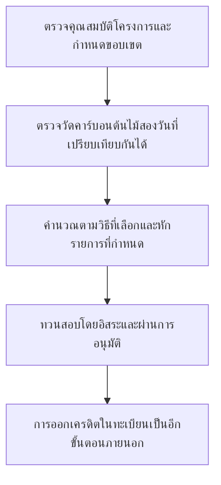
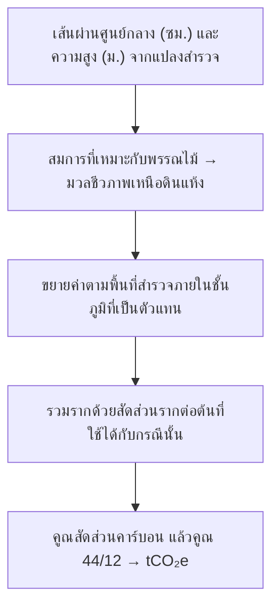
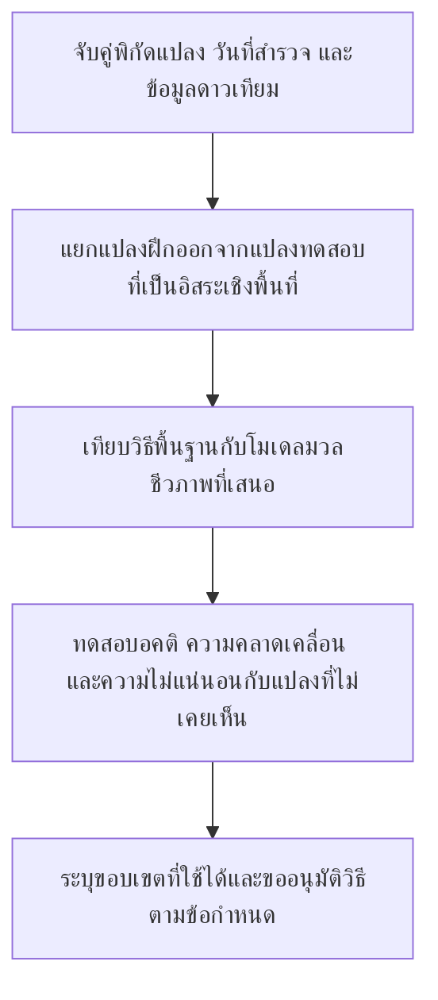
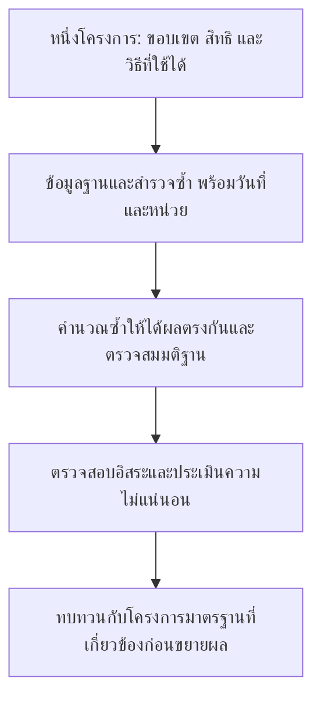

บันทึกงานวิจัย · ประเทศไทย · 25 กันยายน 2569

# ป่าที่ควรค่าแก่การดูแล หลักฐานที่ควรค่าแก่ความเชื่อถือ

ทำความเข้าใจคาร์บอนป่าไม้ผ่านข้อมูลภาคสนาม ดาวเทียม และ AI โดยเปิดให้ตรวจสอบที่มาของทุกผลประเมิน

คนคนหนึ่งอาจดูแลป่ามาหลายปี แต่ยังตอบได้ยากว่างานที่ทำสร้างผลลัพธ์เท่าไร ต้นไม้มีอยู่จริง ความทุ่มเทมีอยู่จริง ส่วนหลักฐานกลับกระจายอยู่ในสมุดสำรวจ แผนที่ ตารางราชการ และคลังภาพดาวเทียม การนำข้อมูลเหล่านี้มาประเมินคาร์บอนอย่างมีเหตุผลต้องลงแรง หน้าจอที่สวยเพียงอย่างเดียวทำงานส่วนนี้แทนไม่ได้

โครงการนี้จึงเริ่มจากการทำให้หลักฐานอยู่ใกล้มือขึ้น ทำให้สูตรถูกตั้งคำถามได้ง่ายขึ้น และทำให้คนสำรวจกับคนตรวจผลมองเห็นข้อมูลชุดเดียวกันว่าอะไรตรวจวัดแล้ว อะไรเป็นสมมติฐาน และอะไรยังต้องกลับไปวัด เทคโนโลยีมีคุณค่าเมื่อช่วยให้การพูดคุยเรื่องเหล่านี้ตรงไปตรงมาขึ้น

จุดเริ่มต้นคือการสอบถามเรื่องใช้ AI ช่วยประเมินคาร์บอนป่าไม้จากผู้ทำงานด้านการจัดการก๊าซเรือนกระจกของไทย ผลลัพธ์ในขั้นนี้เป็นเครื่องมือวิจัยนำร่องอิสระ เปิดเผยโค้ดและตรวจย้อนการคำนวณได้ ยังไม่ได้อ้างการรับรองจาก อบก. โมเดล AI ที่ผ่านการอนุมัติ หรือการออกเครดิต

## 01 · เริ่มจากคำถามให้ตรงกัน

“ป่านี้เก็บคาร์บอนอยู่เท่าไร” กับ “โครงการนี้จะได้รับเครดิตเท่าไร” ต้องใช้หลักฐานต่างกัน ป่าอาจมีคาร์บอนสะสมอยู่มาก แต่ไม่ได้หมายความว่าคาร์บอนทั้งหมดนั้นจะนำมาขอเครดิตใหม่ได้

| สิ่งที่ต้องแยก | ความหมายแบบอ่านง่าย | เครื่องมือนี้ทำอะไร |
|---|---|---|
| คาร์บอนคงเหลือ | คาร์บอนในส่วนของต้นไม้ที่นับรวม ณ วันที่หนึ่ง แสดงเป็น tCO₂e | แปลงมวลชีวภาพที่ระบุ หรือรับค่าคาร์บอนต้นไม้รวมที่มีขอบเขตตรงกัน |
| ผลต่างในช่วงติดตาม | ความเปลี่ยนแปลงระหว่างวันที่เปรียบเทียบกันได้ หลังหักรายการที่วิธีกำหนด | คำนวณค่าประเมินจากข้อมูลที่ให้มา และเก็บค่าติดลบไว้ |
| เครดิตที่ออกแล้ว | หน่วยที่ผ่านขั้นตอนอนุมัติและบันทึกตามโครงการที่เกี่ยวข้อง | ไม่ได้เชื่อมทะเบียน และไม่อนุมานจากค่าประเมิน |

ลำดับนี้สำคัญ การวาดรูปหลายเหลี่ยมกำหนดพื้นที่คำนวณ แต่ไม่ได้พิสูจน์สิทธิที่ดิน การเห็นต้นไม้ไม่ได้พิสูจน์ additionality หรือประโยชน์ส่วนเพิ่มตามเงื่อนไขของวิธีที่ใช้ และยอดขึ้นทะเบียนไม่ได้พิสูจน์ว่าคาร์บอนชุดเดียวกันไม่เคยถูกนำไปอ้างสิทธิที่อื่น

## 02 · ตามคาร์บอนหนึ่งตันผ่านสูตร

ก่อนต้นไม้จะกลายเป็นตัวเลขในบัญชีคาร์บอน ต้องมีการตรวจวัด เส้นผ่านศูนย์กลางกับความสูงนำเข้าสู่ **สมการแอลโลเมตรี** ซึ่งเป็นความสัมพันธ์ที่พัฒนาจากต้นไม้ที่วัดจริงเพื่อประมาณมวลชีวภาพแห้ง คำว่า “แห้ง” สำคัญ เพราะน้ำเพิ่มน้ำหนักโดยไม่ได้เพิ่มคาร์บอนที่กำลังประเมิน สมการต้องเหมาะกับประเภทป่าและพรรณไม้ด้วย

ตัวนำเข้าปัจจุบันรองรับสมการภาคผนวก TGO สำหรับป่าเบญจพรรณและป่าเต็งรัง โดยต้นไม้มี DBH ตั้งแต่ 4.5 ซม. ระบบประมาณมวลเหนือดินของต้นไม้ แล้วขยายค่าจากพื้นที่สำรวจภายใต้สมมติฐานว่ามีชั้นภูมิเดียวและแปลงเป็นตัวแทนของพื้นที่ สูตรไม่ได้ยืนยันให้ว่าการสุ่มแปลงเหมาะสม ไฟล์ CSV รุ่นนี้ยังแทนแปลงว่างไม่ได้ จึงห้ามตัดแปลงที่ไม่มีต้นไม้ออกเพื่อให้ระบบอ่านไฟล์ได้ รายละเอียดสัมประสิทธิ์ หน่วย และสิ่งที่ไม่นับรวมอยู่ใน [คู่มือ](guide-th.html)

สำหรับพรรณไม้ทั่วไปใน [เครื่องมือคำนวณต้นไม้ TGO v2](https://tver.tgo.or.th/database/Uploads/Tool/c575f516-1f3c-4dbc-83ec-2ab65e1d76dc.pdf) ใช้สัดส่วนรากต่อมวลเหนือดิน 0.27 และสัดส่วนคาร์บอน 0.47 ส่วน 44/12 ใช้แปลงมวลคาร์บอนเป็นมวล CO₂ ที่สอดคล้องกัน พรรณไม้กลุ่มอื่นมีค่าต่างออกไป หากข้อมูลรวมรากอยู่แล้วหรือเป็น tCO₂e อยู่แล้ว การคูณซ้ำจะทำให้ผลสูงเกินจริง

### ตัวอย่างที่ลองคำนวณตามได้

สมมติมวลชีวภาพเหนือดินแห้งของโครงการเดิมเพิ่มจาก **1,000 เป็น 1,100 ตัน** โดยใช้ปัจจัยและส่วนที่นับรวมเหมือนกัน ตัวเลขนี้เป็นข้อมูลสมมติสำหรับอธิบาย ไม่ใช่ผลสำรวจป่าจริงในประเทศไทย

| ขั้น | การคำนวณ | ผล |
|---|---|---:|
| มวลเหนือดินที่เพิ่ม | 1,100 − 1,000 | มวลแห้ง 100 ตัน |
| รวมรากที่ประมาณ | 100 × 1.27 | มวลรวม 127 ตัน |
| แปลงเป็นคาร์บอน | 127 × 0.47 | 59.69 tC |
| แปลงเป็น CO₂ | 59.69 × 44/12 | 218.8633 tCO₂ |

นี่คือการเพิ่มของคาร์บอนก่อนหักรายการที่เกี่ยวข้อง ถ้าใช้ระยะเวลาห้าปีพอดี ค่าเฉลี่ยคือ 43.7727 tCO₂ ต่อปี ส่วนแอปใช้จำนวนวันที่ผ่านไปหารด้วย 365.25 จึงได้ค่าเฉลี่ยของวันที่ตัวอย่างต่างกันเล็กน้อย ค่าเฉลี่ยรายปีไม่ได้สร้างสิทธิให้อ้างเครดิตเพิ่มอีกห้าครั้งนอกเหนือจากยอดรวมของช่วงนั้น

อ้างอิงบัญชีที่เลือกคือ [Standard T-VER-S-METH-13-01 v2](https://tver.tgo.or.th/database/Uploads/Methodology/482ce748-b43f-4432-aef8-d7745dcc2692.pdf): คาร์บอนต้นไม้ปัจจุบัน ลบค่าฐานหรือครั้งล่าสุดที่รับรอง ลบการปล่อยจากโครงการตามที่กำหนดและ leakage วิธีนี้ไม่พิจารณา leakage จึงกำหนดส่วนนี้เป็นศูนย์ในเครื่องมือ ต้องอ่านเงื่อนไขไฟไหม้ คุณสมบัติ และเกณฑ์โครงการขนาดเล็กจากเอกสารฉบับเต็ม กิจกรรมหรือมาตรฐานระดับอื่นอาจใช้บัญชีต่างกัน หากคาร์บอนลดลง ผลต้องติดลบ ระบบไม่ควรซ่อนการสูญเสียด้วยการเปลี่ยนเป็นศูนย์

## 03 · ดาวเทียมเห็นอะไร และยังต้องรู้อะไรจากคนในพื้นที่

หน้า [ผลิตภัณฑ์พืชพรรณของ JAXA](https://earth.jaxa.jp/en/data/products/vegetation/index.html) เป็นจุดเริ่มต้นที่ดี มีทางไปสู่ดัชนีพืชพรรณ ข้อมูลพื้นที่ใบ และผลิตภัณฑ์ป่า/ไม่ใช่ป่า สิ่งเหล่านี้เป็นข้อมูลสังเกตพืชพรรณ ไม่ใช่ยอดเครดิตที่ออกแล้ว

NDVI เปรียบเทียบการสะท้อนแสงสีแดงกับอินฟราเรดใกล้ ช่วยบอกลักษณะความเขียว แต่พิกเซลที่เขียวขึ้นไม่ได้แปลเป็นคาร์บอนจำนวนเดียวกันได้ทุกแห่ง ประเภทป่า ฤดูกาล โครงสร้างเรือนยอด และสภาพขณะสังเกตมีผลต่อการตีความ โมเดลที่เชื่อมภาพกับมวลชีวภาพจึงต้องมีข้อมูลตรวจวัดและการทดสอบที่เหมาะสม

| แหล่งข้อมูล | ช่วยโครงการนำร่องด้านใด | ข้อจำกัดที่ต้องติดไปกับข้อมูล |
|---|---|---|
| [JAXA PALSAR / PALSAR-2](https://www.eorc.jaxa.jp/ALOS/en/dataset/fnf_e.htm) | ตัวแปรเรดาร์และการคัดกรองพื้นที่ป่า ภาพโมเสกประมาณ 25 เมตร | เก็บวันที่สังเกต mask และรุ่นประมวลผล ตรวจการลงทะเบียนและเงื่อนไขดาวน์โหลด |
| [Sentinel-2](https://dataspace.copernicus.eu/data-collections/copernicus-sentinel-missions/sentinel-2) | ตัวแปรเชิงแสงและหลักฐานความเปลี่ยนแปลงหลังคัดเมฆ | เลือกฤดูกาลและการประมวลผลที่เทียบกันได้ |
| [NASA GEDI L4A v3](https://doi.org/10.3334/ORNLDAAC/2508) | ค่าประมาณความหนาแน่นมวลเหนือดินตามรอยเท้าการวัด พร้อมค่าคลาดเคลื่อนและข้อมูลคุณภาพ | ไม่ใช่การสำรวจครบทุกแปลง และไม่ใช่ค่าจริงภาคสนามที่ไร้ความผิดพลาด |
| แปลงตรวจวัดภาคสนาม | ข้อมูลท้องถิ่นสำหรับสร้างและทดสอบโมเดลอย่างอิสระ | ต้องรู้แผนสุ่ม พิกัด วันที่ พรรณไม้หรือกลุ่มไม้ และคุณภาพการวัด |

ผลิตภัณฑ์ดาวเทียมข้างต้นเป็นตัวเลือกสำหรับงานวิจัย รุ่นนี้ยังไม่ได้ดาวน์โหลด raster หรือรันโมเดลมวลชีวภาพจากดาวเทียม แผนที่พื้นหลังที่เห็นในแอปช่วยค้นตำแหน่ง ไม่ได้หมายความว่าระบบวิเคราะห์ผลิตภัณฑ์เหล่านั้นแล้ว

## 04 · ให้งาน AI ที่พิสูจน์ได้ว่าทำสำเร็จหรือไม่

งานแรกของ AI ควรชัดเจน: ทำนายมวลชีวภาพของป่าประเภทที่กำหนดจากข้อมูลที่มีวันที่ แล้วเปรียบเทียบกับการตรวจวัดอิสระ โมเดลภาษาช่วยอธิบายวิธีหรือเตือนช่องข้อมูลที่ขาดได้ แต่ไม่ควรใช้ประโยคที่ฟังน่าเชื่อแทนค่ามวลชีวภาพที่ยังไม่มี

ทางลัดที่ชวนให้หลงเชื่อคือสุ่มพิกเซลใกล้กันไปอยู่ทั้งชุดฝึกและชุดทดสอบ คะแนนอาจดีเพราะโมเดลคุ้นกับพื้นที่เดียวกัน แนวทางที่เสนอสำหรับโครงการนี้คือกันแปลงทดสอบที่แยกออกไปเชิงพื้นที่ แล้วดูข้อผิดพลาดตามประเภทป่าและช่วงมวลชีวภาพ เปรียบเทียบการถดถอยแบบง่ายกับโมเดลอย่าง Random Forest ก่อนเพิ่มความซับซ้อน ทั้งหมดนี้เป็นแผนทดสอบ ยังไม่ใช่ผลทดลองที่ทำเสร็จแล้ว

ความไม่แน่นอนต้องเดินทางไปกับสูตร ผลต่างของแผนที่คาร์บอนสองใบที่มีความคลาดเคลื่อนก็ยังมีความคลาดเคลื่อน ข้อผิดพลาดร่วมของโมเดล การสุ่มแปลง และความสัมพันธ์เชิงพื้นที่มีผลต่อความเชื่อมั่นในผลต่าง การเพิ่มทศนิยมไม่ได้แก้ปัญหาเหล่านี้ รุ่นปัจจุบันระบุชัดว่ายังไม่มีค่าความไม่แน่นอนในไฟล์ส่งออก การประเมินช่วงความเชื่อมั่นที่ผ่านการตรวจสอบยังเป็นงานที่ต้องทำก่อนใช้ประเมินโครงการอย่างจริงจัง

## 05 · ข้อมูลเปิด ต้องเปิดไฟล์ดูด้วย

การค้นคำว่า “ป่าไม้” ใน data.go.th เมื่อ **25 กันยายน 2569** พบ **570 ระเบียนชุดข้อมูล และ 2,111 ระเบียนทรัพยากร** นี่คือจำนวนรายการในบัญชีข้อมูล ซึ่งรวมเอกสาร ชิ้นส่วนไฟล์ ลิงก์ และรายการที่อาจดูซ้ำ ไม่ใช่ชุดมวลชีวภาพพร้อมใช้ 570 ชุด งานวิจัยเลือกดาวน์โหลดและตรวจเก้าไฟล์ ส่วนแอปบรรจุข้อมูลจังหวัด-ปีที่ปรับรูปแบบแล้ว 11 ระเบียน

| แหล่งที่ตรวจ | สิ่งที่พบในข้อมูลจริง | การตัดสินใจใช้ |
|---|---|---|
| [พื้นที่ป่าสระบุรี](https://data.go.th/dataset/saraburi-forest-area) | เจ็ดปี พ.ศ. 2561–2567; ปี 2567: 532,177.56 ไร่ | บริบทจังหวัดในอดีต |
| [พื้นที่ป่ากาญจนบุรี](https://data.go.th/dataset/forest-area-2567) | สี่ปี พ.ศ. 2564–2567; ปี 2567: 7,478,170.33 ไร่ | บริบทจังหวัด ตรวจความสอดคล้องของหน่วยแล้ว |
| [พื้นที่ป่า RFD ปี 2562](https://data.go.th/dataset/forestarea_2562_wgs84) | ZIP มีเพียง metadata ตรวจส่วนหัวไฟล์เรขาคณิตแยกต่างหาก | ยังไม่นำเข้ารูปทรงเต็ม พิกัดเป็น UTM 47N ต้องแปลงก่อน |
| [คาร์บอนพื้นที่อนุรักษ์ DNP](https://data.go.th/dataset/gdpublish-67-dnp07-31-02) | ตารางระบุ tCO₂eq แต่ไม่มีตัวหารรายปีชัดเจน | ห้ามเรียกว่าเครดิตรายปี |
| [ตารางป่าสงวน](https://data.go.th/dataset/gdpublish-https-www-forest-go-th-land) | หน่วยพื้นที่ไม่สอดคล้องกันในแถวที่ตรวจ | กันออก ไม่เดาแก้ค่า |

อ่านเหตุผลย้อนหลังได้ใน [บันทึกวิจัยฉบับเต็ม](https://github.com/Nonarkara/carbon/blob/main/RESEARCH.md), [รายการตรวจไฟล์](https://github.com/Nonarkara/carbon/blob/main/research/extracted/download-manifest.json) และ [ข้อมูลจังหวัดที่ปรับรูปแบบแล้ว](data/province-forest-area.csv) วันที่แก้ไขรายการไม่ได้เท่ากับวันที่ตรวจวัด หากสัญญาอนุญาตขัดกันหรือจำกัดการใช้ ต้องตรวจให้ชัดก่อนนำไปเผยแพร่ต่อ

### Dashboard กรมป่าไม้: ข้อมูลตั้งต้นที่ต้องอ่านพร้อมข้อสังเกต

[Dashboard กรมป่าไม้](https://fp.forest.go.th/rfd_app/rfd_dashboard_m/app/main.php) ที่ตรวจเมื่อ 25 กันยายน 2569 แสดงผู้ขึ้นทะเบียนสวนป่า **83,290 ราย, 83,681 แปลง, พื้นที่ 1,447,111 ไร่ และต้นไม้ 139,013,341 ต้น** แต่หน้าสรุปรายภาครวมได้ **83,217 ราย** ต่างกัน 73 ราย ระหว่างตรวจไม่พบวันที่ปรับปรุงที่อธิบายความต่างนี้ จึงเก็บเป็นตัวเลขจากคนละมุมมองตามที่พบ โดยไม่ได้แก้ให้ตรงกันเอง

เมื่อเปิดรายละเอียดภาคเหนือ พบผู้ขึ้นทะเบียนในน่าน 9,480 ราย และอุตรดิตถ์ 9,538 ราย ข้อมูลนี้ช่วยตั้งคำถามว่าจะเริ่มหาพันธมิตรนำร่องที่ใด แต่ไม่ได้บอกมวลชีวภาพของต้นไม้ที่ยังมีชีวิตในปัจจุบัน จุดเรียกข้อมูลสาธารณะตอบกลับเป็น HTML กับข้อมูลตั้งค่ากราฟโดยไม่ต้องล็อกอิน ยังไม่ได้ยืนยันสัญญาการให้บริการ API ที่มีเอกสารรองรับ ตัวเลขส่วนนี้เป็นภาพบันทึกการสำรวจแหล่งข้อมูล ไม่ใช่ข้อมูลสดที่เชื่อมแล้วหรือข้อมูลนำเข้าสูตร

## 06 · โครงการแรกต้องให้เหตุผลที่ดีพอสำหรับโครงการถัดไป

เริ่มจากโครงการเดียวที่ตรวจขอบเขต สิทธิ วิธีคำนวณ และข้อมูลภาคสนามได้ ตกลงคำถามก่อนว่าจะคัดกรองพื้นที่ ประเมินคาร์บอนคงเหลือ หรือเตรียมหลักฐานติดตามผล เพราะแต่ละคำถามต้องการความหนักแน่นของหลักฐานต่างกัน

ชุดข้อมูลนำร่องควรมีขอบเขตที่ระบุรุ่น รายละเอียดการขึ้นทะเบียนถ้ามี แผนสุ่มสำรวจ ข้อมูลแปลงในวันที่เทียบกันได้ บันทึกการรบกวนป่า และสิทธิการใช้ข้อมูล หากใช้ผู้ให้บริการสำรวจระยะไกลที่ได้รับอนุมัติ ต้องขอคำจำกัดความผลลัพธ์ ขอบเขตการอนุมัติ และเอกสารความไม่แน่นอนมาด้วย การอนุมัติของแพลตฟอร์มอื่นไม่ได้ถ่ายโอนมายังแอปนี้

โครงการนำร่องจะมีคุณค่าเมื่อผู้ตรวจที่มีความรู้สามารถคำนวณซ้ำ อธิบายข้อจำกัด และชี้ได้ว่าการวัดอะไรเพิ่มจะเปลี่ยนข้อสรุป เป้าหมายนี้ยากกว่าการทำให้แผนที่ดูน่าเชื่อ และเป็นเหตุผลที่ควรลงมือสร้างเครื่องมือนี้

## 07 · ผู้ริเริ่มโครงการ

<h3>Dr Non Arkaraprasertkul</h3>
สถาปนิก นักมานุษยวิทยา และผู้สร้างระบบข้อมูลเพื่อสาธารณะ ประวัติที่เผยแพร่ระบุการศึกษาด้านสถาปัตยกรรมที่ MIT ด้านมานุษยวิทยาที่ Harvard และงานส่งเสริมเมืองอัจฉริยะที่สำนักงานส่งเสริมเศรษฐกิจดิจิทัล (depa)

จุดเชื่อมกับคาร์บอนป่าไม้คือคำถามด้านการออกแบบ: จะทำให้หลักฐานที่ซับซ้อนเป็นสิ่งที่คนตัดสินใจใช้ได้อย่างไร โครงการนี้นำคำถามดังกล่าวมาใช้กับขอบเขตพื้นที่ การตรวจวัด และข้อมูลที่ตรวจย้อนกลับได้ของแต่ละค่าประเมิน

<a href="https://www.nonarkara.org/">เว็บไซต์ส่วนตัว</a> · <a href="https://github.com/Nonarkara">โครงการสาธารณะ</a> · <a href="https://www.linkedin.com/in/drnon/">LinkedIn</a>

ภาพจาก [หน้าประวัติ RMIT Vietnam](https://www.rmit.edu.vn/research/hubs/rmit-vietnam-smart-and-sustainable-cities-hub/people/dr-non-arkaraprasertkul) ตรวจประวัติร่วมกับ [เว็บไซต์ส่วนตัว](https://www.nonarkara.org/) เมื่อ 25 กันยายน 2569 การระบุหน่วยงานเป็นข้อมูลประวัติ ไม่ได้อ้างว่าหน่วยงานรับรองโครงการนำร่องอิสระนี้ เนื้อหานี้ไม่ได้สร้างคำพูดส่วนตัวหรือเรื่องเล่าประสบการณ์ภาคสนามขึ้นใหม่

## 08 · เก็บหลักฐานไว้ใกล้มือ

[คู่มือภาษาไทย](guide-th.html) และ [คู่มือภาษาอังกฤษ](guide-en.html) อธิบายวิธีใช้จริง สูตร รูปแบบไฟล์ และการเผยแพร่ ส่วน [บัญชีแหล่งข้อมูล](data/source-catalog.json) เก็บรายการอ้างอิงที่มากับระบบ [โค้ดและการทดสอบ](https://github.com/Nonarkara/carbon) เปิดเผยพร้อมบันทึกตรวจข้อมูลต้นฉบับ เอกสารทางการที่เชื่อมไว้ข้างต้นกำหนดรายละเอียดของแต่ละวิธี หน้านี้ช่วยอธิบายให้อ่านเข้าใจ แต่ไม่ใช้แทนข้อกำหนดเหล่านั้น

ลองเปิดเครื่องมือ ใช้ตัวอย่างที่ติดป้ายว่าข้อมูลสมมติ แล้วตามตัวเลขหนึ่งค่ากลับไปถึงข้อมูลตั้งต้น จากนั้นถามว่าต้องมีหลักฐานอะไรเพิ่มจึงจะแทนตัวอย่างนั้นด้วยป่าจริงได้ ตรงนั้นเองคืองานที่เครื่องมือนี้ตั้งใจช่วย
