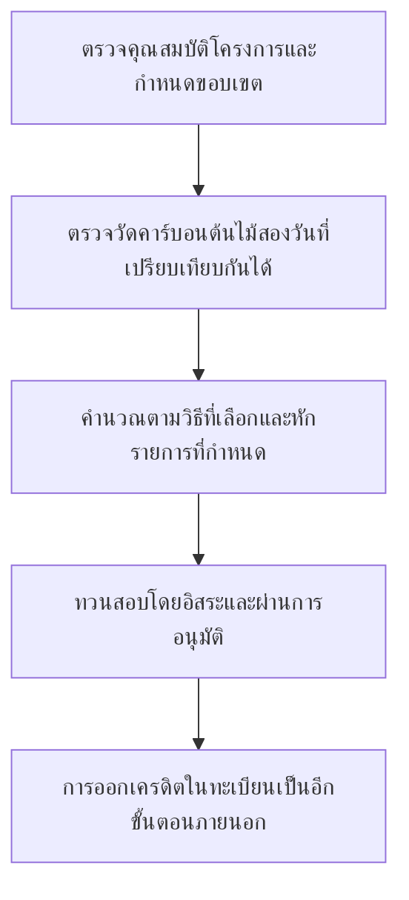
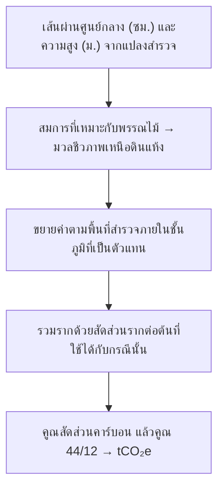
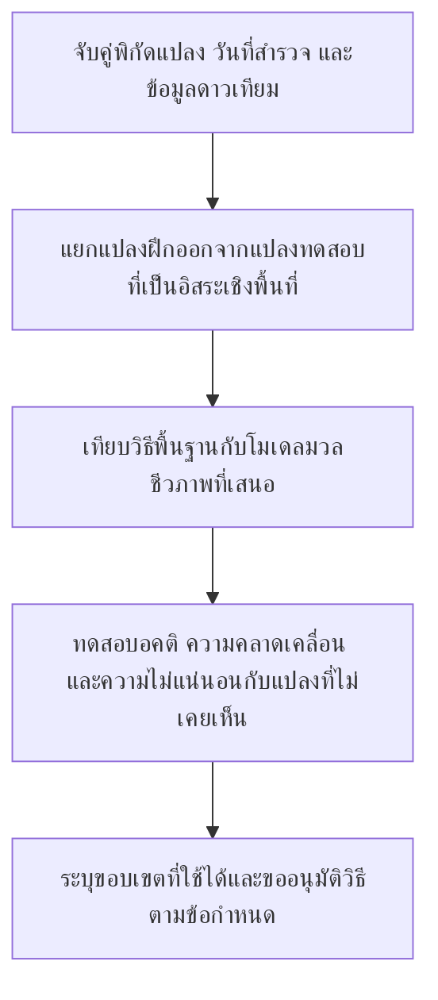
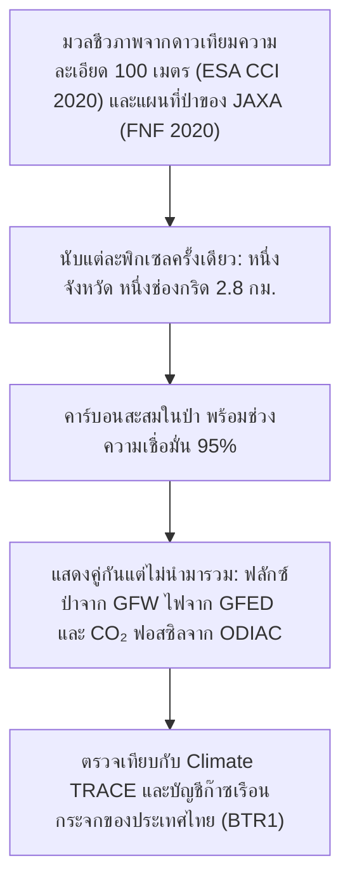
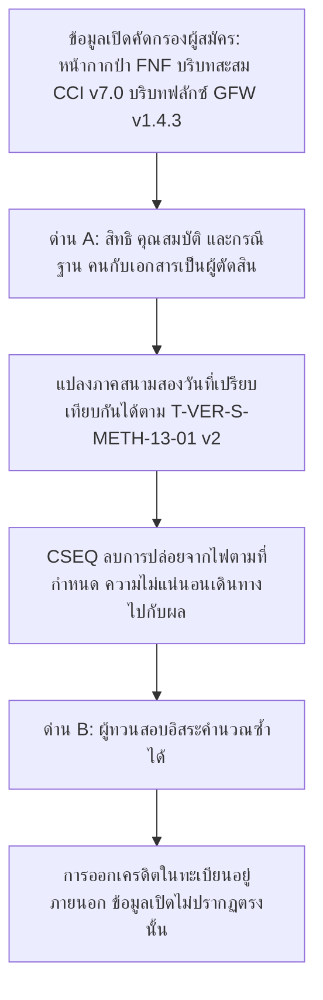
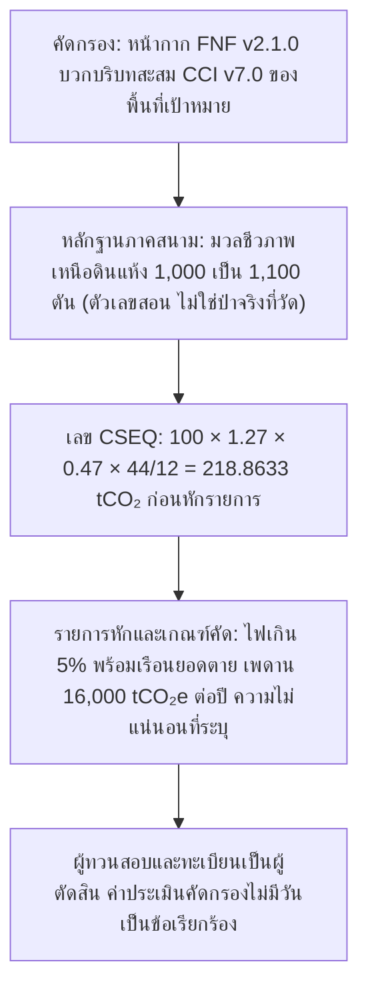
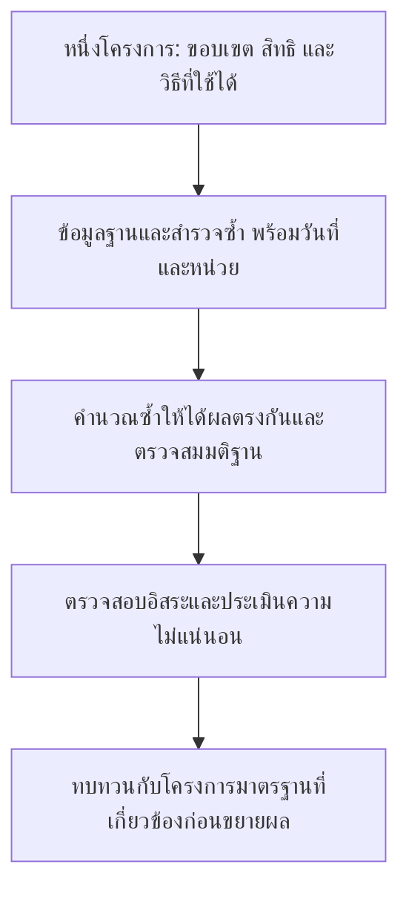

การศึกษาอิสระ เขียนในรูปวิทยานิพนธ์สั้น · คาบอนนะ · ประเทศไทย · กันยายน 2569

# สร้างระบบคำนวณรอยเท้าคาร์บอนของป่าจากข้อมูลสาธารณะและข้อมูลเปิด

ข้อมูลเปิดและข้อมูลสาธารณะชั่งภูมิทัศน์ได้ แต่ผลิตเครดิตไม่ได้ การศึกษานี้สร้างระบบที่แยกสองประโยคนั้นออกจากกัน และแสดงตัวเลขทุกตัวที่ออกมา

นี่คือการศึกษาอิสระที่เขียนในรูปวิทยานิพนธ์สั้น ไม่ใช่วิทยานิพนธ์ที่ยื่นต่อมหาวิทยาลัย ไม่ใช่ปริญญา และไม่ใช่การประเมินอย่างเป็นทางการของ อบก. ระบบที่ใช้งานชื่อ คาบอนนะ บทด้านล่างคือตัววิทยานิพนธ์: คำถาม วิธี หลักฐาน ขอบเขต และหน้าตาที่คนทั่วไปเห็น

<dl class="thesis">
<dt>คำถาม</dt>
<dd>ระบบสาธารณะคำนวณรอยเท้าคาร์บอนของป่าในประเทศไทยจากข้อมูลเปิดและข้อมูลสาธารณะได้หรือไม่ ในระดับจังหวัด กรอบที่วาด หรือขอบเขตโครงการ โดยไม่แกล้งว่าผลลัพธ์คือเครดิตที่ออกแล้ว</dd>
<dt>คำตอบ</dt>
<dd>ได้ สำหรับบัญชีระดับภูมิทัศน์ และได้เพียงเท่านั้น มวลชีวภาพจากดาวเทียม หน้ากากป่า การสูญเสียและการเพิ่มขึ้นของป่า ไฟ และ CO₂ จากเชื้อเพลิงฟอสซิล รวมในขอบเขตเดียวได้ โดยแต่ละตัวเก็บหน่วยของตัวเอง ไม่ได้ สำหรับตัวเลขรอยเท้าเดียว และไม่ได้สำหรับเครดิต คาร์บอนสะสมไม่ใช่ฟลักซ์ของช่วงเวลา ฟลักซ์ไม่ใช่การปล่อยจากไฟ ไฟไม่ใช่ CO₂ ฟอสซิล และไม่มีตัวใดเป็นเครดิตที่ อบก. รับรอง</dd>
<dt>สิ่งที่สร้าง</dt>
<dd>ขั้นตอนเตรียมข้อมูลแบบออฟไลน์ที่แปลงแรสเตอร์และตารางสาธารณะเป็นบัญชี ซึ่งพิกเซล 100 เมตรทุกพิกเซลอยู่ได้ไม่เกินหนึ่งจังหวัด และอยู่ในกริดหนึ่งช่องพอดี ดังนั้นยอดจังหวัด ยอดประเทศ และยอดกริดตรงกัน จากนั้นเบราว์เซอร์ตอบจังหวัด กรอบ หรือขอบเขตที่นำเข้าได้ทันที เครื่องมืออีกส่วนใช้ T-VER-S-METH-13-01 v2 กับตัวเลขที่ผู้ใช้ใส่จากภาคสนามเท่านั้น รายการ T-VER สาธารณะของ อบก. วางข้างแผนที่เป็นบริบท ไม่เคยเป็นข้อมูลนำเข้า</dd>
<dt>สิ่งที่การศึกษานี้ไม่ได้อ้าง</dt>
<dd>ไม่มีแบบจำลองที่ฝึกแล้ว ไม่มีการรับรองจาก อบก. ไม่มีความเห็นของผู้ทวนสอบ และไม่มีการออกเครดิต ภาพบรรยากาศ (ละอองลอย จุดความร้อน คาร์บอนมอนอกไซด์ และ CO₂ ในคอลัมน์อากาศ) เป็นความเข้มข้นและการตรวจพบ ไม่ใช่บัญชีการปล่อย ค่าทวนสอบไม่อยู่ในข้อมูลทะเบียน จึงไม่นำมาตั้งราคาในที่นี้</dd>
</dl>

| ส่วนของวิทยานิพนธ์ | อยู่ที่บท |
|---|---|
| คำถาม และเหตุผลที่ตัวเลขเดียวเป็นคำตอบที่ผิด | 01 |
| การคำนวณ จากต้นไม้ที่วัดได้ถึง tCO₂e | 02 |
| ดาวเทียมเห็นอะไร และอะไรยังต้องวัดบนพื้น | 03, 06 |
| แบบจำลองทำงานได้ตรงไหน | 04 |
| เปิดชุดข้อมูลเปิดทุกชุดก่อนเชื่อป้าย | 05 |
| เหตุผลที่ข้อมูลเปิดไม่กลายเป็นเครดิต | 07 |
| โครงการนำร่องแรกต้องพิสูจน์อะไร | 08 |
| ใครเป็นคนทำงาน | 09 |
| หลักฐานเก็บไว้ที่ไหน | 10 |
| ทะเบียนของ อบก. เป็นบริบท ไม่ใช่ข้อมูลนำเข้า | 11, 12 |
| ทำไมชื่อที่คนทั่วไปเห็นคือ คาบอนนะ | 13 |

คนคนหนึ่งอาจดูแลป่ามาหลายปี แต่ยังตอบได้ยากว่างานที่ทำสร้างผลลัพธ์เท่าไร ต้นไม้มีอยู่จริง ความทุ่มเทมีอยู่จริง ส่วนหลักฐานกลับกระจายอยู่ในสมุดสำรวจ แผนที่ ตารางราชการ และคลังภาพดาวเทียม การนำข้อมูลเหล่านี้มาประเมินคาร์บอนอย่างมีเหตุผลต้องลงแรง หน้าจอที่สวยเพียงอย่างเดียวทำงานส่วนนี้แทนไม่ได้

โครงการนี้จึงเริ่มจากการทำให้หลักฐานอยู่ใกล้มือขึ้น ทำให้สูตรถูกตั้งคำถามได้ง่ายขึ้น และทำให้คนสำรวจกับคนตรวจผลมองเห็นข้อมูลชุดเดียวกันว่าอะไรตรวจวัดแล้ว อะไรเป็นสมมติฐาน และอะไรยังต้องกลับไปวัด เทคโนโลยีมีคุณค่าเมื่อช่วยให้การพูดคุยเรื่องเหล่านี้ตรงไปตรงมาขึ้น

จุดเริ่มต้นคือการสอบถามเรื่องใช้ AI ช่วยประเมินคาร์บอนป่าไม้จากผู้ทำงานด้านการจัดการก๊าซเรือนกระจกของไทย โค้ดเปิดเผยและตรวจย้อนการคำนวณได้ ยังไม่ได้อ้างการรับรองจาก อบก. โมเดล AI ที่ผ่านการอนุมัติ หรือการออกเครดิต

## 01 · เริ่มจากคำถามให้ตรงกัน

“ป่านี้เก็บคาร์บอนอยู่เท่าไร” กับ “โครงการนี้จะได้รับเครดิตเท่าไร” ต้องใช้หลักฐานต่างกัน ป่าอาจมีคาร์บอนสะสมอยู่มาก แต่ไม่ได้หมายความว่าคาร์บอนทั้งหมดนั้นจะนำมาขอเครดิตใหม่ได้

| สิ่งที่ต้องแยก | ความหมายแบบอ่านง่าย | เครื่องมือนี้ทำอะไร |
|---|---|---|
| คาร์บอนคงเหลือ | คาร์บอนในส่วนของต้นไม้ที่นับรวม ณ วันที่หนึ่ง แสดงเป็น tCO₂e | แปลงมวลชีวภาพที่ระบุ หรือรับค่าคาร์บอนต้นไม้รวมที่มีขอบเขตตรงกัน |
| ผลต่างในช่วงติดตาม | ความเปลี่ยนแปลงระหว่างวันที่เปรียบเทียบกันได้ หลังหักรายการที่วิธีกำหนด | คำนวณค่าประเมินจากข้อมูลที่ให้มา และเก็บค่าติดลบไว้ |
| เครดิตที่ออกแล้ว | หน่วยที่ผ่านขั้นตอนอนุมัติและบันทึกตามโครงการที่เกี่ยวข้อง | ไม่ได้เชื่อมทะเบียน และไม่อนุมานจากค่าประเมิน |

ลำดับนี้สำคัญ การวาดรูปหลายเหลี่ยมกำหนดพื้นที่คำนวณ แต่ไม่ได้พิสูจน์สิทธิที่ดิน การเห็นต้นไม้ไม่ได้พิสูจน์ additionality หรือประโยชน์ส่วนเพิ่มตามเงื่อนไขของวิธีที่ใช้ และยอดขึ้นทะเบียนไม่ได้พิสูจน์ว่าคาร์บอนชุดเดียวกันไม่เคยถูกนำไปอ้างสิทธิที่อื่น

## 02 · ตามคาร์บอนหนึ่งตันผ่านสูตร

ก่อนต้นไม้จะกลายเป็นตัวเลขในบัญชีคาร์บอน ต้องมีการตรวจวัด เส้นผ่านศูนย์กลางกับความสูงนำเข้าสู่ **สมการแอลโลเมตรี** ซึ่งเป็นความสัมพันธ์ที่พัฒนาจากต้นไม้ที่วัดจริงเพื่อประมาณมวลชีวภาพแห้ง คำว่า “แห้ง” สำคัญ เพราะน้ำเพิ่มน้ำหนักโดยไม่ได้เพิ่มคาร์บอนที่กำลังประเมิน สมการต้องเหมาะกับประเภทป่าและพรรณไม้ด้วย

ตัวนำเข้าปัจจุบันรองรับสมการภาคผนวก TGO สำหรับป่าเบญจพรรณและป่าเต็งรัง โดยต้นไม้มี DBH ตั้งแต่ 4.5 ซม. ระบบประมาณมวลเหนือดินของต้นไม้ แล้วขยายค่าจากพื้นที่สำรวจภายใต้สมมติฐานว่ามีชั้นภูมิเดียวและแปลงเป็นตัวแทนของพื้นที่ สูตรไม่ได้ยืนยันให้ว่าการสุ่มแปลงเหมาะสม ไฟล์ CSV รุ่นนี้ยังแทนแปลงว่างไม่ได้ จึงห้ามตัดแปลงที่ไม่มีต้นไม้ออกเพื่อให้ระบบอ่านไฟล์ได้ รายละเอียดสัมประสิทธิ์ หน่วย และสิ่งที่ไม่นับรวมอยู่ใน [คู่มือ](guide-th.html)

สำหรับพรรณไม้ทั่วไปใน [เครื่องมือคำนวณต้นไม้ TGO v2](https://tver.tgo.or.th/database/Uploads/Tool/c575f516-1f3c-4dbc-83ec-2ab65e1d76dc.pdf) ใช้สัดส่วนรากต่อมวลเหนือดิน 0.27 และสัดส่วนคาร์บอน 0.47 ส่วน 44/12 ใช้แปลงมวลคาร์บอนเป็นมวล CO₂ ที่สอดคล้องกัน พรรณไม้กลุ่มอื่นมีค่าต่างออกไป หากข้อมูลรวมรากอยู่แล้วหรือเป็น tCO₂e อยู่แล้ว การคูณซ้ำจะทำให้ผลสูงเกินจริง

### ตัวอย่างที่ลองคำนวณตามได้

สมมติมวลชีวภาพเหนือดินแห้งของโครงการเดิมเพิ่มจาก **1,000 เป็น 1,100 ตัน** โดยใช้ปัจจัยและส่วนที่นับรวมเหมือนกัน ตัวเลขนี้เป็นข้อมูลสมมติสำหรับอธิบาย ไม่ใช่ผลสำรวจป่าจริงในประเทศไทย

| ขั้น | การคำนวณ | ผล |
|---|---|---:|
| มวลเหนือดินที่เพิ่ม | 1,100 − 1,000 | มวลแห้ง 100 ตัน |
| รวมรากที่ประมาณ | 100 × 1.27 | มวลรวม 127 ตัน |
| แปลงเป็นคาร์บอน | 127 × 0.47 | 59.69 tC |
| แปลงเป็น CO₂ | 59.69 × 44/12 | 218.8633 tCO₂ |

นี่คือการเพิ่มของคาร์บอนก่อนหักรายการที่เกี่ยวข้อง ถ้าใช้ระยะเวลาห้าปีพอดี ค่าเฉลี่ยคือ 43.7727 tCO₂ ต่อปี ส่วนแอปใช้จำนวนวันที่ผ่านไปหารด้วย 365.25 จึงได้ค่าเฉลี่ยของวันที่ตัวอย่างต่างกันเล็กน้อย ค่าเฉลี่ยรายปีไม่ได้สร้างสิทธิให้อ้างเครดิตเพิ่มอีกห้าครั้งนอกเหนือจากยอดรวมของช่วงนั้น

อ้างอิงบัญชีที่เลือกคือ [Standard T-VER-S-METH-13-01 v2](https://tver.tgo.or.th/database/Uploads/Methodology/482ce748-b43f-4432-aef8-d7745dcc2692.pdf): คาร์บอนต้นไม้ปัจจุบัน ลบค่าฐานหรือครั้งล่าสุดที่รับรอง ลบการปล่อยจากโครงการตามที่กำหนดและ leakage วิธีนี้ไม่พิจารณา leakage จึงกำหนดส่วนนี้เป็นศูนย์ในเครื่องมือ ต้องอ่านเงื่อนไขไฟไหม้ คุณสมบัติ และเกณฑ์โครงการขนาดเล็กจากเอกสารฉบับเต็ม กิจกรรมหรือมาตรฐานระดับอื่นอาจใช้บัญชีต่างกัน หากคาร์บอนลดลง ผลต้องติดลบ ระบบไม่ควรซ่อนการสูญเสียด้วยการเปลี่ยนเป็นศูนย์

## 03 · ดาวเทียมเห็นอะไร และยังต้องรู้อะไรจากคนในพื้นที่

หน้า [ผลิตภัณฑ์พืชพรรณของ JAXA](https://earth.jaxa.jp/en/data/products/vegetation/index.html) เป็นจุดเริ่มต้นที่ดี มีทางไปสู่ดัชนีพืชพรรณ ข้อมูลพื้นที่ใบ และผลิตภัณฑ์ป่า/ไม่ใช่ป่า สิ่งเหล่านี้เป็นข้อมูลสังเกตพืชพรรณ ไม่ใช่ยอดเครดิตที่ออกแล้ว

NDVI เปรียบเทียบการสะท้อนแสงสีแดงกับอินฟราเรดใกล้ ช่วยบอกลักษณะความเขียว แต่พิกเซลที่เขียวขึ้นไม่ได้แปลเป็นคาร์บอนจำนวนเดียวกันได้ทุกแห่ง ประเภทป่า ฤดูกาล โครงสร้างเรือนยอด และสภาพขณะสังเกตมีผลต่อการตีความ โมเดลที่เชื่อมภาพกับมวลชีวภาพจึงต้องมีข้อมูลตรวจวัดและการทดสอบที่เหมาะสม

| แหล่งข้อมูล | ช่วยโครงการนำร่องด้านใด | ข้อจำกัดที่ต้องติดไปกับข้อมูล |
|---|---|---|
| [JAXA PALSAR / PALSAR-2](https://www.eorc.jaxa.jp/ALOS/en/dataset/fnf_e.htm) | ตัวแปรเรดาร์และการคัดกรองพื้นที่ป่า ภาพโมเสกประมาณ 25 เมตร | เก็บวันที่สังเกต mask และรุ่นประมวลผล ตรวจการลงทะเบียนและเงื่อนไขดาวน์โหลด |
| [Sentinel-2](https://dataspace.copernicus.eu/data-collections/copernicus-sentinel-missions/sentinel-2) | ตัวแปรเชิงแสงและหลักฐานความเปลี่ยนแปลงหลังคัดเมฆ | เลือกฤดูกาลและการประมวลผลที่เทียบกันได้ |
| [NASA GEDI L4A v3](https://doi.org/10.3334/ORNLDAAC/2508) | ค่าประมาณความหนาแน่นมวลเหนือดินตามรอยเท้าการวัด พร้อมค่าคลาดเคลื่อนและข้อมูลคุณภาพ | ไม่ใช่การสำรวจครบทุกแปลง และไม่ใช่ค่าจริงภาคสนามที่ไร้ความผิดพลาด |
| แปลงตรวจวัดภาคสนาม | ข้อมูลท้องถิ่นสำหรับสร้างและทดสอบโมเดลอย่างอิสระ | ต้องรู้แผนสุ่ม พิกัด วันที่ พรรณไม้หรือกลุ่มไม้ และคุณภาพการวัด |

เครื่องมือประเมินโครงการไม่ได้ใช้ผลิตภัณฑ์เหล่านี้ ตัวเลขมาจากข้อมูลตรวจวัดของผู้ใช้เท่านั้น ส่วนแผนที่คาร์บอน (หัวข้อ 06) ใช้ผลิตภัณฑ์ดาวเทียมที่เผยแพร่แล้ว รวมถึง ESA CCI Biomass และแผนที่ป่าของ JAXA โดยไม่ได้รันแบบจำลองของตนเอง สิ่งที่ทำคือจัดกริดใหม่ ใช้หน้ากากพื้นที่ป่า และแปลงหน่วยผลิตภัณฑ์เหล่านั้น และตัวเลขระดับภูมิทัศน์ไม่ถูกนำไปใช้ในการคำนวณโครงการ แผนที่ถนนและภาพพื้นหลังช่วยค้นตำแหน่ง ไม่ใช่หลักฐาน

## 04 · ให้งาน AI ที่พิสูจน์ได้ว่าทำสำเร็จหรือไม่

งานแรกของ AI ควรชัดเจน: ทำนายมวลชีวภาพของป่าประเภทที่กำหนดจากข้อมูลที่มีวันที่ แล้วเปรียบเทียบกับการตรวจวัดอิสระ โมเดลภาษาช่วยอธิบายวิธีหรือเตือนช่องข้อมูลที่ขาดได้ แต่ไม่ควรใช้ประโยคที่ฟังน่าเชื่อแทนค่ามวลชีวภาพที่ยังไม่มี

ทางลัดที่ชวนให้หลงเชื่อคือสุ่มพิกเซลใกล้กันไปอยู่ทั้งชุดฝึกและชุดทดสอบ คะแนนอาจดีเพราะโมเดลคุ้นกับพื้นที่เดียวกัน แนวทางที่เสนอสำหรับโครงการนี้คือกันแปลงทดสอบที่แยกออกไปเชิงพื้นที่ แล้วดูข้อผิดพลาดตามประเภทป่าและช่วงมวลชีวภาพ เปรียบเทียบการถดถอยแบบง่ายกับโมเดลอย่าง Random Forest ก่อนเพิ่มความซับซ้อน ทั้งหมดนี้เป็นแผนทดสอบ ยังไม่ใช่ผลทดลองที่ทำเสร็จแล้ว

ความไม่แน่นอนต้องเดินทางไปกับสูตร ผลต่างของแผนที่คาร์บอนสองใบที่มีความคลาดเคลื่อนก็ยังมีความคลาดเคลื่อน ข้อผิดพลาดร่วมของโมเดล การสุ่มแปลง และความสัมพันธ์เชิงพื้นที่มีผลต่อความเชื่อมั่นในผลต่าง การเพิ่มทศนิยมไม่ได้แก้ปัญหาเหล่านี้ รุ่นปัจจุบันระบุชัดว่ายังไม่มีค่าความไม่แน่นอนในไฟล์ส่งออก การประเมินช่วงความเชื่อมั่นที่ผ่านการตรวจสอบยังเป็นงานที่ต้องทำก่อนใช้ประเมินโครงการอย่างจริงจัง

## 05 · ข้อมูลเปิด ต้องเปิดไฟล์ดูด้วย

การค้นคำว่า “ป่าไม้” ใน data.go.th เมื่อ **25 กันยายน 2569** พบ **570 ระเบียนชุดข้อมูล และ 2,111 ระเบียนทรัพยากร** นี่คือจำนวนรายการในบัญชีข้อมูล ซึ่งรวมเอกสาร ชิ้นส่วนไฟล์ ลิงก์ และรายการที่อาจดูซ้ำ ไม่ใช่ชุดมวลชีวภาพพร้อมใช้ 570 ชุด งานวิจัยเลือกดาวน์โหลดและตรวจเก้าไฟล์ ส่วนแอปบรรจุข้อมูลจังหวัด-ปีที่ปรับรูปแบบแล้ว 11 ระเบียน

| แหล่งที่ตรวจ | สิ่งที่พบในข้อมูลจริง | การตัดสินใจใช้ |
|---|---|---|
| [พื้นที่ป่าสระบุรี](https://data.go.th/dataset/saraburi-forest-area) | เจ็ดปี พ.ศ. 2561–2567; ปี 2567: 532,177.56 ไร่ | บริบทจังหวัดในอดีต |
| [พื้นที่ป่ากาญจนบุรี](https://data.go.th/dataset/forest-area-2567) | สี่ปี พ.ศ. 2564–2567; ปี 2567: 7,478,170.33 ไร่ | บริบทจังหวัด ตรวจความสอดคล้องของหน่วยแล้ว |
| [พื้นที่ป่า RFD ปี 2562](https://data.go.th/dataset/forestarea_2562_wgs84) | ZIP มีเพียง metadata ตรวจส่วนหัวไฟล์เรขาคณิตแยกต่างหาก | ยังไม่นำเข้ารูปทรงเต็ม พิกัดเป็น UTM 47N ต้องแปลงก่อน |
| [คาร์บอนพื้นที่อนุรักษ์ DNP](https://data.go.th/dataset/gdpublish-67-dnp07-31-02) | ตารางระบุ tCO₂eq แต่ไม่มีตัวหารรายปีชัดเจน | ห้ามเรียกว่าเครดิตรายปี |
| [ตารางป่าสงวน](https://data.go.th/dataset/gdpublish-https-www-forest-go-th-land) | หน่วยพื้นที่ไม่สอดคล้องกันในแถวที่ตรวจ | กันออก ไม่เดาแก้ค่า |

อ่านเหตุผลย้อนหลังได้ใน [บันทึกวิจัยฉบับเต็ม](https://github.com/Nonarkara/carbon/blob/main/RESEARCH.md), [รายการตรวจไฟล์](https://github.com/Nonarkara/carbon/blob/main/research/extracted/download-manifest.json) และ [ข้อมูลจังหวัดที่ปรับรูปแบบแล้ว](data/province-forest-area.csv) วันที่แก้ไขรายการไม่ได้เท่ากับวันที่ตรวจวัด หากสัญญาอนุญาตขัดกันหรือจำกัดการใช้ ต้องตรวจให้ชัดก่อนนำไปเผยแพร่ต่อ

### Dashboard กรมป่าไม้: ข้อมูลตั้งต้นที่ต้องอ่านพร้อมข้อสังเกต

[Dashboard กรมป่าไม้](https://fp.forest.go.th/rfd_app/rfd_dashboard_m/app/main.php) ที่ตรวจเมื่อ 25 กันยายน 2569 แสดงผู้ขึ้นทะเบียนสวนป่า **83,290 ราย, 83,681 แปลง, พื้นที่ 1,447,111 ไร่ และต้นไม้ 139,013,341 ต้น** แต่หน้าสรุปรายภาครวมได้ **83,217 ราย** ต่างกัน 73 ราย ระหว่างตรวจไม่พบวันที่ปรับปรุงที่อธิบายความต่างนี้ จึงเก็บเป็นตัวเลขจากคนละมุมมองตามที่พบ โดยไม่ได้แก้ให้ตรงกันเอง

เมื่อเปิดรายละเอียดภาคเหนือ พบผู้ขึ้นทะเบียนในน่าน 9,480 ราย และอุตรดิตถ์ 9,538 ราย ข้อมูลนี้ช่วยตั้งคำถามว่าจะเริ่มหาพันธมิตรนำร่องที่ใด แต่ไม่ได้บอกมวลชีวภาพของต้นไม้ที่ยังมีชีวิตในปัจจุบัน จุดเรียกข้อมูลสาธารณะตอบกลับเป็น HTML กับข้อมูลตั้งค่ากราฟโดยไม่ต้องล็อกอิน ยังไม่ได้ยืนยันสัญญาการให้บริการ API ที่มีเอกสารรองรับ ตัวเลขส่วนนี้เป็นภาพบันทึกการสำรวจแหล่งข้อมูล ไม่ใช่ข้อมูลสดที่เชื่อมแล้วหรือข้อมูลนำเข้าสูตร

## 06 · การดูดซับและการปล่อยคาร์บอน มองจากอวกาศ

เครื่องมือประเมินโครงการตอบคำถามระดับแปลง: คาร์บอนที่วัดได้ในพื้นที่นี้เปลี่ยนไปเท่าไร ส่วนแผนที่คาร์บอนตอบคำถามระดับภูมิทัศน์ ป่าในจังหวัดหนึ่งเก็บคาร์บอนไว้เท่าไร ดูดซับและปล่อยออกปีละเท่าไร และในพื้นที่เดียวกันมีการปล่อยจากแหล่งอื่นอีกเท่าไร แผนที่นี้ใช้ผลิตภัณฑ์จากข้อมูลดาวเทียมที่เผยแพร่แล้ว และไม่ได้รันแบบจำลองของตนเอง สิ่งที่ทำคือจัดกริดใหม่ ใช้หน้ากากพื้นที่ป่า และแปลงหน่วยผลิตภัณฑ์เหล่านั้น ตามที่อธิบายด้านล่าง ทุกตัวเลขเป็นค่าประเมินเพื่อคัดกรอง ไม่ใช่เครดิต และไม่นำไปใช้เป็นข้อมูลนำเข้าของเครื่องมือประเมินโครงการ

### สี่ปริมาณ สี่ชุดข้อมูล

| ปริมาณ | สิ่งที่แผนที่แสดง | ชุดข้อมูล | ช่วงเวลา | ความละเอียด |
|---|---|---|---|---|
| **คาร์บอนสะสม** | คาร์บอนในต้นไม้ในพื้นที่ป่า หน่วย tCO₂e | [ESA CCI Biomass v7.0](https://catalogue.ceda.ac.uk/uuid/6429d1aafe1e43b9b414e4a5a7f8b903) มวลชีวภาพเหนือพื้นดิน ร่วมกับแผนที่ป่า [JAXA PALSAR-2 FNF v2.1.0](https://www.eorc.jaxa.jp/ALOS/en/dataset/fnf_e.htm) | 2020 | 100 เมตร |
| **ฟลักซ์ของป่า** | การดูดซับขั้นต้น การปล่อยขั้นต้น และค่าสุทธิ หน่วย tCO₂e ต่อปี | [GFW forest carbon flux v1.4.3](https://essd.copernicus.org/articles/17/1217/2025/) (Harris et al. 2021; Gibbs et al. 2025) | เฉลี่ย 2001–2025 | แบบจำลอง 30 เมตร สรุปรายจังหวัด |
| **ไฟ** | CO₂ จากไฟทุกประเภทในภูมิทัศน์ พร้อมสัดส่วนตามประเภทพื้นที่และรายเดือน | [GFED5.1](https://zenodo.org/records/16794692) | เฉลี่ย 2013–2022 | 0.25° (ประมาณ 28 กม.) |
| **CO₂ ฟอสซิล** | การปล่อยจากพลังงาน อุตสาหกรรม และการขนส่ง | [ODIAC2025](https://db.cger.nies.go.jp/dataset/ODIAC/) | 2024 | 1 กม. |

แหล่งตรวจเทียบ ได้แก่ [Climate TRACE API v7](https://api.climatetrace.org/v7/docs) ข้อมูลภาคป่าไม้รายจังหวัดปี 2024 และ[รายงานความโปร่งใสรายสองปีฉบับแรกของประเทศไทย](https://www.dcce.go.th/wp-content/uploads/2024/12/Submitted-1st-BTR_compressed-1.pdf) (BTR1) ระดับประเทศปี 2022 ขอบเขตจังหวัดเป็นข้อมูลของกรมแผนที่ทหาร เผยแพร่ผ่าน [OCHA/HDX (COD-AB v01)](https://data.humdata.org/dataset/cod-ab-tha)

### JAXA อยู่ตรงไหนในระบบนี้

หน้าข้อมูลพืชพรรณของ JAXA มี NDVI ดัชนีพื้นที่ใบ และแผนที่ป่า/ไม่ใช่ป่า แต่ไม่มีข้อมูลใดเป็นคาร์บอนสะสม แผนที่คาร์บอนใช้แผนที่ป่า/ไม่ใช่ป่าปี 2020 ของ JAXA สามทาง คือเป็นชั้น "ป่าไม้ JAXA (FNF 2020)" ที่มองเห็นได้ เป็นตัวกำหนดว่าส่วนใดของแต่ละพิกเซลมวลชีวภาพนับเป็นป่า และประเภทพื้นที่บกของ FNF ใช้ถ่วงน้ำหนักการกระจายข้อมูลไฟและ CO₂ ฟอสซิลที่มีความละเอียดหยาบลงบนพื้นที่บก ป่าทั้งสองชั้นของ FNF ถูกนับ คือเรือนยอดปกคลุมตั้งแต่ 90% ขึ้นไป และ 10–90%

ป่าตาม FNF ไม่ใช่ป่าตามกรมป่าไม้ FNF จัดพื้นที่ **44.7%** ของประเทศเป็นป่าในปี 2020 ขณะที่[กรมป่าไม้](https://data.forest.go.th/dataset/https-www-forest-go-th-land)รายงาน **31.64%** (102,353,484.76 ไร่) ในปีเดียวกัน แผนที่ป่าจากเรดาร์เห็นเรือนยอดต้นไม้ แต่แยกไม่ได้ว่าเป็นป่าธรรมชาติ สวนป่า หรือไม้ยืนต้นเศรษฐกิจและสวนไม้ผล คำว่า "ป่า" บนแผนที่นี้จึงหมายถึง "เรือนยอดต้นไม้ที่เรดาร์มองเห็น" ไม่ใช่ป่าตามกฎหมายหรือตามการบริหาร

### ตัวเลขคำนวณอย่างไร

**หนึ่งพิกเซล นับครั้งเดียว** พิกเซลมวลชีวภาพขนาด 100 เมตรแต่ละพิกเซลถูกกำหนดตามจุดศูนย์กลางให้อยู่ในจังหวัดไม่เกินหนึ่งจังหวัดและในช่องกริด 2.8 กม. หนึ่งช่องพอดี ผลรวมรายจังหวัด รายช่องกริด และระดับประเทศจึงมาจากพิกเซลชุดเดียวกัน การทดสอบอัตโนมัติตรวจเงื่อนไขนี้ทุกปริมาณ พื้นที่บกของไทยที่คำนวณทีละพิกเซลได้ 515,415 ตร.กม. ตรงกับค่าที่ระบุในไฟล์ขอบเขต (515,416 ตร.กม.) และต่างจากตัวเลขทางการ 513,120 ตร.กม. ไม่เกิน 0.45%

**จากมวลชีวภาพเป็น CO₂e** คาร์บอนสะสม (tCO₂e) = มวลชีวภาพเหนือพื้นดิน (ตัน) × (1 + 0.27) × 0.47 × 44/12 หรือ 2.1886 tCO₂e ต่อมวลชีวภาพเหนือพื้นดินหนึ่งตัน ค่านี้เป็นค่าสำหรับต้นไม้ทั่วไปในเครื่องมือคำนวณต้นไม้ของ อบก. ชุดเดียวกับที่เครื่องมือประเมินโครงการใช้ อัตราส่วนรากต่อส่วนเหนือดินของ IPCC 2019 สำหรับป่าธรรมชาติเขตร้อนในเอเชียอยู่ระหว่างประมาณ 0.21–0.44 ตามชนิดป่าและระดับมวลชีวภาพ ([2019 Refinement เล่ม 4 บทที่ 4 ตาราง 4.4](https://www.ipcc-nggip.iges.or.jp/public/2019rf/pdf/4_Volume4/19R_V4_Ch04_Forest%20Land.pdf)) หากใช้ช่วงนั้นแทน มวลชีวภาพรวมจะเปลี่ยนไป ประมาณ −5% ถึง +13%

**ส่วนที่เป็นป่าในแต่ละพิกเซล** มวลชีวภาพของ ESA CCI เป็นค่าเฉลี่ยทั้งพิกเซล ไม่ว่าจะเป็นป่าหรือไม่ ระบบคูณมวลชีวภาพของแต่ละพิกเซลด้วยสัดส่วนของพิกเซลที่ FNF จัดเป็นป่า วิธีนี้สมมติว่ามวลชีวภาพกระจายเท่ากันภายในพิกเซล และทำให้ส่วนที่เป็นป่ารวมกับส่วนที่ไม่ใช่ป่าเท่ากับทั้งหมดเสมอ จึงไม่มีคาร์บอนเกินหรือหายไป

**ข้อมูลความละเอียดหยาบ** ข้อมูลไฟ (0.25°) และ CO₂ ฟอสซิล (1 กม.) ถูกกระจายลงพิกเซลบก 100 เมตรภายในช่องหยาบแต่ละช่องตามสัดส่วนพื้นที่บก ช่องที่แผนที่ JAXA ไม่มีพื้นที่บกเลย เช่นแนวชายฝั่งแคบ ๆ จะกระจายตามพื้นที่ทั้งหมดแทน จึงไม่มีการปล่อยใดตกหล่นในขั้นการกระจาย ส่วนที่ถูกกระจายไปนอกเขตจังหวัดของไทย เช่นในทะเลหรือข้ามพรมแดน ไม่ถูกนับโดยตั้งใจ ผลรวม CO₂ ฟอสซิลของไทยจากวิธีนี้ต่างจากวิธีหยาบที่นับทั้งช่อง 1 กม. ตามจุดศูนย์กลางเพียง 0.3%

**กรอบที่วาด** ผลรวมของกรอบคำนวณจากช่องกริด 2.8 กม. โดยถ่วงน้ำหนักแต่ละช่องด้วยสัดส่วนพื้นที่บนทรงกลมที่อยู่ในกรอบ และสมมติว่าค่ากระจายเท่ากันภายในช่อง ระบบนับเฉพาะพื้นที่บกในไทย ส่วนของกรอบที่อยู่นอกประเทศไม่ถูกนับ ขอบเขตโครงการที่นำเข้าในเครื่องมือประเมินจะคำนวณด้วยจุดตัวอย่างแบบตาราง 4×4 (16 จุด) ต่อช่อง ในทางปฏิบัติตัวเลขของกรอบจึงมีความละเอียดประมาณ 2.8 กม. ไม่ใช่ 100 เมตร ตัวเลขจะถูกทำให้จางลงเมื่อด้านที่สั้นกว่าของกรอบแคบกว่าช่องของชุดข้อมูล คือ 2.8 กม. สำหรับคาร์บอนสะสม 28 กม. สำหรับไฟ และ 1 กม. สำหรับ CO₂ ฟอสซิล

### ความไม่แน่นอน: บอกเป็นช่วง ไม่ใช่ทศนิยม

ESA CCI เผยแพร่ค่าส่วนเบี่ยงเบนมาตรฐานทุกพิกเซล แต่ความคลาดเคลื่อนเหล่านั้นรวมกันในระดับจังหวัดอย่างไรขึ้นกับสิ่งที่แผนที่ไม่รู้ คือพิกเซลข้างเคียงคลาดเคลื่อนไปในทางเดียวกันมากแค่ไหน แผนที่คาร์บอนจึงให้ช่วง 95% สองแบบ:

- **คลาดเคลื่อนเป็นอิสระต่อกัน** ความคลาดเคลื่อนหักล้างกันเมื่อรวมพิกเซล ระดับประเทศได้ ±0.03%
- **คลาดเคลื่อนไปทางเดียวกันทั้งหมด** ทุกพิกเซลคลาดเคลื่อนไปทางเดียวกัน ระดับประเทศได้ ±110% โดยขอบล่างหยุดที่ศูนย์

กรณีคลาดเคลื่อนไปทางเดียวกันทั้งหมดเป็นเพดานสูงสุด ค่าจริงคาดว่าอยู่ระหว่างสองช่วงนี้ งานศึกษาการประเมินมวลชีวภาพรายแปลงที่ดินในรัฐนิวยอร์กพบว่าความคลาดเคลื่อนคงเหลือที่สัมพันธ์กันเชิงพื้นที่เป็นส่วนหลัก ([Johnson et al.](https://arxiv.org/abs/2412.16403)) ช่วงแคบจึงน่าจะดีเกินจริงสำหรับพื้นที่ขนาดใหญ่ ทั้งสองช่วงไม่รวมความเอนเอียงเชิงระบบของแผนที่ แผนที่มวลชีวภาพระดับโลกมักประเมินพื้นที่มวลชีวภาพต่ำสูงเกินและพื้นที่มวลชีวภาพสูงต่ำเกิน ([Araza et al. 2022](https://doi.org/10.1016/j.rse.2022.112917)) เอกสารสรุป CCI Biomass (จัดทำสำหรับรุ่น v5 ส่วนแผนที่นี้ใช้ v7.0) แนะนำให้ตรวจยอดรวมระดับภูมิภาคเทียบกับการสำรวจทรัพยากรป่าไม้แห่งชาติหรือแปลงภาคสนาม และไม่ควรใช้ค่าของพิกเซลเดี่ยวความละเอียดเต็มโดยลำพัง ([เอกสารสรุป CCI Biomass v5](https://climate.esa.int/documents/2791/CCI_Biomass_product_fact_sheet_V5.0_20240319.pdf)) ข้อมูลสรุประดับจังหวัดของ GFW มีเพียงองค์ประกอบความแปรปรวนบางส่วน ไม่ใช่ความไม่แน่นอนของฟลักซ์ที่ครบถ้วน และแผนที่นี้ไม่ได้ใช้ ค่าประเมินการดูดซับระดับโลกของ GFW ช่วง 2001–2023 คือ −14.5 ± 7.7 GtCO₂ ต่อปี (Gibbs et al. 2025) ส่วน GFED และ ODIAC ไม่มีค่าความไม่แน่นอนรายพิกเซล และรูปแบบเชิงพื้นที่ของ ODIAC ก็เป็นแบบจำลอง คือกระจายยอดรวมระดับประเทศด้วยแสงไฟกลางคืนและแหล่งกำเนิดแบบจุด

### ทำไมไม่นำตัวเลขเหล่านี้มารวมกัน

- **การปล่อยจากป่าของ GFW รวมการสูญเสียป่าจากไฟแล้ว** ไฟของ GFED ในประเภทป่า โดยเฉพาะประเภท "แผ้วถางป่า" อาจนับเหตุการณ์บางส่วนซ้ำกัน ระบบทำเครื่องหมายไว้และไม่นำมารวม
- **GFED นับไฟทุกประเภทในภูมิทัศน์** ประเภทพื้นที่มาจากแผนที่สิ่งปกคลุมดินของ GFED เอง ในไทยคาร์บอนจากไฟ 79% อยู่ในประเภททุ่งหญ้า ไม้พุ่ม และสะวันนา อยู่ในพื้นที่เกษตรเพียง 9% ส่วนเชียงใหม่ซึ่ง JAXA จัดพื้นที่ 80% เป็นป่า กลุ่มสะวันนามีสัดส่วน 90% พื้นที่ส่วนใหญ่นี้เป็นป่าผลัดใบตามนิยามของไทย และบัญชีแห่งชาติของไทยรายงานการสูญเสียคาร์บอนจากไฟป่าในพื้นที่ป่า แนวทางของ IPCC ถือว่า CO₂ จากการเผาในพื้นที่เกษตรและทุ่งหญ้าสมดุลกับการงอกกลับ แต่สมมติฐานนี้ไม่ครอบคลุมไฟทั้งหมดนี้ CO₂ จากไฟจึงแสดงเป็นการปล่อยขั้นต้นจากการเผา ไม่ใช่การสูญเสียคาร์บอนสะสมสุทธิ
- **ODIAC ไม่รวมการใช้ที่ดินและการเผาชีวมวล** ขอบเขตจึงเสริมกัน แต่ปีและวิธีการต่างกัน ระบบแสดงไว้ข้างกัน ไม่นำไปหักลบ
- **ค่าสุทธิที่แสดงมีเพียงค่าของ GFW เอง** คือการปล่อยลบการดูดซับภายในแบบจำลองเดียวกัน ค่าติดลบหมายถึงป่าเป็นแหล่งดูดซับสุทธิ
- **ไม่นำคาร์บอนสะสมสองปีมาลบกัน** ESA เตือนว่าผลต่างระหว่างปีของ CCI อาจมีความเอนเอียงสูง (เอกสารสรุปข้างต้น) และ Global Forest Observations Initiative จัดการประเมินการเปลี่ยนแปลงจากแผนที่มวลชีวภาพสองช่วงเวลาไว้ในระดับงานวิจัย ([GFOI 2025](https://www.reddcompass.org/mgd/resources/GFOI_BiomassMaps_Guidance-20251022.pdf))

### ละอองลอยไม่ใช่คาร์บอน

ชั้นข้อมูลบรรยากาศตอบคำถามคนละข้อกับบัญชีคาร์บอน:

- **ความลึกเชิงแสงของละอองลอย (AOD)** วัดอนุภาค คือฝุ่นและควัน เห็นฤดูเผาได้ชัด แต่ไม่มี CO₂
- **คาร์บอนมอนอกไซด์** บ่งชี้การเผาไหม้ แต่ไม่ใช่ CO₂
- **CO₂ ในคอลัมน์อากาศ (XCO₂)** จาก OCO-2 เป็นความเข้มข้นตามแนววงโคจรแคบ ๆ ไม่ใช่ปริมาณการปล่อย

การแปลง XCO₂ เป็นปริมาณการปล่อยโดยตรงทีละกลุ่มควัน ทำได้เฉพาะแหล่งขนาดใหญ่ที่อยู่โดดเดี่ยว งานศึกษาโรงไฟฟ้าที่ OCO-2 และ OCO-3 ตรวจพบ ใช้ได้เพียง 106 กรณีจากแนวการสังเกตราว 23,000 แนว ([Atmospheric Chemistry and Physics, 2023](https://acp.copernicus.org/articles/23/6599/2023/)) ส่วนการคำนวณย้อนกลับทางบรรยากาศที่ใช้ OCO-2 ประเมินฟลักซ์สุทธิได้ในระดับประเทศและภูมิภาคอย่างหยาบ ([Byrne et al. 2023](https://essd.copernicus.org/articles/15/963/2023/)) ไม่ใช่ยอดรวมรายจังหวัด ชั้นข้อมูลบรรยากาศ ([NASA GIBS](https://nasa-gibs.github.io/gibs-api-docs/)) จึงแสดงเป็นภาพพร้อมคำอธิบายเท่านั้น ไม่แสดงเป็นตัวเลข

### บัญชีระดับประเทศสองชุด วางคู่กัน

| บัญชี | ดูดซับ | ปล่อย | สุทธิ | ขอบเขต |
|---|---:|---:|---:|---|
| GFW เฉลี่ย 2001–2025 | 92.9 ล้านตัน/ปี | 71.7 ล้านตัน CO₂e/ปี | −21.2 ล้านตัน CO₂e/ปี | ป่าจากดาวเทียมที่มีเรือนยอด >30% ในปี 2000 หรือเพิ่มขึ้นภายหลัง การสูญเสียแบบเปลี่ยนทั้งแปลง |
| BTR1 ปี 2022 พื้นที่ป่าที่คงเป็นป่า | 49.0 ล้านตัน | 19.7 ล้านตัน | −29.3 ล้านตัน | พื้นที่ที่มีการจัดการตามนิยามของประเทศ |
| BTR1 ปี 2022 การเปลี่ยนพื้นที่เป็นเกษตร | — | 12.5 ล้านตัน | +12.5 ล้านตัน | การแปลงเป็นพื้นที่เกษตร |
| BTR1 ปี 2022 ภาค LULUCF ทั้งหมด | 156.8 ล้านตัน | 48.6 ล้านตัน | −107.9 ล้านตัน | รวมพื้นที่เกษตรที่คงเป็นเกษตร −91.5 ล้านตัน |

ที่มา: แถว GFW คือผลรวมข้อมูลสรุป 77 จังหวัดหารด้วย 25 (เท่ากับตารางระดับประเทศของ GFW เอง) การปล่อยของ GFW รวมมีเทนและไนตรัสออกไซด์ แถว BTR1 มาจากตาราง 2-184 หน้า 2-241 หน่วยล้านตัน การดูดซับและการปล่อยเป็น CO₂ ค่าสุทธิของทั้งภาครวมมีเทนและไนตรัสออกไซด์จากการเผาชีวมวล 0.27 ล้านตันด้วย แหล่งดูดซับส่วนใหญ่ที่ประเทศไทยรายงานอยู่ในพื้นที่เกษตรที่คงเป็นเกษตร ไม่ใช่ป่า นอกจากนี้แบบจำลองป่าจากดาวเทียมกับบัญชีแห่งชาตินิยามคำว่า "ป่า" และ "เกิดจากมนุษย์" ต่างกัน ในระดับโลก แบบจำลองบัญชีคาร์บอน (bookkeeping model) กับบัญชีแห่งชาติต่างกันราว 6.7 GtCO₂ ต่อปีด้วยเหตุผลด้านนิยามทำนองเดียวกัน ([Grassi et al. 2023](https://essd.copernicus.org/articles/15/1093/2023/)) แผนที่คาร์บอนแสดงทั้งสองชุดและไม่เลือกชุดใดชุดหนึ่ง

### การตรวจสอบที่ทำแล้ว

ดำเนินการเมื่อ 26 กันยายน 2026:

- **การอนุรักษ์ผลรวม** ผลรวมรายจังหวัด รายช่องกริด และกรอบที่คลุมทั้งประเทศ ให้ค่าเท่ากับยอดรวมประเทศทุกปริมาณ และกรอบที่แบ่งเป็นสองส่วนรวมกันได้เท่ากับกรอบเต็ม
- **การจับคู่ขอบเขต** ชื่อจังหวัด COD-AB ทั้ง 77 จังหวัดจับคู่กับชื่อ GADM ของ Climate TRACE ได้แบบหนึ่งต่อหนึ่ง แถวของ GFW เชื่อมด้วยเลข GADM เดียวกัน และพื้นที่จังหวัดของ GFW ต่างจาก COD-AB ไม่เกิน 6.7% ยืนยันว่าเลขรหัสตรงกัน
- **CO₂ ฟอสซิล** ยอดรวมของไทยจาก ODIAC ปี 2024 คือ 290.0 ล้านตัน ส่วน BTR1 รายงาน CO₂ ไม่รวมภาคการใช้ที่ดิน 271.1 ล้านตันในปี 2022 (ตาราง 2-3) ในจำนวนนี้เป็นภาคพลังงาน 241.3 ล้านตัน และกระบวนการอุตสาหกรรม 28.6 ล้านตัน ขอบเขตต่างกัน (ODIAC ครอบคลุมการเผาไหม้เชื้อเพลิงฟอสซิล ซีเมนต์ และการเผาทิ้งก๊าซ) ปีต่างกัน และ ODIAC คาดการณ์ปีล่าสุดจากสถิติพลังงาน
- **ฤดูไฟ** คาร์บอนจากไฟ 83% อยู่ในเดือนกุมภาพันธ์ถึงเมษายน เฉพาะเดือนมีนาคม 44% สอดคล้องกับฤดูเผาในภาคเหนือ
- **เชียงใหม่** CO₂ จากไฟตาม GFED ปีละ 12.1 ล้านตัน (2013–2022 ทุกประเภทพื้นที่) ส่วนไฟในพื้นที่ป่าตาม Climate TRACE 6.3 ล้านตัน CO₂e (2024 เฉพาะป่า) ขอบเขตต่างกันแต่อยู่ในระดับขนาดเดียวกัน
- **ที่มาของข้อมูล** URL ขนาดไฟล์ ค่า SHA-256 และวันที่ดาวน์โหลดของไฟล์ต้นทางทุกไฟล์อยู่ใน[รายการข้อมูลของบัญชี](data/ledger/manifest.json) โค้ดประมวลผลคือ `scripts/ingest/build_ledger.py`

### สิ่งที่แผนที่นี้บอกไม่ได้

- **เครดิต คุณสมบัติโครงการ หรือส่วนเพิ่มเติม (additionality)** ตัวเลขการดูดซับจากดาวเทียมไม่มีกรณีฐาน ไม่มีการหักการรั่วไหล ไม่มีส่วนกันความเสี่ยงด้านความคงทน และไม่ผ่านการทวนสอบอิสระ ดู[หลักการ Core Carbon Principles ของ ICVCM](https://icvcm.org/wp-content/uploads/2024/05/CCP-Book-V3-FINAL-LowRes-10May24.pdf)
- **วิธีที่ได้รับการรับรอง** แบบจำลองการสำรวจระยะไกลสำหรับ T-VER ต้องได้รับการรับรองจาก อบก. ผลิตภัณฑ์เหล่านี้ยังไม่ได้รับการรับรองสำหรับใช้กับโครงการ
- **สภาพปัจจุบัน** คาร์บอนสะสมเป็นของปี 2020 ฟลักซ์ของป่าเป็นค่าเฉลี่ย 2001–2025 ไฟเป็นค่า 2013–2022 และ CO₂ ฟอสซิลเป็นปี 2024
- **ฟลักซ์ภายในกรอบที่วาด** กริด 30 เมตรของ GFW ต้องใช้คีย์ API และยังไม่ได้นำเข้า แผนที่แจ้งไว้ตรง ๆ แทนการแสดงค่าเป็นศูนย์

## 07 · ข้อมูลเปิดกลายเป็นคาร์บอนเครดิตได้หรือไม่

คำตอบสั้น ๆ คือ ไม่ได้ ข้อมูลเปิดและข้อมูลสาธารณะช่วยคัดกรองผู้สมัคร ให้บริบทที่มีวันที่ และชี้ว่าต้องกลับไปวัดอะไรเพิ่ม — แต่ไม่มีดาวเทียม แค็ตตาล็อก หรือผลโมเดลใดในระบบนี้ที่เป็นเครดิต และไม่มีทางกลายเป็นเครดิตด้วยการคำนวณเพียงอย่างเดียว เครดิตถูกสร้างขึ้นนอกระบบนี้ โดยคนและทะเบียน หลังจากผ่านสามด่านที่ข้อมูลเปิดผ่านเองไม่ได้

ปริมาณสามอย่างจากหัวข้อ 01 ยังคุมทุกบรรทัดด้านล่าง: คาร์บอนคงเหลือ ผลต่างในช่วงติดตาม และเครดิตที่ออกแล้วต้องแยกกันเสมอ ข้อมูลเปิดพูดเรื่องแรกได้คล่อง พูดเรื่องที่สองได้เพียงประมาณในระดับภูมิทัศน์ และพูดเรื่องที่สามไม่ได้เลย

### สามด่านที่ดาวเทียมดวงไหนก็ผ่านไม่ได้

เครดิตต้องการสามสิ่งที่ไม่ได้อยู่ในพิกเซล ประการแรกคือ**สิทธิและคุณสมบัติ**: ใครถือครองที่ดิน กิจกรรมนี้เพิ่มจากกรณีฐานจริงหรือไม่ และคาร์บอนชุดเดียวกันเคยถูกอ้างสิทธิที่อื่นหรือยัง รูปหลายเหลี่ยมพิสูจน์เรื่องเหล่านี้ไม่ได้เลย ประการที่สองคือ**วิธีที่ได้รับการรับรองพร้อมกรณีฐาน**: T-VER-S-METH-13-01 v2 (หรือวิธีที่ตรงกับกิจกรรม) ระบุส่วนที่นับรวม สมการ `CSEQ = CTT(t) − CTT(i) − PE − GHG_LEAK` เงื่อนไขไฟไหม้ (พื้นที่เผาเกิน 5% ร่วมกับไฟเรือนยอดที่ทำให้ต้นไม้ตาย) และเกณฑ์คัดกรองโครงการขนาดเล็ก 16,000 tCO₂e ต่อปี โมเดลที่ไม่ได้รับอนุมัติ — ต่อให้แม่นแค่ไหน — ก็ไม่ใช่วิธีที่ถูกต้อง ประการที่สามคือ**การทวนสอบอิสระและทะเบียน**: ผู้ตรวจคุณสมบัติอีกฝ่ายคำนวณซ้ำได้ โครงการอนุมัติ แล้วบันทึกหน่วยในทะเบียน โครงการนำร่องนี้ไม่ได้เชื่อมทะเบียนใดและไม่ได้รันโมเดลที่ได้รับอนุมัติ และบอกไว้ตรง ๆ ทุกหน้าจอ

<figure class="sysmap" aria-label="ระบบจะทำงานอย่างไร">
<figcaption>ระบบจะทำงานอย่างไร — สามช่องทาง สามด่าน</figcaption>

ช่องทางที่ 1 · ข้อมูลเปิด — คัดกรองและให้บริบท

<ul>
<li><b>ESA CCI Biomass v7.0 (2020, 100 เมตร)</b> → บริบทคาร์บอนสะสมของพื้นที่เป้าหมาย</li>
<li><b>JAXA FNF v2.1.0 (2020, 25 เมตร)</b> → หน้ากากพื้นที่ป่าและคัดกรองการเปลี่ยนแปลงที่มองเห็น</li>
<li><b>ฟลักซ์ป่า GFW v1.4.3 (เฉลี่ย 2001–2025, รายจังหวัด)</b> → บริบทการดูดซับและการปล่อย แสดงเฉพาะค่าสุทธิของ GFW เอง</li>
<li><b>GFED5.1 (2013–2022, 0.25°)</b> → หลักฐานไฟที่มีวันที่ แยกรายเดือนและประเภทพื้นที่</li>
<li><b>ODIAC2025 (2024, 1 กม.)</b> → บริบทฟอสซิล แสดงคู่กัน — ไม่นำไปหักลบ</li>
<li><b>COD-AB v01 (มีผล 2022-01-22)</b> → ขอบเขตจังหวัดใช้อ้างอิงตำแหน่ง</li>
<li><b>Climate TRACE API v7 (2024)</b> และ <b>BTR1 (2022)</b> → ตรวจเทียบอิสระ</li>
</ul>

ช่องทางนี้ไม่เคยสร้างเครดิต หน้าที่ของมันคือบอกว่าควรมองที่ไหนและต้องตรวจอะไรต่อ

A ด่าน A · สิทธิ คุณสมบัติ และกรณีฐาน — คนกับเอกสารเป็นผู้ตัดสิน

ช่องทางที่ 2 · ภาคสนามและวิธีที่รับรอง — เส้นทางเดียวสู่ตัวเลขเครดิต

<ul>
<li><b>ขอบเขตที่ระบุรุ่นบวกสิทธิที่ดิน</b> → พื้นที่คำนวณกลายเป็นโครงการ</li>
<li><b>แปลงตรวจวัดสองวันที่เปรียบเทียบกันได้</b> → มวลชีวภาพแห้งทั้งสองข้างของช่วงเวลา</li>
<li><b>เลขคณิตตาม T-VER-S-METH-13-01 v2</b> → CSEQ ลบการปล่อยจากไฟตามที่กำหนด</li>
<li><b>ความไม่แน่นอนและข้อยกเว้นที่ระบุชัด</b> → ผลลัพธ์เดินทางพร้อมข้อจำกัด</li>
</ul>

เครื่องมือประเมินอยู่ตรงนี้: รับข้อมูลตรวจวัดของผู้ใช้ คืนเลขคณิตที่คำนวณซ้ำได้

B ด่าน B · การทวนสอบอิสระ — ผู้ตรวจคุณสมบัติอีกฝ่ายคำนวณซ้ำได้

ช่องทางที่ 3 · ทะเบียน — อยู่นอกระบบนี้

<ul>
<li><b>การอนุมัติของโครงการ</b> → รับคุณสมบัติ กรณีฐาน และแผนติดตาม</li>
<li><b>การออกหน่วย</b> → บันทึกเครดิต ข้อมูลเปิดไม่ปรากฏในช่องทางนี้</li>
</ul>

เส้นประเพราะเกิดที่อื่น ไม่ได้อ้างว่ามีการเชื่อมต่อใด ๆ

</figure>

### สายงานทั้งหมด เมื่อข้อมูลเปิดอยู่ถูกที่

### ข้อมูลเปิดแต่ละชุดพิสูจน์อะไรได้ และพิสูจน์อะไรไม่ได้

| ส่วนผสมของเครดิต | ข้อมูลเปิดที่ช่วยได้ (รุ่น, ช่วงเวลา) | สิ่งที่ข้อมูลเปิดให้ไม่ได้เลย |
|---|---|---|
| ขอบเขตโครงการและสิทธิ | ขอบเขต [COD-AB v01](https://data.humdata.org/dataset/cod-ab-tha) (มีผล 2022-01-22) ใช้อ้างอิงตำแหน่ง แถวป่าชุมชนใน data.go.th ใช้เป็นรายชื่อพันธมิตรตั้งต้น | กรรมสิทธิ์ ความยินยอม additionality หลักฐานว่าไม่นับซ้ำ |
| บริบทคาร์บอนสะสม | [ESA CCI Biomass v7.0](https://catalogue.ceda.ac.uk/uuid/6429d1aafe1e43b9b414e4a5a7f8b903) (2020, 100 เมตร) ร่วมกับป่า [JAXA FNF v2.1.0](https://www.eorc.jaxa.jp/ALOS/en/dataset/fnf_e.htm) (2020, 25 เมตร) | คาร์บอนรายแปลง ณ วันเครดิต สถานะวิธีที่รับรอง |
| บริบทฟลักซ์ | [ฟลักซ์ป่า GFW v1.4.3](https://essd.copernicus.org/articles/17/1217/2025/) (เฉลี่ย 2001–2025, รายจังหวัด) | กรณีฐาน leakage ส่วนกันความคงทน การทวนสอบ |
| หลักฐานไฟสำหรับหัก | [GFED5.1](https://zenodo.org/records/16794692) (2013–2022, 0.25°) รายเดือนและรายกลุ่ม | ไฟเรือนยอดฆ่าต้นไม้ในแปลงนั้นจริงหรือไม่ — ต้องลงพื้นที่ |
| บริบทฟอสซิล ไม่นำไปหักลบ | [ODIAC2025](https://db.cger.nies.go.jp/dataset/ODIAC/) (2024, 1 กม.) | ไม่มีอะไรเกี่ยวกับเครดิตป่า |
| ตรวจเทียบอิสระ | [Climate TRACE API v7](https://api.climatetrace.org/v7/docs) (2024, รายจังหวัด) ตาราง BTR1 2-184 (2022, ระดับประเทศ) | ความเห็นที่สองไม่ใช่การทวนสอบ |

### เดินตามตัวเลขสอนด้วยกันหนึ่งรอบ

ใช้กรณีสอนจากหัวข้อ 02 — มวลชีวภาพเหนือดินแห้งเพิ่มจาก 1,000 เป็น 1,100 ตัน — แล้วดูว่าแต่ละตัวเลขเปลี่ยนมือตรงไหน:

ตัวเลขคัดกรองกับตัวเลขเครดิตมาเจอกันที่ด่าน B เท่านั้น ตรงที่ผู้ทวนสอบคำนวณเลขภาคสนามซ้ำ — ไม่ใช่การคัดลอกยอดดาวเทียมมาใส่ในข้อเรียกร้อง ค่าสุทธิของ GFW เอง (−21.2 ล้านตัน CO₂e ต่อปีของไทย เฉลี่ย 2001–2025) ยังเป็นบริบทภูมิทัศน์วางข้างข้อเรียกร้อง ไฟของ GFED ยังเป็นการปล่อยขั้นต้นจากการเผา ไม่ใช่การสูญเสียสุทธิ และ CO₂ ฟอสซิลของ ODIAC ยังวางข้างตัวเลขป่า ไม่นำไปหักลบ เครื่องมือประเมินบังคับแยกแบบเดียวกัน: ตัวเลขมาจากข้อมูลตรวจวัดของผู้ใช้เท่านั้น และตัวเลขภูมิทัศน์ไม่ถูกนำไปใช้คำนวณโครงการ

### อะไรต้องเปลี่ยน — และโครงการนี้ทำอะไรไปแล้ว

กว่าสายงานข้อมูลเปิดจะจบที่เครดิตจริง ต้องมีสามสิ่งภายนอก: โมเดลสำรวจระยะไกลที่ อบก. รับรองสำหรับกิจกรรมนั้น (แพลตฟอร์มสี่รายที่ประกาศ 13 มิถุนายน 2568 มีการรับรองของตัวเอง ซึ่งถ่ายโอนมาแอปนี้ไม่ได้) ช่องทางเข้าถึงฟลักซ์รายแปลงโดยไม่มีกำแพงคีย์ (กริด 30 เมตรของ GFW ต้องใช้คีย์ API ซึ่งโครงการนี้ไม่มี) และการเชื่อมทะเบียนพร้อมการทวนสอบอิสระ (โครงการนี้ไม่มีและไม่อ้างว่ามี) จนกว่าจะถึงวันนั้น ระบบที่ซื่อตรงคือภาพด้านบน: ข้อมูลเปิดคัดกรองและให้บริบท ภาคสนามบวกวิธีที่รับรองสร้างตัวเลข คนกับทะเบียนเป็นผู้ตัดสิน โครงการนี้รันส่วนกลางของภาพนั้นแล้ว — เลขคณิตที่คำนวณซ้ำได้ พร้อมข้อมูลตั้งต้น วันที่ รุ่น และข้อจำกัดครบ — เพื่อว่าเมื่อด่านเปิด หลักฐานจะพร้อมเดินผ่านไป

## 08 · โครงการแรกต้องให้เหตุผลที่ดีพอสำหรับโครงการถัดไป

เริ่มจากโครงการเดียวที่ตรวจขอบเขต สิทธิ วิธีคำนวณ และข้อมูลภาคสนามได้ ตกลงคำถามก่อนว่าจะคัดกรองพื้นที่ ประเมินคาร์บอนคงเหลือ หรือเตรียมหลักฐานติดตามผล เพราะแต่ละคำถามต้องการความหนักแน่นของหลักฐานต่างกัน

ชุดข้อมูลนำร่องควรมีขอบเขตที่ระบุรุ่น รายละเอียดการขึ้นทะเบียนถ้ามี แผนสุ่มสำรวจ ข้อมูลแปลงในวันที่เทียบกันได้ บันทึกการรบกวนป่า และสิทธิการใช้ข้อมูล หากใช้ผู้ให้บริการสำรวจระยะไกลที่ได้รับอนุมัติ ต้องขอคำจำกัดความผลลัพธ์ ขอบเขตการอนุมัติ และเอกสารความไม่แน่นอนมาด้วย การอนุมัติของแพลตฟอร์มอื่นไม่ได้ถ่ายโอนมายังแอปนี้

โครงการนำร่องจะมีคุณค่าเมื่อผู้ตรวจที่มีความรู้สามารถคำนวณซ้ำ อธิบายข้อจำกัด และชี้ได้ว่าการวัดอะไรเพิ่มจะเปลี่ยนข้อสรุป เป้าหมายนี้ยากกว่าการทำให้แผนที่ดูน่าเชื่อ และเป็นเหตุผลที่ควรลงมือสร้างเครื่องมือนี้

## 09 · ผู้ริเริ่มโครงการ

<h3>Dr Non Arkaraprasertkul</h3>
สถาปนิก นักมานุษยวิทยา และผู้สร้างระบบข้อมูลเพื่อสาธารณะ ประวัติที่เผยแพร่ระบุการศึกษาด้านสถาปัตยกรรมที่ MIT ด้านมานุษยวิทยาที่ Harvard และงานส่งเสริมเมืองอัจฉริยะที่สำนักงานส่งเสริมเศรษฐกิจดิจิทัล (depa)

จุดเชื่อมกับคาร์บอนป่าไม้คือคำถามด้านการออกแบบ: จะทำให้หลักฐานที่ซับซ้อนเป็นสิ่งที่คนตัดสินใจใช้ได้อย่างไร โครงการนี้นำคำถามดังกล่าวมาใช้กับขอบเขตพื้นที่ การตรวจวัด และข้อมูลที่ตรวจย้อนกลับได้ของแต่ละค่าประเมิน

<a href="https://www.nonarkara.org/">เว็บไซต์ส่วนตัว</a> · <a href="https://github.com/Nonarkara">โครงการสาธารณะ</a> · <a href="https://www.linkedin.com/in/drnon/">LinkedIn</a>

ภาพจาก [หน้าประวัติ RMIT Vietnam](https://www.rmit.edu.vn/research/hubs/rmit-vietnam-smart-and-sustainable-cities-hub/people/dr-non-arkaraprasertkul) ตรวจประวัติร่วมกับ [เว็บไซต์ส่วนตัว](https://www.nonarkara.org/) เมื่อ 25 กันยายน 2569 การระบุหน่วยงานเป็นข้อมูลประวัติ ไม่ได้อ้างว่าหน่วยงานรับรองโครงการนำร่องอิสระนี้ เนื้อหานี้ไม่ได้สร้างคำพูดส่วนตัวหรือเรื่องเล่าประสบการณ์ภาคสนามขึ้นใหม่

## 10 · เก็บหลักฐานไว้ใกล้มือ

[คู่มือภาษาไทย](guide-th.html) และ [คู่มือภาษาอังกฤษ](guide-en.html) อธิบายวิธีใช้จริง สูตร รูปแบบไฟล์ และการเผยแพร่ ส่วน [บัญชีแหล่งข้อมูล](data/source-catalog.json) เก็บรายการอ้างอิงที่มากับระบบ [โค้ดและการทดสอบ](https://github.com/Nonarkara/carbon) เปิดเผยพร้อมบันทึกตรวจข้อมูลต้นฉบับ เอกสารทางการที่เชื่อมไว้ข้างต้นกำหนดรายละเอียดของแต่ละวิธี หน้านี้ช่วยอธิบายให้อ่านเข้าใจ แต่ไม่ใช้แทนข้อกำหนดเหล่านั้น

ลองเปิดเครื่องมือ ใช้ตัวอย่างที่ติดป้ายว่าข้อมูลสมมติ แล้วตามตัวเลขหนึ่งค่ากลับไปถึงข้อมูลตั้งต้น จากนั้นถามว่าต้องมีหลักฐานอะไรเพิ่มจึงจะแทนตัวอย่างนั้นด้วยป่าจริงได้ ตรงนั้นเองคืองานที่เครื่องมือนี้ตั้งใจช่วย

## 11 · ทะเบียน T-VER ของ อบก. — บริบท ไม่ใช่ข้อมูลนำเข้า

[องค์การบริหารจัดการก๊าซเรือนกระจก (องค์การมหาชน) หรือ อบก. (TGO)](https://tver.tgo.or.th/) เป็นหน่วยงานของรัฐภายใต้กระทรวงทรัพยากรธรรมชาติและสิ่งแวดล้อม จัดตั้งขึ้นตามพระราชกฤษฎีกาเมื่อปี 2550 ทำหน้าที่พัฒนาและบริหารจัดการตลาดคาร์บอนภาคสมัครใจของประเทศ ดำเนินโครงการลดก๊าซเรือนกระจกภาคสมัครใจตามมาตรฐานของประเทศไทย (Thailand Voluntary Emission Reduction Program: T-VER) ให้การรับรองคาร์บอนเครดิต ขึ้นทะเบียนผู้ประเมินภายนอก (Validation and Verification Bodies: VVBs) และทำหน้าที่เป็นศูนย์ข้อมูลก๊าซเรือนกระจกกลางของประเทศ

ในเดือนมิถุนายน 2568 อบก. ได้ประกาศรับรองแพลตฟอร์มการสำรวจระยะไกลสี่ชุดสำหรับโครงการคาร์บอนเครดิตภาคป่าไม้ภายใต้ T-VER Sandbox เพื่อการประเมินและทวนสอบด้วย AI ได้แก่ GISTDA Carbon Atlas, THAICOM CarbonWatch, SCGC CERT+ และ Varuna Smart Forest (โดย ARV ในเครือ ปตท.สผ.) การรับรองของแต่ละแพลตฟอร์มมีผลเฉพาะระบบของแพลตฟอร์มนั้น แอปพลิเคชันนี้ทำงานเป็นเครื่องมือคัดกรองอิสระที่เปิดเผยซอร์สโค้ดและไม่ขอรับหรืออ้างสิทธิ์การรับรองจาก อบก.

[ฐานข้อมูลทะเบียน T-VER สาธารณะ](https://tver.tgo.or.th/database/public/projects/1/1) เผยแพร่รายการโครงการที่ขึ้นทะเบียนแล้วทั้งหมดโดยไม่ต้องเข้าสู่ระบบ ข้อมูลภาพรวมจากการดึงข้อมูลล่าสุด ณ วันที่ 28 กันยายน 2569 ระบุว่า:

- **257 โครงการ** ในสาขาป่าไม้และพื้นที่สีเขียว/การเกษตร (FOR&AGR) คาดว่าจะลด/กักเก็บก๊าซเรือนกระจกรวม **2,194,333 ตัน CO₂e ต่อปี** (ex-ante)
- **31 โครงการ** เคยผ่านการทวนสอบและได้รับการรับรองเครดิตจริง คิดเป็นปริมาณรวม **733,914 ตัน CO₂e**
- **75 โครงการ** เป็นโครงการป่าชุมชนภายใต้ พ.ร.บ. ป่าชุมชน พ.ศ. 2562
- **34 โครงการ** เป็นโครงการปลูกป่าชายเลนเพื่อประโยชน์จากคาร์บอนเครดิต ร่วมกับกรมทรัพยากรทางทะเลและชายฝั่ง (ทช.)
- **247 โครงการ** ขึ้นทะเบียนตามมาตรฐาน Standard T-VER (T-VER-S) และมี **10 โครงการ** ที่เริ่มพัฒนาตามมาตรฐาน Premium T-VER (T-VER-P)

### หน้าผาการรับรอง 12.1%: เศรษฐศาสตร์ต้นทุนการทวนสอบของโครงการป่าไม้

มีโครงการเพียง 31 จาก 257 โครงการ (คิดเป็น 12.1%) เท่านั้นที่สามารถนำผลการดำเนินงานจริงไปสู่การรับรองเครดิตได้สำเร็จ โครงการอีกกว่า 87% ยังคงค้างอยู่ในสถานะขึ้นทะเบียนก่อนการทวนสอบ คิดเป็นศักยภาพที่ยังไม่ได้รับการตรวจรับรองเกือบ 2 ล้านตัน CO₂e ต่อปี

สาเหตุสำคัญของคอขวดนี้สามารถอธิบายได้ด้วยเศรษฐศาสตร์ระดับโครงการ (Project Unit Economics):

1. **รายได้จากคาร์บอนเครดิตเทียบกับต้นทุนธุรกรรม**: จากข้อมูล [ตลาดคาร์บอนของ อบก.](https://carbonmarket.tgo.or.th/) เครดิตภาคป่าไม้มีการซื้อขายแบบซื้อขายตรง (OTC) ที่ราคาเฉลี่ยถ่วงน้ำหนักประมาณ **280–400 บาทต่อตัน CO₂e** (เคยมีราคาพุ่งถึง 2,000 บาทในบางปีสำหรับโครงการ CSR ขนาดเล็ก) ป่าชุมชนทั่วไปขนาด 100–150 ไร่ สามารถกักเก็บคาร์บอนได้ประมาณ 100–300 ตัน CO₂e ต่อปี ซึ่งสร้างรายได้ขั้นต้นเพียง 30,000–120,000 บาทต่อปี
2. **ภาระค่าใช้จ่ายในการทวนสอบ (VVB Audit Barrier)**: การจ้างผู้ประเมินภายนอก (VVB) ที่ได้รับการขึ้นทะเบียนจาก อบก. เพื่อลงพื้นที่สุ่มตรวจแปลงตัวอย่างและตรวจเอกสาร มีค่าจ้างประมาณ **150,000 ถึง 300,000 บาทต่อรอบการติดตามประเมินผล** ค่าทวนสอบเพียงอย่างเดียวจึงสูงกว่ารายได้จากการขายเครดิตตลอด 2–3 ปีแรกของโครงการ
3. **บทบาทของ Digital MRV และเครื่องมือเปิด**: เมื่อเงินทุนสนับสนุนการตั้งต้นจากภาคเอกชนหรือโครงการนำร่องภาครัฐสิ้นสุดลง ชุมชนขนาดเล็กจึงไม่สามารถแบกรับค่าทวนสอบต่อได้ การใช้ระบบคัดกรองระดับภูมิทัศน์ร่วมกับข้อมูลภาพถ่ายดาวเทียมเพื่อจำแนกชั้นภูมิป่า (stratification) และกำหนดจุดสุ่มตรวจแบบดิจิทัล ช่วยลดเวลาและค่าใช้จ่ายในการเดินสำรวจของ VVB ลงได้ 40%–60% ทำให้โครงการป่าไม้ชุมชนมีความคุ้มค่าทางการเงิน

### สถาปัตยกรรมเปรียบเทียบ: Standard T-VER กับ Premium T-VER

อบก. ได้ยกระดับมาตรฐานคาร์บอนเครดิตของประเทศออกเป็นสองระดับหลัก เพื่อตอบสนองทั้งตลาดภายในประเทศและพันธกรณีระหว่างประเทศ:

| มิติการประเมิน | Standard T-VER (T-VER-S) | Premium T-VER (T-VER-P) |
|---|---|---|
| **ระเบียบวิธีหลัก** | T-VER-S-METH-13-01 v2 (ป่าไม้), 13-02 v2 (P-REDD+), 13-03 v2 | T-VER-P-METH-13-01 (ป่าไม้), 13-02 (ป่าชายเลน), 13-08 (ไม้ยืนต้น) |
| **ระยะเวลาคิดเครดิต** | 7 ปี ต่ออายุได้ไม่เกิน 3 ครั้ง (รวม 21 ปี) หรือ 10 ปีไม่ต่ออายุ | 15 ถึง 30 ปีต่อเนื่อง สำหรับโครงการภาคป่าไม้ |
| **การกันสำรองความเสี่ยง (Buffer)** | ไม่มีข้อกำหนดการหักเข้าบัญชีสำรองส่วนกลาง | บังคับประเมินความเสี่ยงและหักเครดิต 10%–20% เข้าบัญชีสำรอง (Buffer Pool) ป้องกันการสูญเสียคาร์บอน |
| **การถ่ายโอนระหว่างประเทศ** | ใช้ชดเชยภายในประเทศแบบสมัครใจ ไม่มีการปรับปรุงทางบัญชี (CA) | สอดคล้องกับข้อ 6 ของความตกลงปารีส (Article 6.2/6.4), CORSIA และเกณฑ์ CCPs ของ ICVCM |
| **สัดส่วนในพอร์ตโฟลิโอ** | 247 โครงการ (96.1% ของโครงการทั้งหมด) | 10 โครงการ (3.9% ของโครงการทั้งหมด) |

### ความท้าทายเรื่องพิกัดที่ดินและการป้องกันการนับซ้ำ (Double Counting)

จุดเปราะบางสำคัญของระบบคาร์บอนภาคสมัครใจในปัจจุบันคือ **ความทึบของข้อมูลเชิงพื้นที่**: ทะเบียนสาธารณะของ อบก. เผยแพร่เฉพาะชื่อโครงการ ผู้พัฒนา ตำบล อำเภอ และจังหวัดในรูปแบบข้อความ แต่ **ไม่เคยเปิดเผยไฟล์รูปหลายเหลี่ยม (Shapefile/GeoJSON) หรือพิกัดขอบเขตแปลงที่ดิน**

การขาดข้อมูลเชิงพื้นที่เปิดทำให้ผู้พัฒนาโครงการและชุมชนไม่สามารถตรวจสอบได้โดยตรงว่า แปลงที่ดินข้างเคียงมีการยื่นขอคาร์บอนเครดิตทับซ้อนกับแปลงของตนหรือไม่ เครื่องมือของเราจึงพัฒนาฟังก์ชันคัดกรองขอบเขตโครงการ:

- เมื่อผู้ใช้นำเข้าขอบเขต GeoJSON ระบบจะนำพิกัดจุดยอดและจุดศูนย์กลางไปตรวจเทียบกับรูปหลายเหลี่ยมของ 77 จังหวัด (COD-AB)
- ดึงรายชื่อโครงการ T-VER ที่ลงทะเบียนไว้ในจังหวัดนั้นทั้งหมด พร้อมแสดงผู้พัฒนา ระเบียบวิธี และช่วงเวลาคิดเครดิต
- สรุปตัวเลขคาดการณ์การกักเก็บและปริมาณเครดิตที่ออกแล้วในจังหวัดนั้น เพื่อให้ผู้พัฒนาเห็นภาพรวมและใช้เป็นหลักฐานในการตรวจสอบสิทธิที่ดินกับหน่วยงานท้องถิ่น (เช่น ส.ป.ก., กรมป่าไม้) ก่อนยื่นขึ้นทะเบียนจริง

### จุดเปลี่ยนทางกฎหมาย: ร่าง พ.ร.บ. การเปลี่ยนแปลงสภาพภูมิอากาศ

ตลาดคาร์บอนของไทยกำลังเปลี่ยนผ่านครั้งประวัติศาสตร์ เมื่อกรมการเปลี่ยนแปลงสภาพภูมิอากาศและสิ่งแวดล้อม (สส.) กำลังผลักดัน **ร่าง พ.ร.บ. การเปลี่ยนแปลงสภาพภูมิอากาศ พ.ศ. ...** เข้าสู่การพิจารณา:

- **การรายงานภาคบังคับ**: สถานประกอบการขนาดใหญ่ที่ปล่อยก๊าซเรือนกระจกเกินเกณฑ์ที่กำหนดจะต้องรายงานปริมาณการปล่อยประจำปีตามกฎหมาย
- **ระบบการค้าสิทธิการปล่อย (ETS) และภาษีคาร์บอน (Carbon Tax)**: การกำหนดเพดานการปล่อยและภาษีคาร์บอนจะสร้างอุปสงค์ภาคบังคับ (compliance demand) เปลี่ยนคาร์บอนเครดิตจากกิจกรรมส่งเสริมภาพลักษณ์ CSR ไปสู่เครื่องมือปฏิบัติตามกฎหมาย
- **ทะเบียนคาร์บอนแห่งชาติ (National Carbon Registry)**: ทะเบียน T-VER ของ อบก. จะได้รับการยกระดับเป็นทะเบียนคาร์บอนทางการของประเทศ ทำให้ความโปร่งใส การตรวจสอบย้อนกลับ และการป้องกันการนับซ้ำทวีความสำคัญสูงสุด

### ระบบดึงข้อมูลที่ทำซ้ำได้และตรวจสอบได้

สคริปต์ `scripts/ingest/tgo.py` ดึงรายชื่อโครงการ หน้ารายละเอียด และประวัติการซื้อขาย OTC ผ่านกระบวนการที่ตรวจสอบย้อนกลับได้สมบูรณ์:

1. ใช้ `research/raw/tgo/` เป็นแคชในเครื่อง ไฟล์ที่ดึงมาแล้วจะไม่ถูกส่งคำขอซ้ำ
2. คำนวณและบันทึกค่า SHA-256 ของไฟล์ HTML ต้นฉบับทุกหน้า
3. ระบุจังหวัดโดย **อัตโนมัติเฉพาะเมื่อที่อยู่มีคำว่า จ. หรือ จังหวัด** ช่วยป้องกันความผิดพลาดจากการจับคู่ชื่อจังหวัดที่พ้องกับคำสามัญ (เช่น เลย, แพร่, ตาก)
4. บันทึกเหตุผลการตรวจสอบด้วยมือสำหรับ 12 โครงการพิเศษใน `scripts/ingest/tgo_province_overrides.json`
5. ตรวจสอบความถูกต้องโดยระบบจะไม่สร้างไฟล์หากผลรวมรายจังหวัด + หลายจังหวัด + ไม่ระบุจังหวัด ไม่ตรงกับยอดรวมระดับชาติ

ผลลัพธ์คือไฟล์ `public/data/tgo/tver-forestry.json` (~390 KB) รวบรวมข้อมูล 257 โครงการ ครอบคลุม 9 ครอบครัวระเบียบวิธี (AR · ป่าและพื้นที่ปลูก, REDD+, AR พื้นที่ขนาดใหญ่, สวนป่า, ป่าชายเลน, IFM, พื้นที่เกษตร, ไม้ยืนต้น, พื้นที่พีท) และประวัติการรับรองเครดิต 31 รายการ

### ทำไมตัวเลขทะเบียนจึงเป็นบริบท ไม่ใช่ข้อมูลคำนวณของโครงการ

ข้อมูล T-VER บนแผนที่และตารางหลักฐานถูกวางไว้ในฐานะ **บริบทของพื้นที่และสถาบัน**: บอกให้ทราบว่าในพื้นที่เดียวกันมีใครทำอะไรไปแล้วบ้าง และราคาตลาดอยู่ที่เท่าใด ตัวเลขคาร์บอนสะสมและอัตราการดูดซับ/ปล่อยจากดาวเทียม (CCI Biomass v7.0, JAXA FNF v2.1.0, GFW v1.4.3) จะไม่มีการนำไปบวกหรือหักลบกับตัวเลขจากทะเบียน ทั้งสองกลุ่มแสดงคู่กันโดยระบุที่มาอย่างชัดเจน เพื่อรักษาความซื่อตรงระหว่างการสังเกตการณ์โลกจากระยะไกลกับการบันทึกทางธุรการของรัฐ

## 12 · สิ่งที่ทะเบียนบอกเราเกี่ยวกับตัวมันเอง — ภาพตัดขวางที่ อบก. ไม่ได้รวมไว้ให้

การดึงข้อมูล 257 โครงการผ่านแอปนี้ทำให้เห็นภาพตัดขวางที่เว็บไซต์ อบก. ไม่ได้รวมไว้ให้ ข้อมูลเหล่านี้อยู่ใน **บล็อก T-VER บนมุมมองแผนที่ระดับชาติ** ถัดจากรายชื่อโครงการและตารางตลาด OTC ตัวเลขทุกตัวด้านล่างนี้ดึงจาก `data/tgo/tver-forestry.json` แบบเรียลไทม์ ส่วนไฟล์ HTML ต้นฉบับอยู่ใน `research/raw/tgo/` พร้อมค่า SHA-256 ใน JSON เดียวกัน

| ภาพตัดขวาง | สิ่งที่บอก |
|---|---|
| **อัตราผ่านไปป์ไลน์** | **31 จาก 257 โครงการ (12.1%) เคยได้รับเครดิต** เป็นท่อขึ้นทะเบียน มากกว่าจะเป็นท่อเครดิต — T-VER มีเครดิตซื้อขายจริงราว 256,000 ตัน CO₂e/ปี เทียบกับเป้าหมายรวม 2.19 ล้านตัน/ปี |
| **ความครอบคลุมของระเบียบวิธี** | AR (ป่าและพื้นที่ปลูก) 110, REDD+ 69, ไม้ยืนต้น 30, พื้นที่เกษตร 10, สวนป่า 8, AR ขนาดใหญ่ 4, ป่าชายเลน 3, IFM 1, พีท 0 — **โครงการป่าชายเลน 31 แห่งยังไม่มีเครดิตออกเลย** เป็นช่องว่างที่ใหญ่ที่สุดระหว่างที่ขึ้นทะเบียนกับที่ตรวจสอบได้ |
| **สัดส่วนตามขนาดโครงการ (เกณฑ์ อบก.)** | เล็กมาก 144, เล็ก 89, ใหญ่ 24 — โครงการเล็กมากส่วนใหญ่เป็นป่าชุมชน ส่วนโครงการใหญ่เป็นสวนป่าเชิงพาณิชย์ |
| **โปรแกรม / รูปแบบ** | T-VER มาตรฐาน 246, T-VER Premium 11 · โครงการเดี่ยว 243, โครงการในกรอบ (PoA) 14 — Premium มีบัฟเฟอร์พูลบังคับและจัดแนวตาม Article 6 ส่วนมาตรฐานเป็นตลาดภายในประเทศ |
| **ผู้พัฒนา 5 อันดับแรก (ตามเป้าหมาย tCO₂e/ปี)** | กรมป่าไม้ 35 โครงการ, กรมทรัพยากรทางทะเลและชายฝั่ง 27, ธ.ก.ส. 12, การยางแห่งประเทศไทย 10, กรมอุทยานฯ 9 — หน่วยงานรัฐถือครองพอร์ตส่วนใหญ่ |
| **การกระจุกตัวทางภูมิศาสตร์** | 5 จังหวัดอันดับแรกถือ **33.3% ของเป้าหมายรวม** (ชุมพร เชียงราย สุราษฎร์ธานี ระยอง เชียงใหม่) · โครงการระบุจังหวัดเดียว 199, หลายจังหวัด 52, ไม่ระบุ 6 |
| **ไทม์ไลน์การออกเครดิต (tCO₂e)** | 2559 1.5k, 2561 0.8k, 2565 5.6k, 2566 130k, **2567 424k (สูงสุด)**, 2568 57k, 2569 115k (ข้อมูลบางส่วนของปี) — ยอดพุ่งปี 2567 มาจากการออกเครดิตสวนป่าขนาดใหญ่ครั้งเดียว นอกนั้นปริมาณตามไปป์ไลน์ ไม่ใช่ตามข่าว |
| **ตลาด OTC (FOR&AGR)** | ราคาเฉลี่ย ฿280–2,000 ต่อตัน CO₂e ตามปี ปริมาณรายปี 5k–256k ตัน — ปีปัจจุบันเป็นข้อมูลถึงวันที่ดึง ปีก่อนหน้าปิดยอดแล้ว |

### ทำไมเรื่องนี้จึงอยู่ห่างจากการเป็นประโยชน์ต่อ อบก. เพียงเบราว์เซอร์เดียว

ภาพตัดขวางข้างต้นได้มาจากแอปนี้ที่ดึง snapshot สาธารณะของ อบก. ครั้งเดียว ไม่ใช่การเชื่อมต่อทะเบียน ไม่ใช่การตรวจสอบ และไม่ใช่การรับรอง เป็น **ข้อมูลชุดเดียวกัน แต่หั่นเป็นชิ้น**:

- ไม่มี API เสียเงิน ไม่ต้องล็อกอิน เบราว์เซอร์อ่าน `data/tgo/tver-forestry.json` ครั้งเดียว
- ไม่มีการประมวลผลฝั่งเซิร์ฟเวอร์ ทุกการรวมทำใน JavaScript จาก JSON ที่แยกวิเคราะห์
- ไม่มีการเลื่อนหลุดโดยไม่ตั้งใจ `tests/tgo.test.mjs` ยืนยันยอดตรงกัน: 31 โครงการที่ออกเครดิต, 199 จังหวัดเดียว + 52 หลายจังหวัด + 6 ไม่ระบุ = 257 ระดับชาติ, และบันทึกการออกเครดิตทุกรายการรวมเป็นยอดโครงการ
- ทำซ้ำได้ `scripts/ingest/tgo.py` สร้าง snapshot ใหม่จาก `research/raw/tgo/` (แคช + SHA-256) ทำให้นักวิเคราะห์รัน pipeline ซ้ำและได้ผลลัพธ์เท่ากันทุกบิต

แนวทางเดียวกันขยายไปยังสิ่งที่ อบก. ต้องการเห็นต่อไปได้ — การยกเลิกเครดิตรายโครงการ การรายงานตามปีที่ออก สถานะ Corresponding Adjustment ตาม Article 6 รูปแบบการรับรอง VVB รายภูมิภาค แต่ละเรื่องเป็นเพียงการรวมข้อมูลจาก snapshot เดิม ประเด็นคือ snapshot ชุดทดสอบ และชั้นแสดงผลมีอยู่แล้ว การเพิ่มมุมมองใหม่จึงเป็นการเปลี่ยนแปลงเล็กและมีขอบเขตชัด ไม่ใช่การบูรณาการระบบใหม่

## 13 · ทำไมชื่อนี้คือ คาบอนนะ

เครื่องมือนี้ชื่อ **คาบอนนะ** อ่านว่า คา-บอน-นะ ชื่อ เครื่องหมาย และท่าทั้งหกตั้งใจให้นุ่ม เพราะคนที่ไม่ได้ทำบัญชีคาร์บอนจะได้เจอแท็บ ได้เรียกชื่อ และอยู่ต่อ ความนุ่มนั้นไม่ใช่วิธีคิดหนึ่งตัน บัญชี แหล่งข้อมูล และความไม่แน่นอนยังอยู่ในตารางสี่เหลี่ยม ใบหน้าไม่ไปนั่งบนตัวเลข

<figure class="kabonna-lockup"><figcaption><b>คาบอนนะ</b>Kabonna · カボンナ</figcaption></figure>

### ชื่อนี้เป็นประโยคที่เบาลงตั้งแต่ได้ยิน

คาร์บอน เป็นคำไทยของ carbon พูดเต็มมีตัวควบกล้ำและสระยาว คาบอนนะ ตัดให้เหลือสามจังหวะที่เปิดปาก แล้วลงท้ายด้วย นะ คำว่า นะ ในภาษาไทยทำให้สิ่งที่เพิ่งพูดเบาลง ชวนให้รับฟัง ไม่ปิดประโยคด้วยคำตัดสิน ภาษาญี่ปุ่นใช้ な ท้ายประโยคในทำนองเดียวกัน และชื่อคนจำนวนมากก็ลงท้ายด้วยเสียงนี้ カーボン (carbon) เติม な จึงอ่านได้เป็น カボンナ เหมือนชื่อเล็ก ๆ ไม่เหมือนชื่อหน่วยงาน วงการที่เครื่องมือนี้ไปยืนข้าง ๆ เต็มไปด้วยตัวย่อ TGO, T-VER, CCI, GFW, ODIAC สิ่งที่ต่างจากรายการที่เหลือคือสิ่งที่คนจำได้ (von Restorff, 1933) ชื่อที่น่ารักคือสิ่งนั้น จำได้เพราะไม่หน้าตาเหมือนทะเบียน

ความนุ่มยังเป็นขอบเขตของสิ่งที่เครื่องมือนี้ยอมพูดด้วย ค่าประเมินไม่ใช่เครดิต ชื่อที่ฟังแล้วเหมือนกำลังถามว่า «คาร์บอนนะ» ยากที่จะเผลออ่านเป็นตราประทับ

### ทำไมใบหน้ากลม ทั้งที่หน้าจอเป็นสี่เหลี่ยม

คนมองหน้านานขึ้นเมื่อศีรษะใหญ่ ตากว้าง ลำตัวเล็ก Lorenz เรียกรูปแบบนี้ว่า baby schema ส่วน Glocker และคณะวัดแล้วพบว่ามันเพิ่มทั้งความรู้สึกว่าน่ารักและความอยากดูแล ([Glocker et al., 2009](https://doi.org/10.1111/j.1439-0310.2008.01603.x)) นี่คือกลไกของการมองเห็น ใบหน้ากลมบนแท็บเบราว์เซอร์หาง่ายกว่าสี่เหลี่ยมสีกรมท่าอีกอัน Nittono และคณะพบว่าการมองภาพน่ารักทำให้ชิ้นงานเล็กชิ้นถัดไปละเอียดขึ้น และทำให้ความสนใจแคบลง ([Nittono et al., 2012](https://doi.org/10.1371/journal.pone.0046362)) นั่นเป็นเหตุให้หวังว่าคนจะมองใกล้ขึ้น ไม่ใช่เหตุให้เชื่อว่าเลขคณิตดีขึ้น ใบหน้าตรวจหนึ่งตันไม่ได้ ความระมัดระวังต้องอยู่ในแหล่งข้อมูล ตัวคูณ และการทดสอบ

มาสคอตจึงกลมได้ และเกือบทุกอย่างอื่นกลมไม่ได้ แผนที่ เส้นตาราง และของสามชิ้นที่ตัวละครถือ — กรอบมอง ธงแปลง และฝ่ามือหยุด — ยังเป็นสี่เหลี่ยม ในสีกระดาษ สีกรมท่า และสีเหลืองเดียวกับหน้าจอที่เหลือ ใบหนึ่งเป็นเขียวของแผนที่คาร์บอนสะสม อีกใบเป็นเหลืองซึ่งเป็นสีเน้นสีเดียว เส้นโค้งเป็นข้อยกเว้นที่ทำให้ใบหน้าทำงานได้ และมันหยุดที่ใบหน้า

### หกท่า หกงาน

ตัวละครตัวเดียวกัน เพื่อให้ใบหน้าเป็นความจำเดียว ท่าเปลี่ยน เพื่อให้ใบหน้าทำงานได้โดยไม่ไปแปะบนผลลัพธ์

<ul class="kabonna-poses">
<li><b>ทัก</b>เครื่องหมายของชื่อ มือเปิด เชิญเข้ามา นี่คือโลโก้</li>
<li><b>มอง</b>กรอบสี่เหลี่ยม คือกรอบที่วาดและช่องของดาวเทียม การมองไม่ใช่คำตัดสิน</li>
<li><b>สองมือ</b>มือหนึ่งถือใบ อีกมือถือควัน มีช่องว่างคั่น ดูดซับกับปล่อยแสดงคู่กัน และไม่ถูกบวกกัน</li>
<li><b>วัด</b>ธงในแปลงสี่เหลี่ยมเล็ก คือหลักฐานภาคสนาม ไม่ใช่การเดาจากรูป</li>
<li><b>งง</b>ตามองขึ้น ปากอ้า สิ่งที่ยังไม่รู้ยังอยู่บนหน้าจอ การไม่รู้เป็นท่า ไม่ใช่ช่องที่จะเติมด้วยศูนย์</li>
<li><b>หยุด</b>ฝ่ามือยื่นมา ความน่ารักหยุดก่อนเครดิต หน่วยที่ออกแล้วไม่ใช่หน้าที่ของตัวละครนี้</li>
</ul>

ท่าทักเป็นท่าเดียวที่อยู่บนหัวหน้าและไอคอนแท็บ ดังนั้นใบหน้าที่คนทั่วไปเห็นคือคำเชิญ มอง สองมือ วัด และงง คืองาน: ดูพื้นที่ แยกสองด้าน ขอแปลงสำรวจ และทิ้งความไม่แน่นอนไว้บนจอ ท่าหยุดคือขอบของความคิดทั้งหมด ถ้าความน่ารักข้ามไปนั่งบนบรรทัดเครดิต มันจะใช้ความไว้ใจที่ baby schema ยืมมาจนหมด ตัวละครโบกมือได้ แต่รับรองเครดิตไม่ได้

[Global data sources, cadence and fallback rules / แหล่งข้อมูลโลกและรอบการอัปเดต](https://github.com/Nonarkara/carbon/blob/main/docs/WORLD_DATA.md).

<section class="standards-note" id="standards"><h2>มาตรฐาน ขอบเขต และความรับผิดชอบ</h2>
<strong>ระบบนำร่องเพื่อวิจัยและประเมิน · ไม่ใช่เครดิตที่ผ่านการรับรอง</strong> คุณสมบัติด้านล่างสนับสนุนแนวปฏิบัติบางส่วนที่เกี่ยวข้องกับ ISO เป็นการอธิบายความเชื่อมโยงด้านการออกแบบ ยังไม่ใช่การตรวจความสอดคล้องครบทุกข้อ การรับรอง ISO หรือความเห็นจากผู้ทวนสอบ
<dl><dt><a href="https://www.iso.org/standard/66454.html">ISO 14064-2:2019</a> · บัญชีก๊าซเรือนกระจกระดับโครงการ</dt><dd>ขอบเขตโครงการ วันที่ฐานและช่วงติดตาม ปัจจัยที่ระบุที่มา และข้อมูลส่งออกที่คำนวณซ้ำได้ ช่วยให้การประเมินโปร่งใส การตรวจคุณสมบัติ เหตุผลของกรณีฐาน และแผนติดตามครบถ้วนยังต้องจัดทำรายโครงการ</dd><dt><a href="https://www.iso.org/standard/66455.html">ISO 14064-3:2019</a> · การตรวจสอบความใช้ได้และการทวนสอบ</dt><dd>แหล่งข้อมูล รุ่น สมมติฐาน และบันทึกการคำนวณช่วยเตรียมหลักฐานสำหรับผู้ตรวจอิสระ ซอฟต์แวร์นี้ไม่ได้ดำเนินการตรวจสอบหรือทวนสอบอย่างอิสระ</dd><dt><a href="https://www.iso.org/standard/74257.html">ISO 14065:2020</a> · หน่วยตรวจสอบและทวนสอบ</dt><dd>ใช้พิจารณาหน่วยงานที่จะตรวจสอบข้อมูลสิ่งแวดล้อม มาตรฐานนี้ใช้กับหน่วยงานดังกล่าว แอปพลิเคชันนี้ไม่ใช่ผู้ทวนสอบที่ได้รับการรับรองระบบงาน</dd></dl>
หลักเกณฑ์ T-VER และระเบียบวิธีที่ได้รับอนุมัติซึ่งใช้กับโครงการ เป็นตัวกำหนดคุณสมบัติและการออกเครดิต คาร์บอนสะสมจากดาวเทียมไม่ใช่เครดิตของช่วงติดตาม และภาพละอองลอยไม่ใช่การวัดคาร์บอนเครดิต

ไฟล์โครงการประมวลผลในหน่วยความจำเบราว์เซอร์ โปรดส่งออกเพื่อเก็บบันทึก ผู้ให้บริการแผนที่ได้รับคำขอภาพแผนที่ เซิร์ฟเวอร์ดึงข้อมูลโลกที่เผยแพร่สาธารณะ เงื่อนไขและวันที่ของแต่ละแหล่งยังมีผล เครื่องหมายองค์กรระบุบริบทโครงการ ไม่ใช่หลักฐานการรับรองโดยองค์กร ISO หรือ อบก. ตรวจแหล่งอ้างอิงมาตรฐาน 26 กันยายน 2569
</section>
